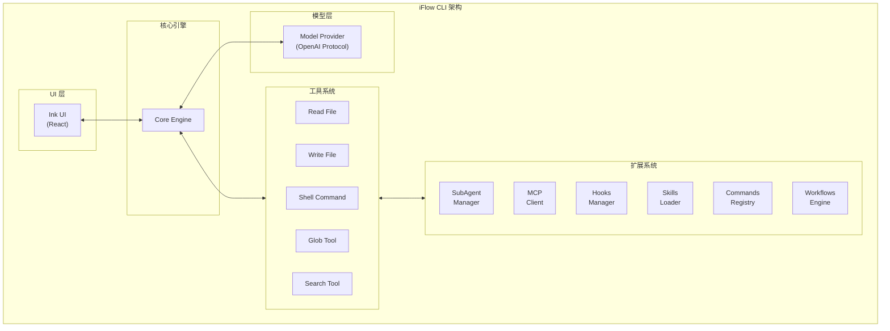
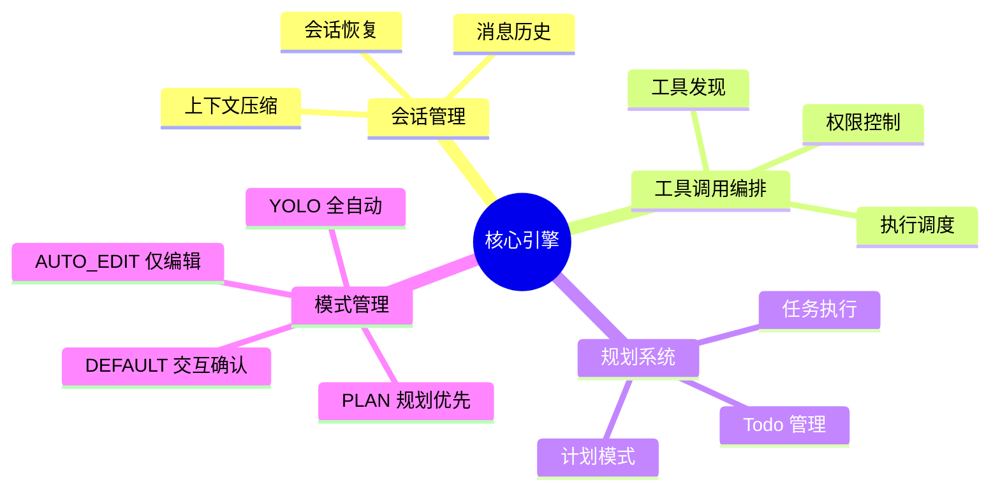
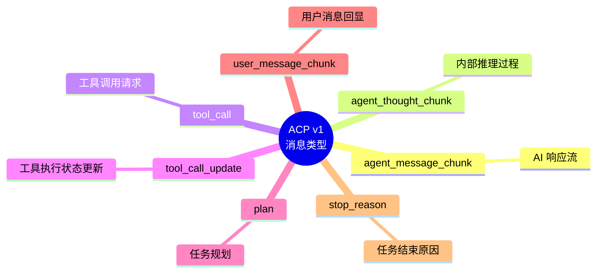
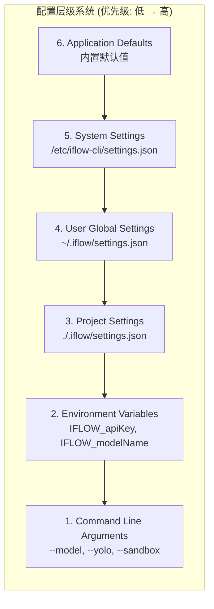
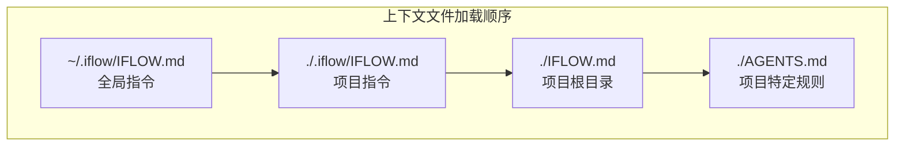
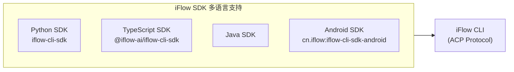

# iFlow CLI 核心实现架构

## 1. 技术栈

| 层级 | 技术 |
|------|------|
| **语言** | TypeScript |
| **运行时** | Node.js 22+ |
| **终端 UI** | [Ink](https://github.com/vadimdemedes/ink) (React for CLI) |
| **包管理** | npm / Monorepo 结构 |
| **通信协议** | ACP (Agent Communication Protocol) |
| **模型接口** | OpenAI-compatible API |

## 2. 核心架构设计



## 3. 核心模块解析

### 3.1 终端 UI 层 (Ink)

- 使用 **Ink** 框架（React for CLI）构建交互式界面
- 支持多主题、Vim 模式、多行输入、图片粘贴
- 实时流式输出、进度显示、状态指示器

### 3.2 核心引擎 (Core Engine)



### 3.3 通信协议层 (ACP)



### 3.4 工具系统 (Tool System)

```typescript
// 内置核心工具
const coreTools = [
  'read_file',           // 文件读取
  'write_file',          // 文件写入
  'replace',             // 文本替换
  'run_shell_command',   // Shell 执行
  'glob',                // 文件搜索
  'search_file_content', // 内容搜索
  'list_directory',      // 目录列表
  'web_fetch',           // 网络请求
  'web_search',          // 网络搜索
  // ...
];

// 工具执行流程
User Request → LLM Decision → Tool Call → Permission Check → Execution → Result → LLM
```

### 3.5 扩展系统 (Extension System)

| 扩展类型 | 加载位置 | 作用 |
|---------|---------|------|
| **SubAgent** | `.iflow/agents/` 或 Open Market | 专业分工的子智能体 |
| **MCP Servers** | `settings.json` → `mcpServers` | 外部工具协议集成 |
| **Skills** | `.iflow/skills/` | 复杂功能包 |
| **Commands** | `.iflow/commands/` | 自定义斜杠命令 |
| **Hooks** | `settings.json` → `hooks` | 生命周期钩子 |
| **Workflows** | Open Market | 工作流自动化 |

## 4. 配置层级系统



## 5. 关键实现特性

### 5.1 上下文自动压缩

- 当上下文达到 **70%** 阈值时触发
- 使用 Task Tool 压缩历史对话
- 保留关键决策和状态

### 5.2 分层上下文指令



### 5.3 沙箱执行

- 支持 Docker 容器隔离
- 可自定义沙箱配置 (`.iflow/sandbox.Dockerfile`)
- macOS 专属沙箱配置 (`.iflow/sandbox-macos-custom.sb`)

### 5.4 进程管理

```typescript
// SDK 自动进程管理逻辑
async function ensureIFlowRunning() {
  if (!isIFlowInstalled()) await installIFlow();
  if (!isIFlowRunning()) {
    const port = await findAvailablePort();
    await spawnIFlow(['--experimental-acp', '--port', port]);
  }
  return connect(port);
}
```

## 6. 与同类工具对比

| 特性 | iFlow CLI | Claude Code | Gemini CLI |
|------|-----------|-------------|------------|
| **UI 框架** | Ink (React) | Ink (React) | 自研 |
| **扩展市场** | ✅ 内置 Open Market | ❌ | ❌ |
| **免费模型** | ✅ 多模型免费 | ❌ | ❌ |
| **SubAgent** | ✅ | ✅ | ❌ |
| **MCP 支持** | ✅ | ✅ | ✅ |
| **Hook 系统** | ✅ | ✅ | ❌ |
| **Workflow** | ✅ | ❌ | ❌ |
| **SDK** | ✅ Python SDK | ✅ | ❌ |

## 7. 总结

iFlow CLI 是一个基于 **TypeScript + Node.js + Ink (React)** 构建的现代 AI CLI 工具，核心特点是：

1. **分层架构**：UI 层 → 核心引擎 → 工具系统 → 扩展系统
2. **ACP 协议**：统一的 Agent 通信协议，支持流式消息和工具调用
3. **扩展性强**：通过 SubAgent、MCP、Skills、Commands、Hooks 等机制扩展能力
4. **配置灵活**：多层级配置系统，支持环境变量覆盖
5. **智能压缩**：自动管理上下文长度，支持长对话

## 8. SDK 多语言支持

iFlow SDK 提供**四种语言版本**，支持以编程方式与 iFlow CLI 交互，快速集成到业务系统中。



### 8.1 版本概览

| 语言 | 包名 | 当前版本 | 系统要求 |
|------|------|----------|----------|
| **Python** | `iflow-cli-sdk` | v0.1.11 | Python 3.8+ |
| **TypeScript** | `@iflow-ai/iflow-cli-sdk` | - | Node.js 18+ |
| **Java** | - | - | Java 8+ |
| **Android** | `cn.iflow:iflow-cli-sdk-android` | v1.0.0 | Android API 21+, Kotlin 1.8+ |

### 8.2 核心特性

所有 SDK 版本共享以下核心特性：

| 特性 | 说明 |
|------|------|
| **自动进程管理** | SDK 自动检测并启动 iFlow 进程，无需手动配置 |
| **双向通信** | 通过 WebSocket 实现实时消息流传输 |
| **工具调用控制** | 细粒度的工具执行权限管理 |
| **SubAgent 支持** | 支持多 Agent 协作，跟踪 `agent_id` |
| **任务规划** | 接收和处理结构化任务计划 |
| **ACP 协议** | 完整实现 Agent Communication Protocol v1 |

### 8.3 快速开始

#### Python

```python
# 安装
pip install iflow-cli-sdk

# 使用
from iflow_sdk import query
import asyncio

async def main():
    response = await query("什么是机器学习？")
    print(response)

asyncio.run(main())
```

#### TypeScript

```typescript
// 安装
npm install @iflow-ai/iflow-cli-sdk

// 使用
import { IFlowClient } from '@iflow-ai/iflow-cli-sdk';

const client = new IFlowClient();
await client.connect();
await client.sendMessage('Hello, iFlow!');
```

#### Java

```java
// Maven 依赖
<dependency>
    <groupId>cn.iflow</groupId>
    <artifactId>iflow-cli-sdk-java</artifactId>
</dependency>

// 使用
IFlowClient client = new IFlowClient();
client.connect();
client.sendMessage("Hello, iFlow!");
```

#### Android (Kotlin)

```kotlin
// build.gradle
implementation 'cn.iflow:iflow-cli-sdk-android:1.0.0'

// 使用
val options = IFlowOptions()
IFlowClient(options).use { client ->
    client.connect()
    client.sendMessage("Hello, iFlow!")
    client.receiveMessages { message ->
        when (message) {
            is AssistantMessage -> println(message.chunk.text)
            is TaskFinishMessage -> return@receiveMessages
        }
    }
}
```

### 8.4 消息类型

所有 SDK 支持统一的消息类型：

| 消息类型 | 说明 | 主要属性 |
|----------|------|----------|
| `AssistantMessage` | AI 助手文本响应 | `chunk.text`, `agent_info` |
| `ToolCallMessage` | 工具执行请求和状态 | `label`, `status`, `tool_name` |
| `PlanMessage` | 结构化任务计划 | `entries` (content, priority, status) |
| `TaskFinishMessage` | 任务完成信号 | `stop_reason` |

## 9. 参考资源

- [iFlow CLI GitHub](https://github.com/iflow-ai/iflow-cli)
- [iFlow CLI SDK (Python)](https://pypi.org/project/iflow-cli-sdk/)
- [iFlow 开放平台](https://platform.iflow.cn/)
- [Ink - React for CLI](https://github.com/vadimdemedes/ink)
