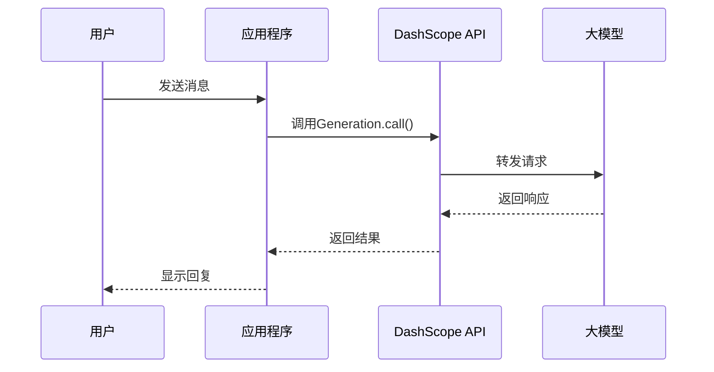

# 大模型原理与API使用 - 技术架构

## 架构概览

大模型API使用项目采用分层架构设计，包含应用层、API封装层、工具层和外部服务层四个核心层次，确保系统的可扩展性、可维护性和易用性。

```
┌─────────────────────────────────────────────────────────────┐
│                    大模型 API 调用实践                        │
├─────────────────────────────────────────────────────────────┤
│                                                             │
│  ┌──────────────┐    ┌──────────────┐    ┌──────────────┐  │
│  │ 基础对话调用  │    │ Function     │    │ 多模态调用   │  │
│  │              │    │ Calling      │    │              │  │
│  │ 1-情感分析   │    │ 2-天气查询   │    │ 3-表格提取   │  │
│  │ 5-DeepSeek   │    │ 4-运维处置   │    │              │  │
│  │ 6-联网搜索   │    │ 陪伴机器人   │    │              │  │
│  └──────┬───────┘    └──────┬───────┘    └──────┬───────┘  │
│         │                   │                   │          │
│         └───────────────────┼───────────────────┘          │
│                             ▼                              │
│              ┌─────────────────────────────┐               │
│              │   DashScope API (阿里云)     │               │
│              │   OpenAI Compatible API     │               │
│              └─────────────────────────────┘               │
│                             │                              │
│         ┌───────────────────┼───────────────────┐          │
│         ▼                   ▼                   ▼          │
│  ┌─────────────┐    ┌─────────────┐    ┌─────────────┐    │
│  │ deepseek-v3 │    │ qwen-max    │    │ qwen-vl-plus│    │
│  │ deepseek-r1 │    │ qwen-turbo  │    │ (视觉模型)  │    │
│  │ qwen-plus   │    │             │    │             │    │
│  └─────────────┘    └─────────────┘    └─────────────┘    │
│                                                             │
│  ┌──────────────────────────────────────────────────────┐  │
│  │                 外部服务/API                          │  │
│  │  ┌─────────────┐    ┌─────────────┐                  │  │
│  │  │ 高德天气API │    │ 监控系统API │                  │  │
│  │  └─────────────┘    └─────────────┘                  │  │
│  └──────────────────────────────────────────────────────┘  │
│                                                             │
└─────────────────────────────────────────────────────────────┘
```

## 核心组件架构

### 1. API调用封装层

```python
def get_response(messages):
    """
    统一的API调用封装
    
    Args:
        messages: 消息列表
        
    Returns:
        API响应对象
    """
    response = dashscope.Generation.call(
        model="deepseek-v3",
        messages=messages,
        result_format="message"
    )
    return response
```

**设计原则：**
- **统一接口**: 所有模型调用使用相同的消息格式
- **结果标准化**: 统一的响应格式处理
- **错误隔离**: 封装异常处理逻辑

### 2. Function Calling流程

```
┌─────────┐     ┌─────────┐     ┌─────────┐     ┌─────────┐
│ 用户请求 │ ──▶ │ 首次调用 │ ──▶ │ 函数执行 │ ──▶ │ 结果整合 │
└─────────┘     └─────────┘     └─────────┘     └─────────┘
                     │               │               │
                     ▼               ▼               ▼
               ┌───────────┐   ┌───────────┐   ┌───────────┐
               │ 判断是否  │   │ 执行外部  │   │ 生成最终  │
               │ 调用函数  │   │ 函数调用  │   │ 回复      │
               └───────────┘   └───────────┘   └───────────┘
```

## API调用模式详解

### 1. 基础对话调用

#### 调用流程


#### 代码实现
```python
# 基础对话调用
def get_response(messages):
    response = dashscope.Generation.call(
        model="deepseek-v3",
        messages=messages,
        result_format="message"
    )
    return response

# 使用示例
messages = [
    {"role": "system", "content": "你是一个情感分析助手"},
    {"role": "user", "content": "今天心情真好，天气也很棒！"}
]
response = get_response(messages)
print(response.output.choices[0].message.content)
```

### 2. Function Calling

#### 工作原理

Function Calling允许大模型在对话过程中调用外部函数，获取实时数据或执行特定操作。

```
┌────────────────────────────────────────────────────────────┐
│                    Function Calling 流程                    │
├────────────────────────────────────────────────────────────┤
│                                                            │
│  1. 定义函数                                                │
│     ┌─────────────────────────────────────────────────┐   │
│     │ functions = [{                                   │   │
│     │     "name": "get_weather",                       │   │
│     │     "description": "获取天气信息",               │   │
│     │     "parameters": {...}                          │   │
│     │ }]                                               │   │
│     └─────────────────────────────────────────────────┘   │
│                          │                                 │
│                          ▼                                 │
│  2. 首次调用                                                │
│     ┌─────────────────────────────────────────────────┐   │
│     │ response = call(model, messages, functions)      │   │
│     │ → 模型返回 function_call 而非直接回复            │   │
│     └─────────────────────────────────────────────────┘   │
│                          │                                 │
│                          ▼                                 │
│  3. 执行函数                                                │
│     ┌─────────────────────────────────────────────────┐   │
│     │ function_name = message.function_call.name       │   │
│     │ arguments = message.function_call.arguments      │   │
│     │ result = execute_function(function_name, args)   │   │
│     └─────────────────────────────────────────────────┘   │
│                          │                                 │
│                          ▼                                 │
│  4. 整合结果                                                │
│     ┌─────────────────────────────────────────────────┐   │
│     │ messages.append({                                │   │
│     │     "role": "function",                          │   │
│     │     "name": function_name,                       │   │
│     │     "content": str(result)                       │   │
│     │ })                                               │   │
│     │ final_response = call(model, messages)           │   │
│     └─────────────────────────────────────────────────┘   │
│                                                            │
└────────────────────────────────────────────────────────────┘
```

#### 函数定义格式
```python
functions = [{
    "name": "get_current_weather",
    "description": "获取指定地区的当前天气状况",
    "parameters": {
        "type": "object",
        "properties": {
            "location": {
                "type": "string",
                "description": "城市名称，如：北京"
            },
            "unit": {
                "type": "string",
                "enum": ["celsius", "fahrenheit"]
            }
        },
        "required": ["location"]
    }
}]
```

#### Tool Calling格式（新版）
```python
tools = [
    {
        "type": "function",
        "function": {
            "name": "get_current_status",
            "description": "调用监控系统接口，获取当前数据库服务器性能指标",
            "parameters": {},
            "required": []
        }
    }
]
```

### 3. 工具调用循环

多轮工具调用是Function Calling的高级应用，支持连续多次调用不同的工具。

```python
# 多轮工具调用循环
while True:
    response = get_response(messages)
    message = response.output.choices[0].message
    messages.append(message.to_dict())
    
    finish_reason = response.output.choices[0].finish_reason
    
    if finish_reason == 'stop':
        break
    
    # 处理工具调用
    if hasattr(message, 'tool_calls') and message.tool_calls:
        for tool_call in message.tool_calls:
            function_name = tool_call['function']['name']
            arguments = json.loads(tool_call['function']['arguments'])
            
            # 执行函数
            result = execute_function(function_name, arguments)
            
            # 添加工具响应
            messages.append({
                "role": "tool",
                "content": str(result),
                "name": function_name,
                "tool_call_id": tool_call['id']
            })
```

### 4. 多模态调用

#### 架构图
```
┌─────────────────────────────────────────────────────────┐
│                    多模态调用架构                         │
├─────────────────────────────────────────────────────────┤
│                                                         │
│  ┌──────────────┐                                       │
│  │   图像输入   │                                       │
│  │  (Base64/URL)│                                       │
│  └──────┬───────┘                                       │
│         │                                               │
│         ▼                                               │
│  ┌──────────────────────────────────────────────────┐  │
│  │ messages = [{                                     │  │
│  │     "role": "user",                               │  │
│  │     "content": [                                  │  │
│  │         {"image": "https://..."},                 │  │
│  │         {"text": "提取表格数据"}                   │  │
│  │     ]                                             │  │
│  │ }]                                                │  │
│  └──────────────────────────────────────────────────┘  │
│         │                                               │
│         ▼                                               │
│  ┌──────────────────────────────────────────────────┐  │
│  │ response = MultiModalConversation.call(           │  │
│  │     model="qwen-vl-plus",                         │  │
│  │     messages=messages                             │  │
│  │ )                                                 │  │
│  └──────────────────────────────────────────────────┘  │
│         │                                               │
│         ▼                                               │
│  ┌──────────────────────────────────────────────────┐  │
│  │ 输出结构化数据（JSON格式）                         │  │
│  └──────────────────────────────────────────────────┘  │
│                                                         │
└─────────────────────────────────────────────────────────┘
```

#### 代码实现
```python
# 多模态调用 - 表格提取
def extract_table(image_url: str):
    messages = [
        {
            "role": "user",
            "content": [
                {"image": image_url},
                {"text": "请提取图片中的表格数据，以JSON格式输出"}
            ]
        }
    ]
    
    response = dashscope.MultiModalConversation.call(
        model="qwen-vl-plus",
        messages=messages
    )
    
    return response.output.choices[0].message.content
```

### 5. 联网搜索

#### 工作流程
```
┌─────────────────────────────────────────────────────────┐
│                    联网搜索流程                          │
├─────────────────────────────────────────────────────────┤
│                                                         │
│  用户问题 ──▶ 启用搜索 ──▶ 获取搜索结果 ──▶ 整合回答    │
│                                                         │
│  示例：                                                  │
│  "今天北京天气怎么样？"                                  │
│        │                                                │
│        ▼                                                │
│  enable_search=True                                     │
│        │                                                │
│        ▼                                                │
│  [搜索结果1: 北京天气...]                               │
│  [搜索结果2: 今日天气...]                               │
│        │                                                │
│        ▼                                                │
│  "根据最新信息，今天北京天气..."                         │
│                                                         │
└─────────────────────────────────────────────────────────┘
```

#### 代码实现
```python
# 联网搜索调用
response = dashscope.Generation.call(
    model="qwen-plus",
    messages=messages,
    result_format="message",
    search_options={
        "enable_search": True
    }
)
```

## 消息格式规范

### 1. 基础消息格式
```python
# 基础对话消息
messages = [
    {"role": "system", "content": "系统提示词"},
    {"role": "user", "content": "用户消息"},
    {"role": "assistant", "content": "助手回复"}
]
```

### 2. 多模态消息格式
```python
# 多模态消息
messages = [
    {
        "role": "user",
        "content": [
            {"image": "https://example.com/image.jpg"},
            {"text": "请描述这张图片"}
        ]
    }
]
```

### 3. Function消息格式
```python
# Function Calling消息
messages = [
    {"role": "user", "content": "北京天气怎么样？"},
    {"role": "assistant", "content": "", "function_call": {
        "name": "get_weather",
        "arguments": '{"location": "北京"}'
    }},
    {"role": "function", "name": "get_weather", "content": '{"temp": 25}'}
]
```

### 4. Tool消息格式（新版）
```python
# Tool Calling消息
messages = [
    {"role": "user", "content": "检查服务器状态"},
    {"role": "assistant", "tool_calls": [{
        "id": "call_xxx",
        "function": {"name": "get_status", "arguments": "{}"}
    }]},
    {"role": "tool", "tool_call_id": "call_xxx", "content": '{"status": "ok"}'}
]
```

## 响应处理

### 1. 响应结构
```python
response = {
    "status_code": 200,
    "output": {
        "choices": [{
            "finish_reason": "stop",  # 或 "tool_calls"
            "message": {
                "role": "assistant",
                "content": "回复内容",
                # 可选字段
                "function_call": {...},  # Function Calling
                "tool_calls": [...]      # Tool Calling
            }
        }]
    },
    "usage": {
        "input_tokens": 100,
        "output_tokens": 50
    }
}
```

### 2. 完成原因
| finish_reason | 说明 |
|---------------|------|
| `stop` | 正常完成，生成结束 |
| `tool_calls` | 需要调用工具 |
| `length` | 达到最大长度限制 |
| `content_filter` | 内容过滤触发 |

## 错误处理架构

### 1. 错误类型
```python
class APIError(Exception):
    """API调用基础错误"""
    pass

class RateLimitError(APIError):
    """速率限制错误"""
    pass

class AuthenticationError(APIError):
    """认证错误"""
    pass

class ModelNotFoundError(APIError):
    """模型不存在错误"""
    pass
```

### 2. 重试策略
```python
from tenacity import retry, stop_after_attempt, wait_exponential

@retry(
    stop=stop_after_attempt(3),
    wait=wait_exponential(multiplier=1, min=2, max=10)
)
def call_api_with_retry(messages):
    return dashscope.Generation.call(
        model="qwen-max",
        messages=messages
    )
```

## 扩展架构

### 1. 插件化工具系统
```python
class ToolRegistry:
    """工具注册中心"""
    
    def __init__(self):
        self.tools = {}
    
    def register(self, name: str, function: callable, schema: dict):
        self.tools[name] = {
            "function": function,
            "schema": schema
        }
    
    def execute(self, name: str, arguments: dict):
        return self.tools[name]["function"](**arguments)
    
    def get_schemas(self):
        return [tool["schema"] for tool in self.tools.values()]
```

### 2. 多模型路由
```python
class ModelRouter:
    """模型路由器"""
    
    def __init__(self):
        self.models = {
            "fast": "qwen-turbo",
            "balanced": "qwen-plus",
            "powerful": "qwen-max",
            "vision": "qwen-vl-plus"
        }
    
    def route(self, task_type: str) -> str:
        return self.models.get(task_type, "qwen-turbo")
```

---

*最后更新: 2026年2月21日*
*架构版本: v1.0*
*技术负责人: AI系统架构组*
