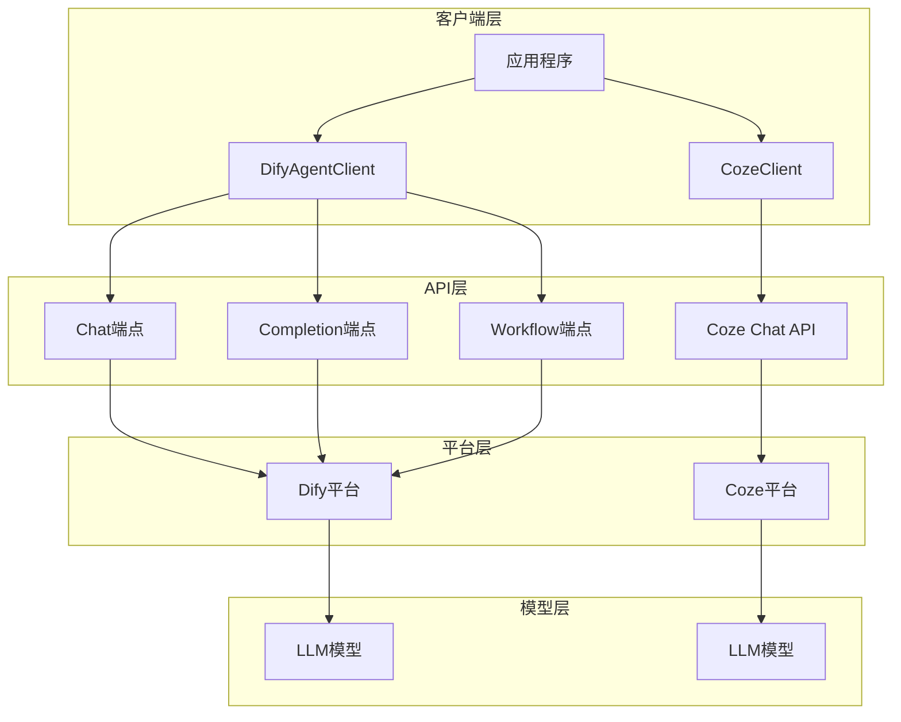
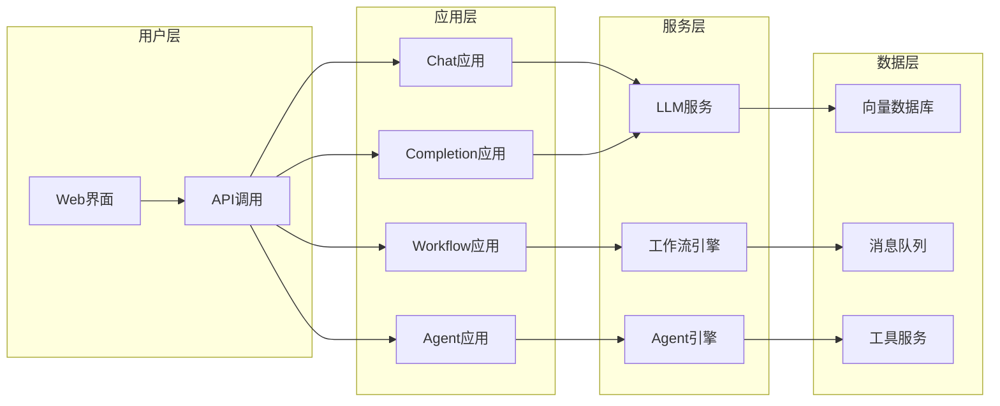
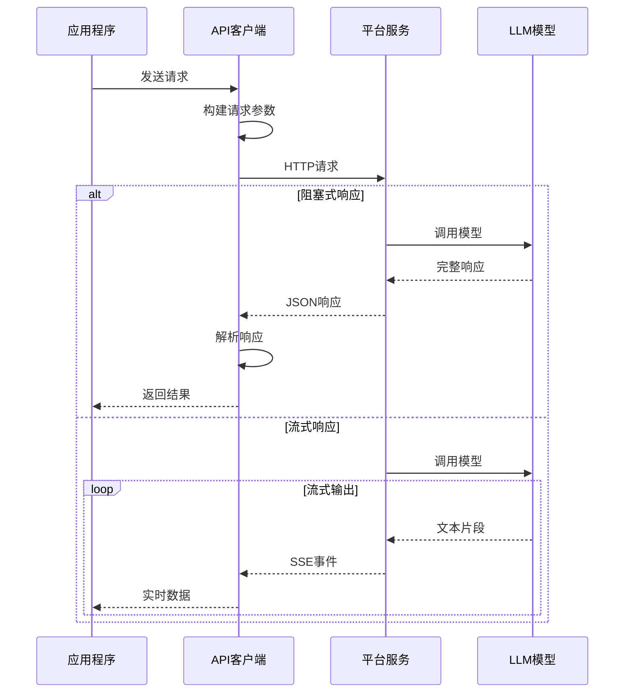
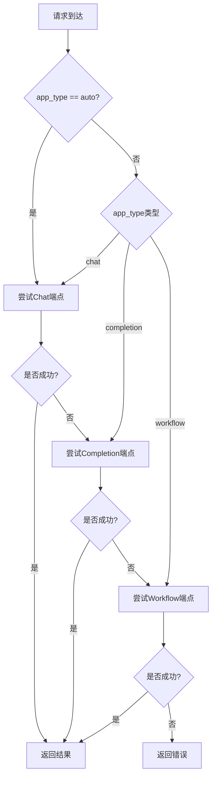

# Dify本地化部署和应用 - 技术架构

## 架构概览

Dify本地化部署和应用项目采用客户端-服务器架构，通过统一的API客户端封装，实现对Dify平台和Coze平台的透明访问。项目设计遵循高内聚、低耦合的原则，支持多种应用类型和调用方式。



## Dify平台架构概览

### Dify系统架构



### Dify核心组件

#### 1. 应用管理
- **应用定义**: Prompt模板、模型配置、参数设置
- **API密钥**: 密钥生成、权限控制、使用统计
- **版本管理**: 应用版本控制、回滚支持

#### 2. 工作流引擎
- **节点类型**: LLM节点、知识库节点、条件节点、代码节点
- **执行控制**: 顺序执行、条件分支、循环迭代
- **变量传递**: 节点间数据流转

#### 3. 知识库管理
- **文档导入**: PDF、Word、TXT等格式支持
- **向量化处理**: 自动分块、向量化、索引
- **检索服务**: 语义搜索、相似度匹配

## 核心组件架构

### 1. DifyAgentClient类架构

```python
class DifyAgentClient:
    """
    Dify Agent API 客户端类
    核心功能模块：
    - 多端点适配模块
    - 响应处理模块
    - 会话管理模块
    - 错误处理模块
    """
    
    def __init__(self, base_url: str, api_key: str):
        # 初始化基础配置
        # 设置请求头
        # 配置超时参数
```

### 2. CozeClient类架构

```python
class CozeClient:
    """
    基于 cozepy 的 Coze API 客户端类
    核心功能模块：
    - 流式聊天模块
    - 普通聊天模块
    - 智能体管理模块
    - 历史记录模块
    """
    
    def __init__(self, api_token: str, bot_id: str, base_url: str):
        # 初始化 Coze SDK
        # 配置认证信息
        # 设置基础参数
```

## API设计架构

### 1. Dify API端点设计

#### Chat端点
```
POST /v1/chat-messages
Content-Type: application/json
Authorization: Bearer {api_key}

{
    "inputs": {},
    "query": "用户问题",
    "response_mode": "blocking" | "streaming",
    "user": "user_id",
    "conversation_id": "可选，用于多轮对话"
}
```

#### Completion端点
```
POST /v1/completions-messages
Content-Type: application/json
Authorization: Bearer {api_key}

{
    "inputs": {},
    "response_mode": "blocking" | "streaming",
    "user": "user_id"
}
```

#### Workflow端点
```
POST /v1/workflows/run
Content-Type: application/json
Authorization: Bearer {api_key}

{
    "inputs": {
        "query": "输入参数"
    },
    "response_mode": "blocking" | "streaming",
    "user": "user_id"
}
```

### 2. Coze API端点设计

#### Chat接口
```python
# 流式聊天
for event in coze.chat.stream(
    bot_id=bot_id,
    user_id=user_id,
    additional_messages=[Message.build_user_question_text(message)]
):
    # 处理流式事件
    pass

# 普通聊天
chat_poll = coze.chat.create_and_poll(
    bot_id=bot_id,
    user_id=user_id,
    additional_messages=[Message.build_user_question_text(message)]
)
```

### 3. 数据流架构



## 多应用类型支持架构

### 1. 自动检测机制

```python
def chat_completion(self, user_input: str, app_type: str = "auto"):
    if app_type == "auto":
        # 1. 尝试Chat端点
        result = self._try_chat_endpoint(...)
        if result.get("error") and "not_chat_app" in str(result.get("message")):
            # 2. 降级到Completion端点
            result = self._try_completion_endpoint(...)
            if result.get("error") and "app_unavailable" in str(result.get("message")):
                # 3. 降级到Workflow端点
                result = self._try_workflow_endpoint(...)
        return result
```

### 2. 端点适配策略



### 3. 请求格式适配

#### Chat端点格式
```python
payload = {
    "inputs": {},
    "query": user_input,
    "response_mode": "blocking",
    "user": user_id,
    "conversation_id": conversation_id  # 可选
}
```

#### Completion端点格式
```python
payload = {
    "inputs": {},  # 空对象
    "response_mode": "blocking",
    "user": user_id
}
```

#### Workflow端点格式
```python
payload = {
    "inputs": {"query": user_input},  # 参数在inputs中
    "response_mode": "blocking",
    "user": user_id
}
```

## 响应处理架构

### 1. 阻塞式响应处理

```python
def _handle_blocking_response(self, url: str, payload: Dict) -> Dict:
    response = requests.post(url, headers=self.headers, json=payload, timeout=60)
    
    if response.status_code != 200:
        return {
            "error": True,
            "message": f"HTTP {response.status_code}: {response.text}"
        }
    
    result = response.json()
    return {
        "error": False,
        "data": result,
        "answer": result.get("answer", ""),
        "conversation_id": result.get("conversation_id", ""),
        "message_id": result.get("message_id", "")
    }
```

### 2. 流式响应处理

```python
def _handle_streaming_response(self, url: str, payload: Dict) -> Dict:
    response = requests.post(url, headers=self.headers, json=payload, stream=True)
    
    full_answer = ""
    for line in response.iter_lines():
        if line and line.startswith(b"data: "):
            data = json.loads(line[6:])
            if data.get("event") == "message":
                full_answer += data.get("answer", "")
    
    return {
        "error": False,
        "answer": full_answer
    }
```

### 3. Workflow响应处理

```python
def _handle_workflow_blocking_response(self, url: str, payload: Dict) -> Dict:
    result = response.json()
    outputs = result.get("data", {}).get("outputs", {})
    
    # 尝试多种输出字段名
    for key in ["answer", "result", "output", "text", "response"]:
        if key in outputs:
            answer = outputs[key]
            break
    
    return {
        "error": False,
        "answer": answer,
        "outputs": outputs,
        "workflow_run_id": result.get("workflow_run_id")
    }
```

## 安全架构

### 1. 认证机制
- **API密钥**: Bearer Token认证
- **密钥管理**: 环境变量存储
- **权限控制**: 基于API密钥的应用访问控制

### 2. 数据安全
- **HTTPS**: 所有API请求使用HTTPS
- **敏感信息**: 不在日志中记录敏感信息
- **输入验证**: 对所有输入进行格式验证

### 3. 访问控制
- **超时控制**: 防止长时间阻塞
- **请求限制**: 支持请求频率控制
- **错误处理**: 完善的异常捕获

## 扩展架构

### 1. 插件化设计

```python
class LLMClientPlugin:
    """LLM客户端插件基类"""
    
    def __init__(self, platform_name: str):
        self.platform_name = platform_name
    
    def chat(self, message: str, **kwargs) -> Dict:
        raise NotImplementedError
    
    def stream_chat(self, message: str, **kwargs) -> Generator:
        raise NotImplementedError
```

### 2. 多平台支持

```python
class LLMClientManager:
    """LLM客户端管理器"""
    
    def __init__(self):
        self.clients = {
            "dify": DifyAgentClient,
            "coze": CozeClient,
            # 可扩展更多平台
        }
    
    def get_client(self, platform: str, **config) -> LLMClientPlugin:
        return self.clients[platform](**config)
```

### 3. 中间件架构

```python
class Middleware:
    """中间件基类"""
    
    def before_request(self, request: Dict) -> Dict:
        return request
    
    def after_response(self, response: Dict) -> Dict:
        return response

class LoggingMiddleware(Middleware):
    """日志中间件"""
    
    def before_request(self, request: Dict) -> Dict:
        logger.info(f"Request: {request}")
        return request
    
    def after_response(self, response: Dict) -> Dict:
        logger.info(f"Response: {response}")
        return response
```

---

*最后更新: 2026年2月21日*
*架构版本: v1.0*
*技术负责人: AI系统架构组*
