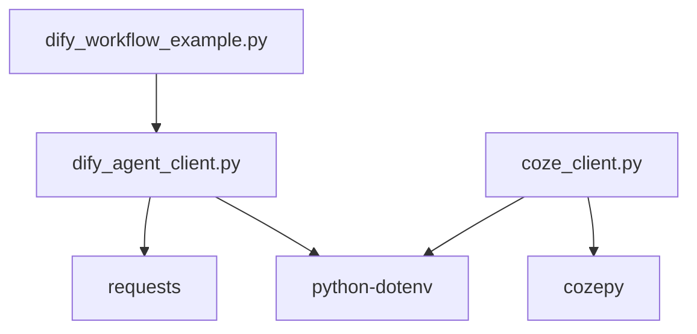

# Dify本地化部署和应用 - 代码实现详解

## 核心代码结构

### 1. 项目文件组织

```
code/
├── dify_agent_client.py      # Dify API客户端核心实现
├── dify_workflow_example.py  # 工作流调用示例
└── coze_client.py            # Coze API客户端实现
```

### 2. 模块依赖关系



## DifyAgentClient类详解

### 1. 初始化方法

```python
class DifyAgentClient:
    """Dify Agent API 客户端类"""
    
    def __init__(self, base_url: str, api_key: str):
        """
        初始化 Dify Agent 客户端
        
        Args:
            base_url: Dify API 的基础 URL
            api_key: 应用的 API 密钥
        """
        self.base_url = base_url.rstrip("/")
        self.api_key = api_key
        self.headers = {
            "Authorization": f"Bearer {api_key}",
            "Content-Type": "application/json",
            "Accept": "application/json"
        }
```

**设计要点：**
- **URL标准化**: 使用`rstrip("/")`移除尾部斜杠，确保URL拼接正确
- **请求头封装**: 统一设置认证和内容类型头
- **配置集中**: 所有配置集中在初始化方法中

### 2. 核心聊天方法

```python
def chat_completion(
    self,
    user_input: str,
    user_id: str = "default_usr",
    conversation_id: Optional[str] = None,
    stream: bool = False,
    app_type: str = "auto"
) -> Dict[str, Any]:
    """
    调用 Dify Agent 进行对话
    
    Args:
        user_input: 用户输入的消息
        user_id: 用户ID
        conversation_id: 会话 ID，用于维持对话上下文
        stream: 是否使用流式响应
        app_type: 应用类型，支持 "chat"、"completion"、"workflow" 或 "auto"
    
    Returns:
        API 响应结果
    """
```

**功能特点：**
- **自动检测**: 支持自动检测应用类型
- **多端点支持**: 支持Chat、Completion、Workflow三种端点
- **流式支持**: 支持阻塞式和流式两种响应模式
- **会话管理**: 支持多轮对话的会话上下文

## 多端点适配实现

### 1. 自动检测机制

```python
def chat_completion(self, user_input: str, app_type: str = "auto"):
    if app_type == "auto":
        # 先尝试 chat 端点
        result = self._try_chat_endpoint(user_input, user_id, conversation_id, stream)
        
        # 如果失败且是"非聊天应用"错误，切换到 completion 端点
        if result.get("error") and "not_chat_app" in str(result.get("message", "")):
            print("检测到非聊天应用，切换到 completion 端点...")
            result = self._try_completion_endpoint(user_input, user_id, stream)
            
            # 如果还是失败，尝试 workflow 端点
            if result.get("error") and "app_unavailable" in str(result.get("message", "")):
                print("检测到非完成应用，切换到工作流端点...")
                result = self._try_workflow_endpoint(user_input, user_id, stream)
        
        return result
```

**降级策略：**
1. 首先尝试Chat端点（最常用的应用类型）
2. 如果返回"not_chat_app"错误，降级到Completion端点
3. 如果返回"app_unavailable"错误，降级到Workflow端点

### 2. Chat端点实现

```python
def _try_chat_endpoint(
    self,
    user_input: str,
    user_id: str,
    conversation_id: Optional[str],
    stream: bool
) -> Dict[str, Any]:
    """尝试使用 chat 端点"""
    url = f"{self.base_url}/chat-messages"
    
    # 构建请求体
    payload = {
        "inputs": {},
        "query": user_input,
        "response_mode": "streaming" if stream else "blocking",
        "user": user_id
    }
    
    # 只有当 conversation_id 存在时才添加
    if conversation_id:
        payload["conversation_id"] = conversation_id
    
    try:
        if stream:
            return self._handle_streaming_response(url, payload)
        else:
            return self._handle_blocking_response(url, payload)
    except requests.exceptions.RequestException as e:
        return {
            "error": True,
            "message": f"请求失败：{str(e)}"
        }
```

**关键实现：**
- **条件参数**: `conversation_id`仅在存在时添加，避免传递None或空字符串
- **响应模式**: 根据`stream`参数选择阻塞式或流式响应
- **异常捕获**: 捕获网络请求异常并返回统一格式的错误信息

### 3. Completion端点实现

```python
def _try_completion_endpoint(
    self,
    user_input: str,
    user_id: str,
    stream: bool
) -> Dict[str, Any]:
    """尝试使用 completion 端点"""
    url = f"{self.base_url}/completions-messages"
    
    # 根据官方文档，completion 端点的正确格式
    payload = {
        "inputs": {},  # 空对象，不是包含 query 的对象
        "response_mode": "streaming" if stream else "blocking",
        "user": user_id
    }
    
    try:
        if stream:
            return self._handle_streaming_response(url, payload)
        else:
            return self._handle_blocking_response(url, payload)
    except requests.exceptions.RequestException as e:
        return {
            "error": True,
            "message": f"请求失败：{str(e)}"
        }
```

**注意事项：**
- Completion端点的`inputs`字段是空对象，与Chat端点不同
- 不支持`conversation_id`（单轮对话）
- 错误处理与Chat端点一致

### 4. Workflow端点实现

```python
def _try_workflow_endpoint(
    self,
    user_input: str,
    user_id: str,
    stream: bool
) -> Dict[str, Any]:
    """尝试使用 workflow 端点"""
    url = f"{self.base_url}/workflows/run"
    
    # 工作流端点的 payload 格式
    payload = {
        "inputs": {"query": user_input},  # 工作流通常需要在 inputs 中传递参数
        "response_mode": "stream" if stream else "blocking",
        "user": user_id
    }
    
    try:
        if stream:
            return self._handle_workflow_streaming_response(url, payload)
        else:
            return self._handle_workflow_blocking_response(url, payload)
    except requests.exceptions.RequestException as e:
        return {
            "error": True,
            "message": f"请求失败：{str(e)}"
        }
```

**差异点：**
- Workflow端点的路径是`/workflows/run`
- `inputs`参数格式不同，需要包含具体的工作流输入参数
- 响应处理方法不同（专门的Workflow响应处理方法）

## 响应处理详解

### 1. 阻塞式响应处理

```python
def _handle_blocking_response(
    self,
    url: str,
    payload: Dict[str, Any]
) -> Dict[str, Any]:
    """处理阻塞式响应"""
    try:
        response = requests.post(url, headers=self.headers, json=payload, timeout=60)
        
        # 调试信息
        print(f"请求URL: {url}")
        print(f"响应状态码: {response.status_code}")
        
        if response.status_code != 200:
            print(f"响应数据: {response.text}")
            return {
                "error": True,
                "message": f"HTTP {response.status_code}: {response.text}"
            }
        
        result = response.json()
        return {
            "error": False,
            "data": result,
            "answer": result.get("answer", ""),
            "conversation_id": result.get("conversation_id", ""),
            "message_id": result.get("message_id", "")
        }
    except requests.exceptions.RequestException as e:
        return {
            "error": True,
            "message": f"网络请求异常：{str(e)}"
        }
    except json.JSONDecodeError as e:
        return {
            "error": True,
            "message": f"JSON 解析异常：{str(e)}"
        }
```

**处理流程：**
1. 发送HTTP POST请求
2. 检查响应状态码
3. 解析JSON响应
4. 提取关键字段（answer、conversation_id、message_id）
5. 异常捕获和处理

### 2. 流式响应处理

```python
def _handle_streaming_response(
    self,
    url: str,
    payload: Dict[str, Any]
) -> Dict[str, Any]:
    """处理流式响应"""
    try:
        response = requests.post(url, headers=self.headers, json=payload, stream=True, timeout=60)
        
        if response.status_code != 200:
            return {
                "error": True,
                "message": f"HTTP {response.status_code}: {response.text}"
            }
        
        full_answer = ""
        conversation_id = ""
        message_id = ""
        
        # 遍历SSE数据流
        for line in response.iter_lines():
            if line:
                line = line.decode("utf-8")
                if line.startswith("data: "):
                    try:
                        data = json.loads(line[6:])
                        if data.get("event") == "message":
                            full_answer += data.get("answer", "")
                        elif data.get("event") == "message_id":
                            conversation_id = data.get("conversation_id", "")
                            message_id = data.get("id", "")
                    except json.JSONDecodeError:
                        continue
        
        return {
            "error": False,
            "answer": full_answer,
            "conversation_id": conversation_id,
            "message_id": message_id
        }
    except requests.exceptions.RequestException as e:
        return {
            "error": True,
            "message": f"网络请求异常：{str(e)}"
        }
```

**SSE数据格式：**
```
data: {"event": "message", "answer": "你好"}
data: {"event": "message", "answer": "，"}
data: {"event": "message", "answer": "我是"}
data: {"event": "message_end", "conversation_id": "xxx", "id": "yyy"}
```

### 3. Workflow响应处理

```python
def _handle_workflow_blocking_response(
    self,
    url: str,
    payload: Dict[str, Any]
) -> Dict[str, Any]:
    """处理工作流阻塞式响应"""
    try:
        response = requests.post(url, headers=self.headers, json=payload, timeout=60)
        
        if response.status_code != 200:
            return {
                "error": True,
                "message": f"HTTP {response.status_code}: {response.text}"
            }
        
        result = response.json()
        outputs = result.get("data", {}).get("outputs", {})
        
        # 尝试从 outputs 中提取答案
        answer = ""
        if isinstance(outputs, dict):
            # 常见的输出字段名
            for key in ["answer", "result", "output", "text", "response"]:
                if key in outputs:
                    answer = str(outputs[key])
                    break
            
            # 如果没有找到，使用第一个值
            if not answer and outputs:
                answer = str(list(outputs.values())[0])
        
        return {
            "error": False,
            "data": result,
            "answer": answer,
            "outputs": outputs,
            "workflow_run_id": result.get("workflow_run_id", ""),
            "task_id": result.get("task_id", "")
        }
    except Exception as e:
        return {
            "error": True,
            "message": f"处理响应时出错：{str(e)}"
        }
```

**响应结构差异：**
- Workflow响应的数据在`data.outputs`中
- 输出字段名可能因工作流配置不同而变化
- 需要尝试多种可能的字段名

## CozeClient类详解

### 1. 初始化方法

```python
class CozeClient:
    """基于 cozepy 的 Coze API 客户端类"""

    def __init__(self, api_token: str = None, bot_id: str = None, base_url: str = None):
        """
        初始化 Coze 客户端
        
        Args:
            api_token: Coze API token
            bot_id: 智能体 ID
            base_url: API 基础 URL
        """
        self.api_token = api_token or os.getenv("COZE_API_TOKEN")
        self.bot_id = bot_id or os.getenv("COZE_BOT_ID")
        self.base_url = base_url or os.getenv("COZE_CN_BASE_URL")

        # 初始化 Coze 客户端
        self.coze = Coze(
            auth=TokenAuth(token=self.api_token),
            base_url=self.base_url
        )
```

**特点：**
- 使用官方SDK（cozepy）
- 支持环境变量配置
- 初始化时打印配置信息便于调试

### 2. 流式聊天实现

```python
def chat_stream(self, message: str, user_id: str = None) -> Generator[str, None, None]:
    """
    流式聊天，实时返回智能体的回复
    
    Args:
        message: 用户消息
        user_id: 用户ID
    
    Yield:
        智能体回复的文本片段
    """
    user_id = user_id or os.getenv("DEFAULT_USER_ID")

    try:
        # 创建流式聊天
        for event in self.coze.chat.stream(
            bot_id=self.bot_id,
            user_id=user_id,
            additional_messages=[Message.build_user_question_text(message)],
        ):
            # 处理消息增量事件
            if event.event == ChatEventType.CONVERSATION_MESSAGE_DELTA:
                # 检查消息内容是否存在且为文本类型
                if (
                    hasattr(event.message, "content") and
                    event.message.content and
                    hasattr(event.message.content, "type") and
                    event.message.content.type == MessageContentType.TEXT
                ):
                    yield event.message.content.text
    except Exception as e:
        print(f"❌ 流式聊天发生错误: {e}")
        yield f"错误: {str(e)}"
```

**实现要点：**
- 使用生成器模式返回流式数据
- 正确处理SDK返回的事件类型
- 完善的错误处理

### 3. 普通聊天实现

```python
def chat(self, message: str, user_id: str = None) -> Optional[str]:
    """
    普通聊天，返回完整的智能体回复
    
    Args:
        message: 用户消息
        user_id: 用户ID
    
    Returns:
        智能体的完整回复
    """
    user_id = user_id or os.getenv("DEFAULT_USER_ID")

    try:
        # 使用 create_and_poll 方法
        chat_poll = self.coze.chat.create_and_poll(
            bot_id=self.bot_id,
            user_id=user_id,
            additional_messages=[Message.build_user_question_text(message)],
        )

        # 检查聊天状态
        if chat_poll.chat.status == ChatStatus.COMPLETED:
            # 从消息列表中提取助手的回复
            for msg in chat_poll.messages:
                if msg.role == "assistant" and msg.content:
                    return msg.content
            
            return "智能体没有回复内容"
        else:
            return f"聊天未完成，状态：{chat_poll.chat.status}"

    except Exception as e:
        print(f"❌ 聊天发生错误: {e}")
        return None
```

### 4. 交互式聊天实现

```python
def interactive_chat():
    """交互式聊天函数"""
    print("🚀 Coze智能体交互式聊天启动！")
    print("💡 输入 'quit' 或 'exit' 退出程序")
    print("💡 输入 'stream' 切换到流式模式")
    print("💡 输入 'normal' 切换到普通模式")
    print("💡 输入 'info' 查看智能体信息")
    
    client = CozeClient()
    stream_mode = False
    
    while True:
        try:
            user_input = input(f"\n{'[流式]' if stream_mode else '[普通]'} 请输入您的问题: ").strip()
            
            if user_input.lower() in ["quit", "exit", "退出"]:
                print("👋 再见！")
                break
            
            if user_input.lower() == "stream":
                stream_mode = True
                continue
            
            if user_input.lower() == "normal":
                stream_mode = False
                continue
            
            if stream_mode:
                for chunk in client.chat_stream(user_input):
                    print(chunk, end="", flush=True)
                print()
            else:
                response = client.chat(user_input)
                if response:
                    print(f"🤖 智能体: {response}")
        except KeyboardInterrupt:
            print("\n👋 程序被用户中断，再见！")
            break
```

## 错误处理和调试机制

### 1. 统一错误格式

```python
# 成功响应格式
{
    "error": False,
    "data": {...},
    "answer": "...",
    "conversation_id": "...",
    "message_id": "..."
}

# 错误响应格式
{
    "error": True,
    "message": "错误描述信息"
}
```

### 2. 调试信息输出

```python
def _handle_blocking_response(self, url: str, payload: Dict[str, Any]):
    # 打印调试信息
    print(f"请求URL: {url}")
    print(f"请求头: {self.headers}")
    print(f"请求体: {json.dumps(payload, ensure_ascii=False, indent=2)}")
    print(f"响应状态码: {response.status_code}")
    
    if response.status_code != 200:
        print(f"响应数据: {response.text}")
```

### 3. 异常捕获策略

```python
try:
    # API调用
    response = requests.post(url, headers=headers, json=payload, timeout=60)
except requests.exceptions.Timeout:
    return {"error": True, "message": "请求超时"}
except requests.exceptions.ConnectionError:
    return {"error": True, "message": "网络连接错误"}
except requests.exceptions.RequestException as e:
    return {"error": True, "message": f"请求失败：{str(e)}"}
except json.JSONDecodeError as e:
    return {"error": True, "message": f"JSON解析错误：{str(e)}"}
except Exception as e:
    return {"error": True, "message": f"未知错误：{str(e)}"}
```

---

*最后更新: 2026年2月21日*
*代码实现版本: v1.0*
*开发团队: AI系统开发组*
