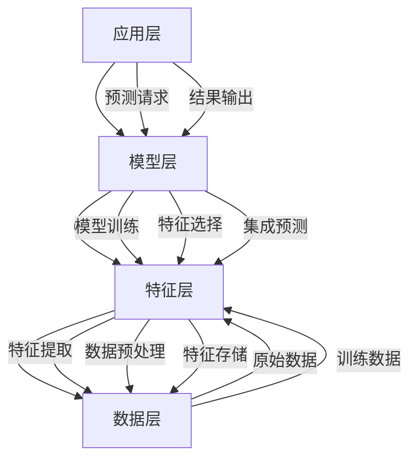
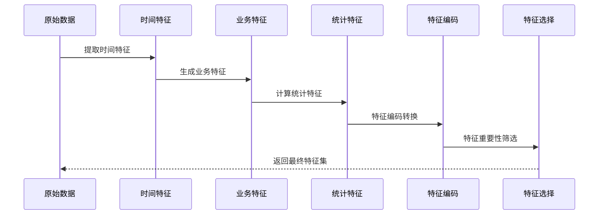
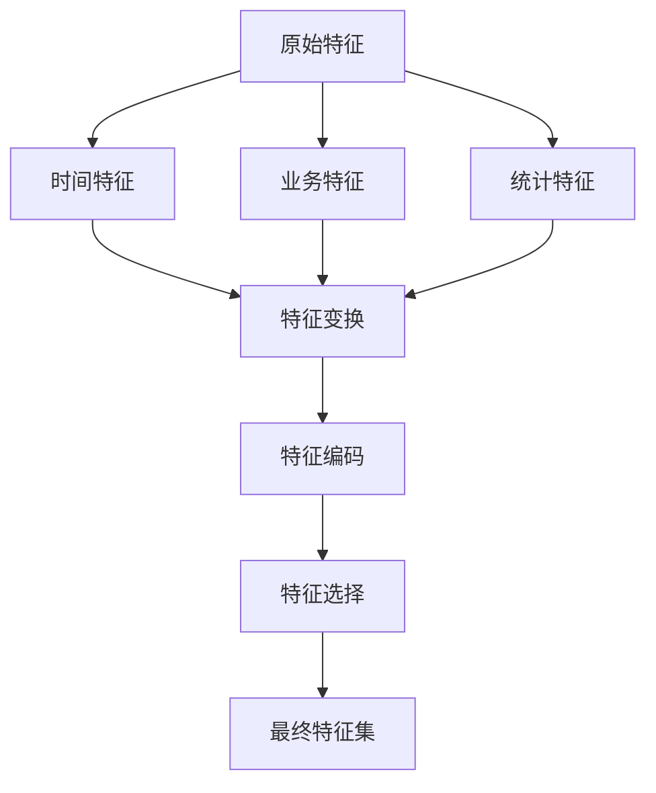
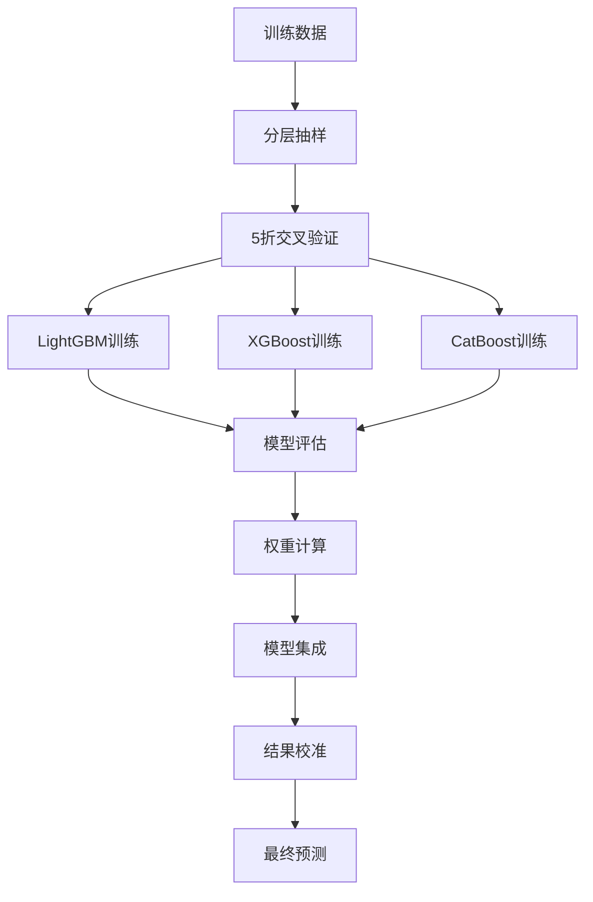

# 二手车价格预测项目 - 技术架构

## 架构概览

二手车价格预测项目采用模块化的机器学习架构设计，包含数据层、特征层、模型层和应用层四个核心层次，确保系统的可扩展性、可维护性和高性能。



## 核心组件架构

### 1. 数据预处理模块

```python
class DataPreprocessor:
    """
    数据预处理器
    核心功能：
    - 数据加载和验证
    - 缺失值处理
    - 异常值处理
    - 数据类型转换
    """
    
    def __init__(self):
        self.data_dir = get_project_path('data')
        self.missing_threshold = 0.1  # 缺失值阈值
    
    def load_data(self, train_path: str, test_path: str):
        # 加载训练和测试数据
        # 支持多种分隔符格式
        pass
    
    def handle_missing_values(self, df: pd.DataFrame):
        # 智能缺失值处理
        # 分类变量：众数填充 + 缺失标记
        # 数值变量：中位数填充
        pass
    
    def handle_outliers(self, df: pd.DataFrame):
        # power异常值处理（>600设为600）
        # 价格异常值处理
        pass
```

### 2. 特征工程流程



### 3. 模型训练架构

```python
class ModelTrainer:
    """
    模型训练器
    支持多种梯度提升框架的统一训练接口
    """
    
    def __init__(self):
        self.models = {
            'lgb': self._create_lgb_model,
            'xgb': self._create_xgb_model,
            'cat': self._create_cat_model
        }
    
    def train_with_cv(self, X, y, model_type='lgb'):
        """
        使用交叉验证训练模型
        
        Args:
            X: 特征数据
            y: 目标变量
            model_type: 模型类型
        """
        skf = StratifiedKFold(n_splits=5, shuffle=True, random_state=42)
        # 分层交叉验证训练
        pass
```

## 技术栈详解

### 1. 梯度提升框架

#### LightGBM配置
```python
lgb_params = {
    'objective': 'mae',           # 目标函数：平均绝对误差
    'metric': 'mae',              # 评估指标
    'num_leaves': 37,             # 叶子节点数
    'max_depth': 8,               # 最大深度
    'learning_rate': 0.07,        # 学习率
    'feature_fraction': 0.8,      # 特征采样率
    'bagging_fraction': 0.85,     # 数据采样率
    'lambda_l1': 0.25,            # L1正则化
    'lambda_l2': 0.25,            # L2正则化
    'min_child_samples': 18,      # 最小样本数
    'random_state': 42
}
```

#### XGBoost配置
```python
xgb_params = {
    'objective': 'reg:absoluteerror',  # 目标函数
    'eval_metric': 'mae',              # 评估指标
    'max_depth': 8,                    # 最大深度
    'learning_rate': 0.07,             # 学习率
    'subsample': 0.85,                 # 数据采样率
    'colsample_bytree': 0.8,           # 特征采样率
    'reg_alpha': 0.6,                  # L1正则化
    'reg_lambda': 0.6,                 # L2正则化
    'min_child_weight': 8,             # 最小权重
    'random_state': 42
}
```

#### CatBoost配置
```python
catboost_params = {
    'loss_function': 'MAE',       # 损失函数
    'eval_metric': 'MAE',         # 评估指标
    'depth': 8,                   # 树深度
    'learning_rate': 0.07,        # 学习率
    'iterations': 1800,           # 迭代次数
    'l2_leaf_reg': 1.2,           # L2正则化
    'random_strength': 0.35,      # 随机性强度
    'random_seed': 42,
    'verbose': False
}
```

### 2. 特征工程架构

#### 时间特征模块
```python
def create_time_features(df):
    """创建时间相关特征"""
    # 基础时间特征
    df['car_age'] = current_year - df['regDate'].dt.year
    df['reg_month'] = df['regDate'].dt.month
    df['reg_quarter'] = df['regDate'].dt.quarter
    df['reg_dayofweek'] = df['regDate'].dt.dayofweek
    
    # 季节特征
    df['reg_season'] = df['reg_month'].map(season_mapping)
    df['is_winter_reg'] = df['reg_month'].isin([12, 1, 2]).astype(int)
    df['is_summer_reg'] = df['reg_month'].isin([6, 7, 8]).astype(int)
    
    # 周期性编码
    df['reg_month_sin'] = np.sin(2 * np.pi * df['reg_month'] / 12)
    df['reg_month_cos'] = np.cos(2 * np.pi * df['reg_month'] / 12)
    
    return df
```

#### 业务特征模块
```python
def create_business_features(df):
    """创建业务逻辑特征"""
    # 功率相关特征
    df['power_age_ratio'] = df['power'] / (df['car_age'] + 1)
    df['power_decay'] = df['power'] * np.exp(-df['car_age'] * 0.05)
    df['log_power'] = np.log1p(df['power'])
    df['sqrt_power'] = np.sqrt(df['power'])
    
    # 里程相关特征
    df['km_per_year'] = df['kilometer'] / (df['car_age'] + 0.1)
    df['log_kilometer'] = np.log1p(df['kilometer'])
    df['sqrt_kilometer'] = np.sqrt(df['kilometer'])
    
    # 组合特征
    df['power_km_ratio'] = df['power'] / (df['kilometer'] + 1)
    df['age_km_interaction'] = df['car_age'] * df['kilometer'] / 1000
    
    return df
```

#### 统计特征模块
```python
def create_statistical_features(df):
    """创建统计特征"""
    # 品牌统计特征
    brand_stats = df.groupby('brand')['price'].agg(['mean', 'std', 'count', 'median'])
    df['brand_avg_price'] = df['brand'].map(brand_stats['mean'])
    df['brand_price_stability'] = df['brand'].map(brand_stats['std'] / brand_stats['mean'])
    
    # 目标编码
    for col in ['brand', 'model', 'bodyType']:
        target_mean = df.groupby(col)['price'].mean()
        df[f'{col}_target_enc'] = df[col].map(target_mean)
    
    # v特征统计
    v_cols = [f'v_{i}' for i in range(15)]
    df['v_mean'] = df[v_cols].mean(axis=1)
    df['v_std'] = df[v_cols].std(axis=1)
    df['v_max'] = df[v_cols].max(axis=1)
    df['v_min'] = df[v_cols].min(axis=1)
    
    return df
```

### 3. 模型集成架构

#### 集成策略
```python
def innovative_ensemble(lgb_pred, xgb_pred, cat_pred, scores_info):
    """
    创新集成策略
    基于性能的自适应权重分配
    """
    # 计算基础权重（基于MAE反比）
    lgb_score = np.mean(scores_info['lgb_scores'])
    xgb_score = np.mean(scores_info['xgb_scores'])
    cat_score = np.mean(scores_info['cat_scores'])
    
    total_inv_score = 1/lgb_score + 1/xgb_score + 1/cat_score
    raw_weights = {
        'lgb': (1/lgb_score) / total_inv_score,
        'xgb': (1/xgb_score) / total_inv_score,
        'cat': (1/cat_score) / total_inv_score
    }
    
    # 稳定性调整
    stability_factor = {
        'lgb': 1 / (1 + np.std(scores_info['lgb_scores']) * 2),
        'xgb': 1 / (1 + np.std(scores_info['xgb_scores']) * 2),
        'cat': 1 / (1 + np.std(scores_info['cat_scores']) * 2)
    }
    
    # 应用调整并归一化
    final_weights = apply_stability_adjustment(raw_weights, stability_factor)
    
    # 加权集成
    ensemble_pred = (final_weights['lgb'] * lgb_pred + 
                    final_weights['xgb'] * xgb_pred + 
                    final_weights['cat'] * cat_pred)
    
    return ensemble_pred
```

#### 校准算法
```python
def enhanced_calibration(predictions, y_train):
    """
    多阶段校准算法
    """
    # 第一阶段：分位数校准
    quantiles = [5, 10, 25, 40, 50, 60, 75, 90, 95]
    train_quantiles = np.percentile(y_train, quantiles)
    pred_quantiles = np.percentile(predictions, quantiles)
    quantile_factors = train_quantiles / pred_quantiles
    quantile_calibrated = apply_quantile_calibration(predictions, quantile_factors)
    
    # 第二阶段：均值校准
    mean_factor = y_train.mean() / predictions.mean()
    mean_calibrated = predictions * mean_factor
    
    # 第三阶段：中位数校准
    median_factor = y_train.median() / np.median(predictions)
    median_calibrated = predictions * median_factor
    
    # 智能权重融合
    pred_skew = (predictions.mean() - np.median(predictions)) / predictions.std()
    weights = determine_calibration_weights(pred_skew)
    
    final_predictions = (
        weights['quantile'] * quantile_calibrated +
        weights['mean'] * mean_calibrated +
        weights['median'] * median_calibrated
    )
    
    return final_predictions
```

## 数据处理流程

### 1. 数据加载流程


### 2. 特征工程流程


### 3. 模型训练流程


## 性能优化架构

### 1. 内存管理
```python
# 批量特征处理
def process_features_in_batches(df, batch_size=50000):
    """分批处理特征，避免内存溢出"""
    results = []
    for i in range(0, len(df), batch_size):
        batch = df.iloc[i:i+batch_size]
        processed = create_features(batch)
        results.append(processed)
    return pd.concat(results, ignore_index=True)
```

### 2. 并行计算
```python
from concurrent.futures import ProcessPoolExecutor

def parallel_feature_creation(df, feature_functions):
    """并行特征创建"""
    with ProcessPoolExecutor(max_workers=4) as executor:
        futures = [executor.submit(func, df) for func in feature_functions]
        results = [future.result() for future in futures]
    return combine_results(results)
```

### 3. 缓存机制
```python
import joblib
from functools import lru_cache

@lru_cache(maxsize=100)
def get_feature_importance(model_type):
    """缓存特征重要性计算结果"""
    model = load_model(model_type)
    return model.feature_importances_

def save_intermediate_results(data, filename):
    """保存中间结果，支持断点续传"""
    cache_path = get_project_path('user_data', f'{filename}.pkl')
    joblib.dump(data, cache_path)
```

## 扩展架构

### 1. 插件化设计
```python
class FeaturePlugin:
    """特征工程插件基类"""
    def __init__(self, name: str):
        self.name = name
    
    def create_features(self, df: pd.DataFrame) -> pd.DataFrame:
        raise NotImplementedError

class TimeFeaturePlugin(FeaturePlugin):
    """时间特征插件"""
    def create_features(self, df):
        # 实现时间特征创建逻辑
        pass
```

### 2. 模型扩展接口
```python
class ModelInterface:
    """模型统一接口"""
    def train(self, X, y):
        raise NotImplementedError
    
    def predict(self, X):
        raise NotImplementedError
    
    def get_feature_importance(self):
        raise NotImplementedError

class LightGBMModel(ModelInterface):
    """LightGBM模型实现"""
    def train(self, X, y):
        # 实现训练逻辑
        pass
```

---

*最后更新: 2026年2月15日*
*架构版本: v1.0*
*技术负责人: AI系统架构组*
