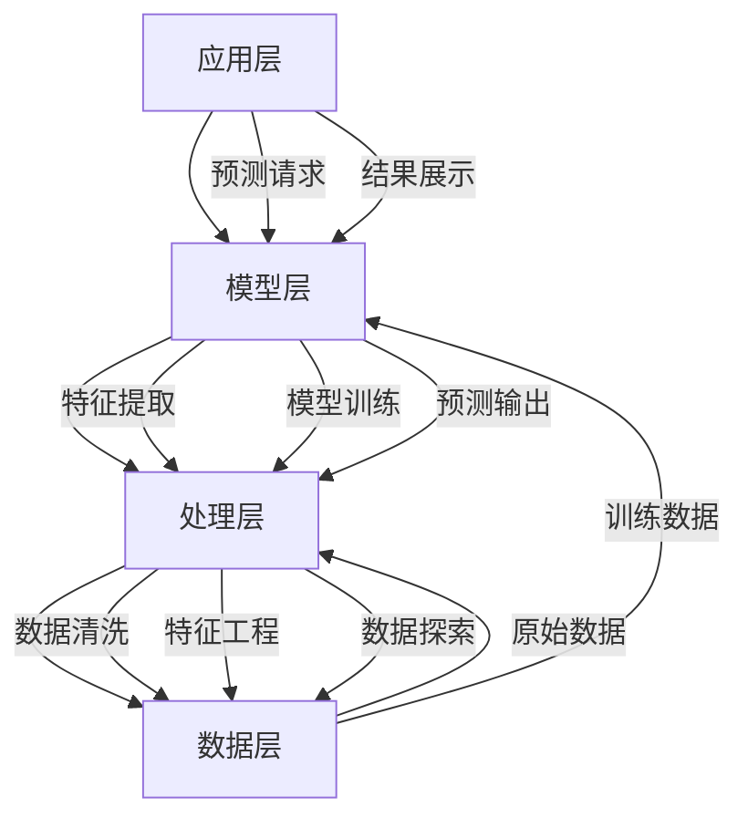
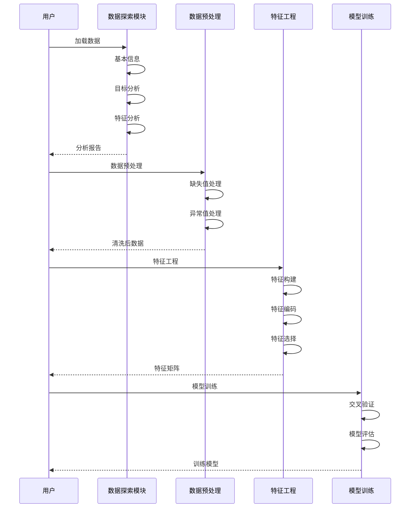

# 员工离职预测分析项目 - 技术架构

## 架构概览

员工离职预测分析项目采用模块化的机器学习架构设计，包含数据层、处理层、模型层和应用层四个核心层次，确保系统的可扩展性、可维护性和高性能。



## 核心组件架构

### 1. 数据探索模块架构

```python
class EDAModule:
    """
    数据探索性分析模块
    核心功能：
    - 数据基本信息分析
    - 目标变量分析
    - 数值特征分析
    - 分类特征分析
    - 特征关系分析
    """
    
    def __init__(self):
        self.train_df = None
        self.test_df = None
        self.numeric_cols = []
        self.categorical_cols = []
```

### 2. 数据处理流程



## 技术栈详解

### 1. 数据处理技术

#### Pandas数据处理
```python
import pandas as pd
import numpy as np

# 加载数据
train_df = pd.read_csv('data/train.csv')
test_df = pd.read_csv('data/test.csv')

# 数据基本信息
def basic_info(df, name="数据集"):
    """输出数据集基本信息"""
    print(f"形状: {df.shape[0]} 行 × {df.shape[1]} 列")
    print(f"数据类型分布:")
    print(df.dtypes.value_counts())
    
    # 缺失值检查
    missing = df.isnull().sum()
    missing_pct = (missing / len(df) * 100).round(2)
```

**技术特点：**
- **高效处理**: Pandas提供高性能数据处理能力
- **灵活操作**: 支持复杂的数据筛选和转换
- **类型支持**: 支持多种数据类型处理

### 2. 数据可视化技术

#### Matplotlib & Seaborn
```python
import matplotlib.pyplot as plt
import seaborn as sns

# 设置中文显示
plt.rcParams['font.sans-serif'] = ['SimHei', 'Arial Unicode MS', 'DejaVu Sans']
plt.rcParams['axes.unicode_minus'] = False
sns.set_style("whitegrid")

# 目标变量分布可视化
def target_analysis(df, target_col='Attrition'):
    """目标变量分析和可视化"""
    target_counts = df[target_col].value_counts()
    
    plt.figure(figsize=(10, 5))
    plt.subplot(1, 2, 1)
    target_counts.plot(kind='bar', color=['skyblue', 'salmon'])
    plt.title(f'{target_col} 分布')
    
    plt.subplot(1, 2, 2)
    plt.pie(target_counts.values, labels=target_counts.index, autopct='%1.1f%%')
    plt.title(f'{target_col} 占比')
```

**可视化类型：**
- **柱状图**: 类别分布展示
- **饼图**: 比例关系展示
- **热力图**: 相关性分析
- **箱线图**: 数值分布分析

### 3. 特征工程技术

#### 分类特征编码
```python
from sklearn.preprocessing import LabelEncoder, OneHotEncoder

# 标签编码（适用于有序分类变量）
def label_encode(df, columns):
    """标签编码"""
    le = LabelEncoder()
    for col in columns:
        df[col + '_encoded'] = le.fit_transform(df[col])
    return df

# 独热编码（适用于无序分类变量）
def one_hot_encode(df, columns):
    """独热编码"""
    return pd.get_dummies(df, columns=columns, drop_first=True)
```

#### 特征构建策略
```python
def create_features(df):
    """创建新特征"""
    # 工作稳定性特征
    df['JobStability'] = df['YearsAtCompany'] / df['TotalWorkingYears']
    
    # 满意度综合评分
    df['SatisfactionScore'] = (
        df['JobSatisfaction'] + 
        df['EnvironmentSatisfaction'] + 
        df['RelationshipSatisfaction'] + 
        df['WorkLifeBalance']
    ) / 4
    
    # 薪资相对水平
    df['IncomeLevel'] = df['MonthlyIncome'] / df.groupby('JobLevel')['MonthlyIncome'].transform('mean')
    
    # 职业发展停滞指标
    df['CareerStagnation'] = df['YearsSinceLastPromotion'] / (df['YearsAtCompany'] + 1)
    
    return df
```

### 4. 模型训练架构

#### 模型选择策略
```python
from sklearn.linear_model import LogisticRegression
from sklearn.tree import DecisionTreeClassifier
from sklearn.ensemble import RandomForestClassifier, GradientBoostingClassifier
from xgboost import XGBClassifier
from lightgbm import LGBMClassifier

# 模型字典
models = {
    'logistic_regression': LogisticRegression(random_state=42),
    'decision_tree': DecisionTreeClassifier(random_state=42),
    'random_forest': RandomForestClassifier(random_state=42),
    'gradient_boosting': GradientBoostingClassifier(random_state=42),
    'xgboost': XGBClassifier(random_state=42, use_label_encoder=False),
    'lightgbm': LGBMClassifier(random_state=42)
}
```

#### 交叉验证架构
```python
from sklearn.model_selection import cross_val_score, StratifiedKFold

def train_with_cv(model, X, y, cv=5):
    """使用交叉验证训练模型"""
    skf = StratifiedKFold(n_splits=cv, shuffle=True, random_state=42)
    
    scores = cross_val_score(model, X, y, cv=skf, scoring='f1')
    
    print(f"交叉验证F1分数: {scores.mean():.4f} (+/- {scores.std():.4f})")
    return scores
```

## 数据处理架构

### 1. 数据清洗流程


### 2. 特征工程架构

#### 特征类型划分
```python
# 特征分类
feature_categories = {
    'personal_info': ['Age', 'Gender', 'MaritalStatus', 'Education', 'EducationField'],
    'work_info': ['Department', 'JobRole', 'JobLevel', 'BusinessTravel', 'DistanceFromHome'],
    'salary_info': ['MonthlyIncome', 'MonthlyRate', 'DailyRate', 'HourlyRate', 
                    'PercentSalaryHike', 'StockOptionLevel'],
    'satisfaction': ['JobSatisfaction', 'EnvironmentSatisfaction', 
                     'RelationshipSatisfaction', 'WorkLifeBalance', 'JobInvolvement'],
    'career': ['TotalWorkingYears', 'YearsAtCompany', 'YearsInCurrentRole', 
               'YearsSinceLastPromotion', 'YearsWithCurrManager', 
               'NumCompaniesWorked', 'TrainingTimesLastYear'],
    'other': ['OverTime', 'Over18', 'PerformanceRating']
}

# 无用特征（常量或标识）
useless_features = ['EmployeeCount', 'StandardHours', 'EmployeeNumber', 'Over18', 'user_id']
```

#### 特征选择策略
```python
from sklearn.feature_selection import SelectKBest, f_classif, mutual_info_classif

def feature_selection(X, y, k=20):
    """特征选择"""
    # 单变量特征选择
    selector = SelectKBest(score_func=f_classif, k=k)
    X_selected = selector.fit_transform(X, y)
    
    # 获取选择的特征
    selected_features = X.columns[selector.get_support()].tolist()
    
    print(f"选择的 {k} 个特征: {selected_features}")
    return X_selected, selected_features
```

### 3. 类别不平衡处理

```python
from imblearn.over_sampling import SMOTE
from imblearn.under_sampling import RandomUnderSampler
from imblearn.combine import SMOTETomek

def handle_imbalance(X, y, method='smote'):
    """处理类别不平衡"""
    if method == 'smote':
        sampler = SMOTE(random_state=42)
    elif method == 'undersample':
        sampler = RandomUnderSampler(random_state=42)
    elif method == 'combine':
        sampler = SMOTETomek(random_state=42)
    
    X_resampled, y_resampled = sampler.fit_resample(X, y)
    
    print(f"原始样本分布: {y.value_counts().to_dict()}")
    print(f"重采样后分布: {pd.Series(y_resampled).value_counts().to_dict()}")
    
    return X_resampled, y_resampled
```

## 模型评估架构

### 1. 评估指标体系

```python
from sklearn.metrics import (
    accuracy_score, precision_score, recall_score, f1_score,
    roc_auc_score, confusion_matrix, classification_report
)

def evaluate_model(y_true, y_pred, y_prob=None):
    """全面评估模型性能"""
    metrics = {
        'accuracy': accuracy_score(y_true, y_pred),
        'precision': precision_score(y_true, y_pred, pos_label='Yes'),
        'recall': recall_score(y_true, y_pred, pos_label='Yes'),
        'f1': f1_score(y_true, y_pred, pos_label='Yes'),
    }
    
    if y_prob is not None:
        metrics['roc_auc'] = roc_auc_score(y_true, y_prob[:, 1])
    
    return metrics
```

### 2. 混淆矩阵可视化

```python
def plot_confusion_matrix(y_true, y_pred, labels=['No', 'Yes']):
    """绘制混淆矩阵"""
    cm = confusion_matrix(y_true, y_pred, labels=labels)
    
    plt.figure(figsize=(8, 6))
    sns.heatmap(cm, annot=True, fmt='d', cmap='Blues',
                xticklabels=labels, yticklabels=labels)
    plt.title('混淆矩阵')
    plt.xlabel('预测值')
    plt.ylabel('真实值')
    plt.show()
```

### 3. ROC曲线分析

```python
from sklearn.metrics import roc_curve, auc

def plot_roc_curve(y_true, y_prob):
    """绘制ROC曲线"""
    fpr, tpr, thresholds = roc_curve(y_true, y_prob[:, 1], pos_label='Yes')
    roc_auc = auc(fpr, tpr)
    
    plt.figure(figsize=(8, 6))
    plt.plot(fpr, tpr, color='darkorange', lw=2, 
             label=f'ROC curve (AUC = {roc_auc:.2f})')
    plt.plot([0, 1], [0, 1], color='navy', lw=2, linestyle='--')
    plt.xlim([0.0, 1.0])
    plt.ylim([0.0, 1.05])
    plt.xlabel('假正率 (False Positive Rate)')
    plt.ylabel('真正率 (True Positive Rate)')
    plt.title('ROC曲线')
    plt.legend(loc="lower right")
    plt.show()
```

## 系统配置架构

### 1. 项目路径管理

```python
from pathlib import Path

def get_project_path(*paths: str) -> Path:
    """获取项目路径的统一方法"""
    try:
        current_dir = Path(__file__).parent
        project_dir = current_dir.parent
        return project_dir.joinpath(*paths)
    except NameError:
        return Path.cwd().joinpath(*paths)

# 项目目录配置
PROJECT_DIRS = {
    'data': get_project_path('data'),
    'code': get_project_path('code'),
    'model': get_project_path('model'),
    'feature': get_project_path('feature'),
    'docs': get_project_path('docs'),
    'output': get_project_path('prediction_result')
}
```

### 2. 配置管理

```python
import json

# 模型配置
MODEL_CONFIG = {
    'random_state': 42,
    'test_size': 0.2,
    'cv_folds': 5,
    'scoring': 'f1',
    'n_jobs': -1
}

# 特征配置
FEATURE_CONFIG = {
    'target_col': 'Attrition',
    'id_col': 'user_id',
    'useless_cols': ['EmployeeCount', 'StandardHours', 'EmployeeNumber', 'Over18'],
    'numeric_cols': ['Age', 'DailyRate', 'DistanceFromHome', 'HourlyRate', 
                     'MonthlyIncome', 'MonthlyRate', 'NumCompaniesWorked', 
                     'PercentSalaryHike', 'TotalWorkingYears', 'TrainingTimesLastYear',
                     'YearsAtCompany', 'YearsInCurrentRole', 'YearsSinceLastPromotion', 
                     'YearsWithCurrManager'],
    'categorical_cols': ['BusinessTravel', 'Department', 'EducationField', 
                         'Gender', 'JobRole', 'MaritalStatus', 'OverTime']
}

def save_config(config, filepath):
    """保存配置到文件"""
    with open(filepath, 'w', encoding='utf-8') as f:
        json.dump(config, f, ensure_ascii=False, indent=2)

def load_config(filepath):
    """从文件加载配置"""
    with open(filepath, 'r', encoding='utf-8') as f:
        return json.load(f)
```

## 性能优化架构

### 1. 内存优化

```python
def optimize_memory(df):
    """优化数据框内存使用"""
    for col in df.columns:
        col_type = df[col].dtype
        
        if col_type == 'int64':
            if df[col].min() >= 0:
                if df[col].max() < 255:
                    df[col] = df[col].astype('uint8')
                elif df[col].max() < 65535:
                    df[col] = df[col].astype('uint16')
                else:
                    df[col] = df[col].astype('uint32')
            else:
                if df[col].min() > -128 and df[col].max() < 127:
                    df[col] = df[col].astype('int8')
                elif df[col].min() > -32768 and df[col].max() < 32767:
                    df[col] = df[col].astype('int16')
                else:
                    df[col] = df[col].astype('int32')
        
        elif col_type == 'float64':
            df[col] = df[col].astype('float32')
        
        elif col_type == 'object':
            if df[col].nunique() / len(df) < 0.5:
                df[col] = df[col].astype('category')
    
    return df
```

### 2. 并行处理

```python
from joblib import Parallel, delayed

def parallel_feature_engineering(df, feature_funcs):
    """并行特征工程"""
    def process_func(func, data):
        return func(data)
    
    results = Parallel(n_jobs=-1)(
        delayed(process_func)(func, df.copy()) 
        for func in feature_funcs
    )
    
    # 合并结果
    for result in results:
        df = pd.concat([df, result], axis=1)
    
    return df
```

## 扩展架构

### 1. 模型注册机制

```python
class ModelRegistry:
    """模型注册器"""
    
    _models = {}
    
    @classmethod
    def register(cls, name: str):
        """注册模型装饰器"""
        def decorator(model_class):
            cls._models[name] = model_class
            return model_class
        return decorator
    
    @classmethod
    def get_model(cls, name: str):
        """获取注册的模型"""
        return cls._models.get(name)
    
    @classmethod
    def list_models(cls):
        """列出所有注册的模型"""
        return list(cls._models.keys())

# 使用示例
@ModelRegistry.register('custom_rf')
class CustomRandomForest(RandomForestClassifier):
    """自定义随机森林"""
    pass
```

### 2. Pipeline架构

```python
from sklearn.pipeline import Pipeline
from sklearn.compose import ColumnTransformer
from sklearn.preprocessing import StandardScaler

def create_pipeline(model, numeric_cols, categorical_cols):
    """创建数据处理管道"""
    
    # 数值特征处理
    numeric_transformer = Pipeline(steps=[
        ('scaler', StandardScaler())
    ])
    
    # 分类特征处理
    categorical_transformer = Pipeline(steps=[
        ('onehot', OneHotEncoder(handle_unknown='ignore', drop='first'))
    ])
    
    # 组合转换器
    preprocessor = ColumnTransformer(
        transformers=[
            ('num', numeric_transformer, numeric_cols),
            ('cat', categorical_transformer, categorical_cols)
        ])
    
    # 完整管道
    pipeline = Pipeline(steps=[
        ('preprocessor', preprocessor),
        ('classifier', model)
    ])
    
    return pipeline
```

---

*最后更新: 2026年2月15日*
*架构版本: v1.0*
*技术负责人: AI系统架构组*
