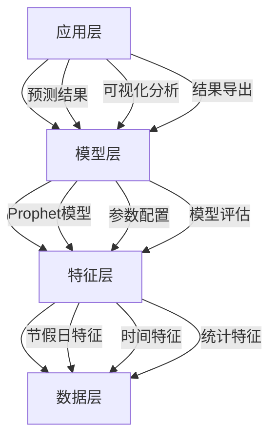
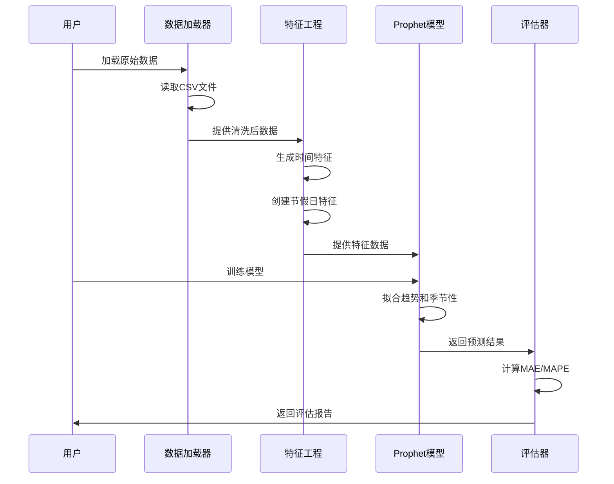

# 资金流入流出预测项目 - 技术架构

## 架构概览

资金流入流出预测项目采用模块化的数据处理和预测架构，包含数据层、特征层、模型层和应用层四个核心层次，确保系统的可扩展性、可维护性和高性能。



## 核心组件架构

### 1. Prophet预测模型架构

```python
class ProphetModel:
    """
    Prophet时间序列预测模型
    核心功能模块：
    - 趋势建模模块
    - 季节性建模模块
    - 节假日效应模块
    - 预测生成模块
    """
    
    def __init__(self, config: dict):
        # 趋势参数
        self.changepoint_prior_scale = config.get('changepoint_prior_scale', 0.05)
        self.seasonality_prior_scale = config.get('seasonality_prior_scale', 10.0)
        self.holidays_prior_scale = config.get('holidays_prior_scale', 10.0)
        
        # 季节性配置
        self.yearly_seasonality = config.get('yearly_seasonality', True)
        self.weekly_seasonality = config.get('weekly_seasonality', True)
        self.daily_seasonality = config.get('daily_seasonality', False)
        
        # 节假日配置
        self.holidays = config.get('holidays', None)
```

### 2. 数据处理流程



## 技术栈详解

### 1. Prophet模型架构

#### 核心组件
```python
from prophet import Prophet

# 创建Prophet模型实例
model = Prophet(
    # 趋势配置
    growth='linear',                    # 线性趋势
    changepoint_prior_scale=0.05,       # 变点敏感度
    changepoint_range=0.8,              # 变点范围
    
    # 季节性配置
    yearly_seasonality=True,            # 年度季节性
    weekly_seasonality=True,            # 周度季节性
    daily_seasonality=False,            # 日度季节性（不适用）
    seasonality_mode='additive',        # 加法模式
    
    # 节假日配置
    holidays=holidays_df,               # 节假日数据
    holidays_prior_scale=10.0,          # 节假日权重
    
    # 不确定性区间
    interval_width=0.95,                # 置信区间宽度
    mcmc_samples=0                      # MCMC采样数
)
```

**模型特点：**
- **趋势建模**: 自动检测趋势变点
- **季节性分解**: 傅里叶级数拟合季节性
- **节假日效应**: 灵活的节假日建模
- **不确定性量化**: 提供预测置信区间

### 2. 数据加载架构

#### DataLoader类设计
```python
class DataLoader:
    """数据加载工具类"""
    
    def __init__(self, data_dir: str):
        self.data_dir = data_dir
        self.cache = {}  # 数据缓存
    
    def load_user_balance(self) -> pd.DataFrame:
        """加载用户余额数据"""
        file_path = os.path.join(self.data_dir, 'user_balance_table.csv')
        df = pd.read_csv(file_path)
        
        # 数据清洗
        df['report_date'] = pd.to_datetime(df['report_date'], format='%Y%m%d')
        df = df.sort_values('report_date')
        
        return df
    
    def aggregate_daily(self, df: pd.DataFrame) -> pd.DataFrame:
        """聚合每日数据"""
        daily_df = df.groupby('report_date').agg({
            'total_purchase_amt': 'sum',
            'total_redeem_amt': 'sum'
        }).reset_index()
        
        return daily_df
```

### 3. 特征工程架构

#### 时间特征生成
```python
def create_time_features(df: pd.DataFrame) -> pd.DataFrame:
    """创建时间特征"""
    df = df.copy()
    
    # 基础时间特征
    df['year'] = df['ds'].dt.year
    df['month'] = df['ds'].dt.month
    df['day'] = df['ds'].dt.day
    df['dayofweek'] = df['ds'].dt.dayofweek
    df['dayofyear'] = df['ds'].dt.dayofyear
    
    # 周末标识
    df['is_weekend'] = df['dayofweek'].isin([5, 6]).astype(int)
    
    # 月初月末标识
    df['is_month_start'] = df['ds'].dt.is_month_start.astype(int)
    df['is_month_end'] = df['ds'].dt.is_month_end.astype(int)
    
    return df
```

#### 节假日特征建模
```python
def create_china_holidays() -> pd.DataFrame:
    """创建中国节假日特征"""
    holidays = []
    
    # 2013年节假日
    holidays.extend([
        {'holiday': '元旦', 'ds': '2013-01-01', 'lower_window': 0, 'upper_window': 0},
        {'holiday': '春节', 'ds': '2013-02-10', 'lower_window': -1, 'upper_window': 6},
        {'holiday': '清明节', 'ds': '2013-04-04', 'lower_window': 0, 'upper_window': 2},
        {'holiday': '劳动节', 'ds': '2013-05-01', 'lower_window': 0, 'upper_window': 0},
        {'holiday': '端午节', 'ds': '2013-06-12', 'lower_window': 0, 'upper_window': 0},
        {'holiday': '中秋节', 'ds': '2013-09-19', 'lower_window': 0, 'upper_window': 2},
        {'holiday': '国庆节', 'ds': '2013-10-01', 'lower_window': 0, 'upper_window': 6},
    ])
    
    # 2014年节假日
    holidays.extend([
        {'holiday': '元旦', 'ds': '2014-01-01', 'lower_window': 0, 'upper_window': 0},
        {'holiday': '春节', 'ds': '2014-01-31', 'lower_window': -1, 'upper_window': 6},
        {'holiday': '清明节', 'ds': '2014-04-05', 'lower_window': 0, 'upper_window': 2},
        {'holiday': '劳动节', 'ds': '2014-05-01', 'lower_window': 0, 'upper_window': 2},
        {'holiday': '端午节', 'ds': '2014-05-31', 'lower_window': 0, 'upper_window': 2},
        {'holiday': '中秋节', 'ds': '2014-09-06', 'lower_window': 0, 'upper_window': 2},
        {'holiday': '国庆节', 'ds': '2014-10-01', 'lower_window': 0, 'upper_window': 6},
    ])
    
    return pd.DataFrame(holidays)
```

### 4. 时间序列分析架构

#### 平稳性检验
```python
from statsmodels.tsa.stattools import adfuller

def adf_test(series: pd.Series, name: str) -> dict:
    """执行ADF平稳性检验"""
    result = adfuller(series.dropna(), autolag='AIC')
    
    return {
        'name': name,
        'adf_statistic': result[0],
        'p_value': result[1],
        'used_lag': result[2],
        'n_obs': result[3],
        'critical_values': result[4],
        'is_stationary': result[1] <= 0.05
    }
```

#### 差分分析
```python
def differencing_analysis(series: pd.Series, max_diff: int = 2) -> dict:
    """差分分析，确定差分阶数"""
    results = {}
    current_series = series.copy()
    
    for d in range(max_diff + 1):
        adf_result = adf_test(current_series, f'diff_{d}')
        results[f'diff_{d}'] = adf_result
        
        if adf_result['is_stationary']:
            break
        
        current_series = current_series.diff().dropna()
    
    return results
```

## 系统配置架构

### 1. 项目路径管理
```python
def get_project_path(*paths: str) -> str:
    """获取项目路径的统一方法"""
    try:
        current_dir = os.path.dirname(os.path.abspath(__file__))
        project_dir = os.path.dirname(current_dir)
        return os.path.join(project_dir, *paths)
    except NameError:
        return os.path.join(os.getcwd(), *paths)
```

### 2. 目录结构
```
CASE-资金流入流出预测-P1/
├── data/                    # 原始数据
│   ├── user_balance_table.csv
│   ├── user_profile_table.csv
│   ├── mfd_bank_shibor.csv
│   └── mfd_day_share_interest.csv
├── user_data/               # 处理后数据
│   ├── daily_summary.csv
│   ├── filtered_data.csv
│   └── chart_data.json
├── model/                   # 模型存储
│   ├── purchase_prophet_v6_model.pkl
│   └── redeem_prophet_v6_model.pkl
├── prediction_result/       # 预测结果
│   └── prophet_v6_predictions_201409.csv
├── code/                    # 核心代码
│   └── prophet_v6_prediction.py
├── feature/                 # 特征工程
│   ├── data_analysis.py
│   ├── data_loader.py
│   └── time_series_analysis.py
└── docs/                    # 文档
```

### 3. 模型配置管理
```python
# Prophet模型配置
PROPHET_CONFIG = {
    # 趋势参数
    'changepoint_prior_scale': 0.05,      # 变点敏感度
    'seasonality_prior_scale': 10.0,      # 季节性权重
    'holidays_prior_scale': 10.0,         # 节假日权重
    
    # 季节性参数
    'yearly_seasonality': True,           # 年度季节性
    'weekly_seasonality': True,           # 周度季节性
    'daily_seasonality': False,           # 日度季节性
    'seasonality_mode': 'additive',       # 加法模式
    
    # 预测参数
    'interval_width': 0.95,               # 置信区间
    'mcmc_samples': 0,                    # MCMC采样
    
    # 预测范围
    'forecast_periods': 30,               # 预测天数
}
```

## 性能优化架构

### 1. 数据处理优化
```python
# 使用迭代器处理大数据
def process_large_data(file_path: str, chunk_size: int = 10000):
    """分块处理大数据"""
    for chunk in pd.read_csv(file_path, chunksize=chunk_size):
        processed_chunk = process_chunk(chunk)
        yield processed_chunk

# 使用缓存机制
from functools import lru_cache

@lru_cache(maxsize=128)
def get_holiday_features(date_str: str):
    """缓存节假日特征"""
    return calculate_holiday_features(date_str)
```

### 2. 模型训练优化
```python
# 并行训练多个模型
from concurrent.futures import ProcessPoolExecutor

def train_models_parallel(configs: list):
    """并行训练多个模型配置"""
    with ProcessPoolExecutor(max_workers=4) as executor:
        futures = [executor.submit(train_model, config) for config in configs]
        results = [future.result() for future in futures]
    return results
```

### 3. 内存管理
```python
# 及时释放内存
def train_and_predict(config: dict):
    """训练和预测，自动管理内存"""
    # 训练模型
    model = Prophet(**config)
    model.fit(train_data)
    
    # 预测
    forecast = model.predict(future_df)
    
    # 保存结果后释放内存
    save_forecast(forecast)
    del model
    gc.collect()
    
    return forecast
```

## 扩展架构

### 1. 多模型集成
```python
class EnsemblePredictor:
    """集成预测器"""
    
    def __init__(self):
        self.models = {
            'prophet': ProphetModel(),
            'arima': ARIMAModel(),
            'lstm': LSTMModel()
        }
        self.weights = {
            'prophet': 0.5,
            'arima': 0.3,
            'lstm': 0.2
        }
    
    def predict(self, future_periods: int):
        """加权集成预测"""
        predictions = {}
        for name, model in self.models.items():
            predictions[name] = model.predict(future_periods)
        
        # 加权平均
        ensemble_pred = sum(
            predictions[name] * self.weights[name]
            for name in self.models.keys()
        )
        
        return ensemble_pred
```

### 2. 自动化调参
```python
from sklearn.model_selection import ParameterGrid

def auto_tune_prophet(train_data: pd.DataFrame, param_grid: dict):
    """自动调参Prophet模型"""
    best_score = float('inf')
    best_params = None
    
    for params in ParameterGrid(param_grid):
        model = Prophet(**params)
        model.fit(train_data)
        
        # 交叉验证评估
        score = cross_validate(model, train_data)
        
        if score < best_score:
            best_score = score
            best_params = params
    
    return best_params, best_score
```

---

*最后更新: 2026年2月15日*
*架构版本: v1.0*
*技术负责人: AI系统架构组*
