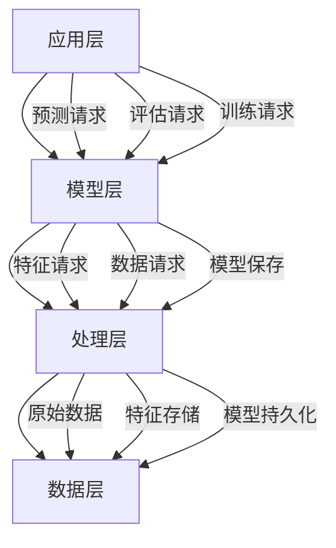
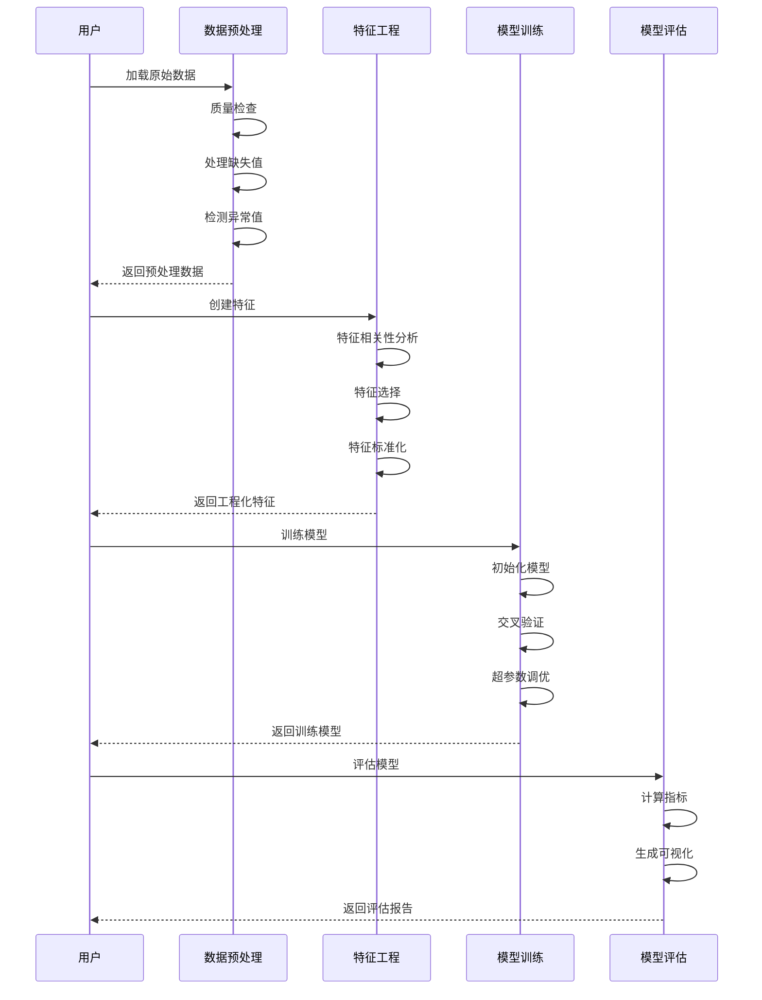

# 波士顿房价预测系统 - 技术架构

## 架构概览

波士顿房价预测系统采用分层模块化架构设计，包含数据层、处理层、模型层和应用层四个核心层次，确保系统的可扩展性、可维护性和高性能。



## 核心组件架构

### 1. 数据预处理架构

```python
# 数据预处理模块核心结构
class DataPreprocessor:
    """
    数据预处理核心模块
    功能：
    - 数据加载
    - 质量检查
    - 缺失值处理
    - 异常值检测
    - 统计分析
    """
    
    def __init__(self, data_path: str):
        self.data_path = data_path
        self.raw_data = None
        self.processed_data = None
        self.quality_report = {}
```

### 2. 数据处理流程



## 技术栈详解

### 1. 数据处理技术

#### Pandas数据处理
```python
import pandas as pd
import numpy as np

def load_boston_data():
    """加载波士顿房价数据"""
    # 从CSV文件加载
    df = pd.read_csv('data/housing.csv')
    
    # 特征和目标分离
    X = df.drop('MEDV', axis=1)
    y = df['MEDV']
    
    return X, y

def check_data_quality(df):
    """数据质量检查"""
    report = {
        'shape': df.shape,
        'missing_values': df.isnull().sum().to_dict(),
        'duplicates': df.duplicated().sum(),
        'dtypes': df.dtypes.to_dict()
    }
    return report
```

**技术特点：**
- **高效处理**: 基于NumPy的向量化操作
- **灵活索引**: 支持多种索引和切片方式
- **数据对齐**: 自动处理数据对齐问题

### 2. 特征工程技术

#### 特征标准化
```python
from sklearn.preprocessing import StandardScaler, MinMaxScaler, RobustScaler

def scale_features(X, method='standard'):
    """
    特征标准化
    
    Args:
        X: 特征数据
        method: 标准化方法
            - 'standard': 均值0方差1
            - 'minmax': 缩放到[0,1]
            - 'robust': 基于中位数和四分位数
    """
    scalers = {
        'standard': StandardScaler(),
        'minmax': MinMaxScaler(),
        'robust': RobustScaler()
    }
    
    scaler = scalers[method]
    X_scaled = scaler.fit_transform(X)
    
    return X_scaled, scaler
```

#### 多项式特征
```python
from sklearn.preprocessing import PolynomialFeatures

def create_polynomial_features(X, degree=2):
    """创建多项式特征"""
    poly = PolynomialFeatures(degree=degree, include_bias=False)
    X_poly = poly.fit_transform(X)
    return X_poly, poly
```

**特征处理策略：**
- **标准化**: 处理不同量纲的特征
- **归一化**: 将特征缩放到统一范围
- **多项式**: 捕捉特征间的非线性关系

### 3. 机器学习模型

#### 线性模型
```python
from sklearn.linear_model import LinearRegression, Ridge, Lasso

# 线性回归
linear_model = LinearRegression()

# 岭回归（L2正则化）
ridge_model = Ridge(alpha=1.0)

# Lasso回归（L1正则化）
lasso_model = Lasso(alpha=1.0)
```

**线性模型特点：**
- **计算高效**: 训练速度快
- **可解释性强**: 系数直接反映特征重要性
- **适合高维数据**: 在特征数大于样本数时表现良好

#### 集成学习模型
```python
from sklearn.ensemble import RandomForestRegressor, GradientBoostingRegressor

# 随机森林
rf_model = RandomForestRegressor(
    n_estimators=100,
    max_depth=None,
    min_samples_split=2,
    random_state=42
)

# 梯度提升
gb_model = GradientBoostingRegressor(
    n_estimators=100,
    learning_rate=0.1,
    max_depth=3,
    random_state=42
)
```

**集成模型特点：**
- **高精度**: 通常比单一模型表现更好
- **抗过拟合**: 通过集成降低方差
- **特征重要性**: 自动计算特征重要性

#### 支持向量机
```python
from sklearn.svm import SVR

svr_model = SVR(
    kernel='rbf',
    C=1.0,
    epsilon=0.1,
    gamma='scale'
)
```

**SVR特点：**
- **非线性映射**: 通过核函数处理非线性问题
- **鲁棒性**: 对异常值不敏感
- **参数敏感**: 需要仔细调参

#### 神经网络
```python
from sklearn.neural_network import MLPRegressor

mlp_model = MLPRegressor(
    hidden_layer_sizes=(100, 50),
    activation='relu',
    solver='adam',
    alpha=0.0001,
    learning_rate='adaptive',
    max_iter=1000,
    random_state=42
)
```

**神经网络特点：**
- **强大表达能力**: 可以拟合复杂函数
- **自动特征学习**: 不需要显式特征工程
- **训练时间长**: 需要更多计算资源

### 4. 模型评估技术

#### 评估指标
```python
from sklearn.metrics import (
    mean_absolute_error,
    mean_squared_error,
    r2_score,
    explained_variance_score
)

def evaluate_model(y_true, y_pred):
    """计算所有评估指标"""
    metrics = {
        'MAE': mean_absolute_error(y_true, y_pred),
        'MSE': mean_squared_error(y_true, y_pred),
        'RMSE': np.sqrt(mean_squared_error(y_true, y_pred)),
        'R2': r2_score(y_true, y_pred),
        'Explained_Variance': explained_variance_score(y_true, y_pred)
    }
    return metrics
```

**指标解释：**
- **MAE**: 平均绝对误差，直观反映预测偏差
- **RMSE**: 均方根误差，对大误差更敏感
- **R²**: 决定系数，反映模型解释能力
- **Explained Variance**: 解释方差，衡量模型稳定性

## 系统配置架构

### 1. 项目路径管理
```python
import os
from pathlib import Path

def get_project_path(*paths: str) -> str:
    """获取项目路径的统一方法"""
    try:
        current_dir = Path(__file__).parent
        project_dir = current_dir.parent
        return project_dir.joinpath(*paths)
    except NameError:
        return Path.cwd().joinpath(*paths)

# 目录结构
PROJECT_DIRS = {
    'data': 'data/',
    'model': 'model/',
    'feature': 'feature/',
    'prediction_result': 'prediction_result/',
    'user_data': 'user_data/'
}
```

### 2. 配置管理
```python
# 模型配置
MODEL_CONFIG = {
    'linear_regression': {
        'fit_intercept': True,
        'normalize': False
    },
    'ridge': {
        'alpha': 1.0,
        'solver': 'auto'
    },
    'lasso': {
        'alpha': 1.0,
        'max_iter': 1000
    },
    'random_forest': {
        'n_estimators': 100,
        'max_depth': None,
        'min_samples_split': 2,
        'random_state': 42
    },
    'gradient_boosting': {
        'n_estimators': 100,
        'learning_rate': 0.1,
        'max_depth': 3,
        'random_state': 42
    },
    'svr': {
        'kernel': 'rbf',
        'C': 1.0,
        'epsilon': 0.1
    },
    'neural_network': {
        'hidden_layer_sizes': (100, 50),
        'activation': 'relu',
        'solver': 'adam',
        'max_iter': 1000,
        'random_state': 42
    }
}

# 训练配置
TRAINING_CONFIG = {
    'test_size': 0.2,
    'random_state': 42,
    'cv_folds': 5,
    'scoring': 'neg_mean_squared_error'
}
```

## 性能优化架构

### 1. 数据处理优化
```python
# 批量处理
def batch_process(data, batch_size=1000):
    """批量处理大数据集"""
    results = []
    for i in range(0, len(data), batch_size):
        batch = data[i:i+batch_size]
        processed = process_batch(batch)
        results.append(processed)
    return pd.concat(results)

# 内存优化
def optimize_memory(df):
    """优化DataFrame内存使用"""
    for col in df.columns:
        if df[col].dtype == 'float64':
            df[col] = df[col].astype('float32')
        elif df[col].dtype == 'int64':
            df[col] = df[col].astype('int32')
    return df
```

### 2. 模型训练优化
```python
# 并行训练
from joblib import Parallel, delayed

def train_models_parallel(models, X_train, y_train, n_jobs=-1):
    """并行训练多个模型"""
    def train_single(model, X, y):
        model.fit(X, y)
        return model
    
    trained_models = Parallel(n_jobs=n_jobs)(
        delayed(train_single)(model, X_train, y_train) 
        for model in models.values()
    )
    
    return dict(zip(models.keys(), trained_models))

# 缓存机制
from functools import lru_cache

@lru_cache(maxsize=128)
def cached_feature_engineering(feature_hash):
    """缓存特征工程结果"""
    return engineer_features(feature_hash)
```

## 安全架构

### 1. 数据安全
- **输入验证**: 对所有输入数据进行格式和范围验证
- **异常处理**: 完善的异常捕获和处理机制
- **数据备份**: 定期备份训练数据和模型

### 2. 模型安全
- **版本控制**: 对模型进行版本管理
- **回滚机制**: 支持模型快速回滚
- **访问控制**: 模型文件的访问权限控制

## 扩展架构

### 1. 插件化设计
```python
class ModelPlugin:
    """模型插件基类"""
    
    def __init__(self, name: str):
        self.name = name
    
    def train(self, X, y):
        raise NotImplementedError
    
    def predict(self, X):
        raise NotImplementedError
    
    def evaluate(self, X, y):
        raise NotImplementedError

class ModelRegistry:
    """模型注册表"""
    
    _models = {}
    
    @classmethod
    def register(cls, name: str, model_class):
        cls._models[name] = model_class
    
    @classmethod
    def get(cls, name: str):
        return cls._models.get(name)
```

### 2. 自适应学习
```python
class AdaptiveLearner:
    """自适应学习器"""
    
    def __init__(self):
        self.performance_history = []
        self.best_config = None
    
    def optimize_config(self):
        """基于历史性能优化配置"""
        # 分析历史性能
        # 自动调整超参数
        pass
    
    def update_model(self, new_data):
        """增量更新模型"""
        # 使用新数据更新模型
        pass
```

---

*最后更新: 2026年2月15日*
*架构版本: v1.0*
*技术负责人: AI系统架构组*
