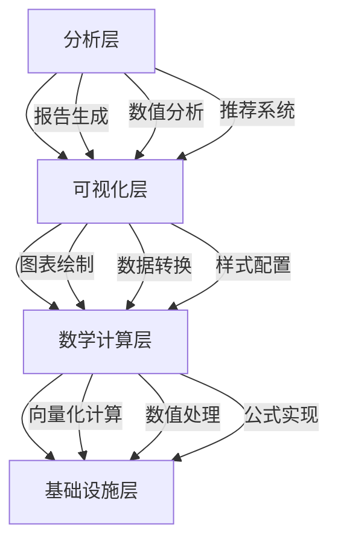
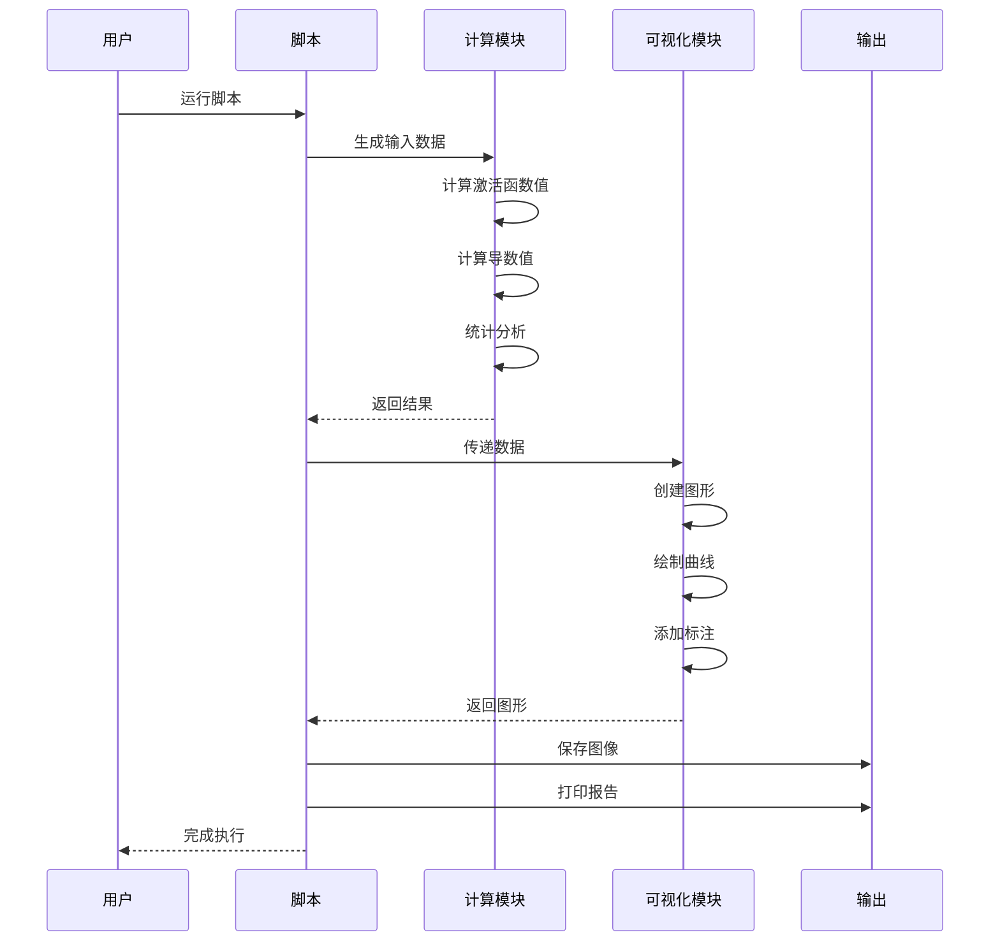

# 激活函数示例项目 - 技术架构

## 架构概览

激活函数示例项目采用模块化架构设计，包含数学计算层、可视化层和分析层三个核心层次，确保系统的可扩展性、可维护性和高性能。



## 核心组件架构

### 1. 激活函数模块

```python
class ActivationFunctions:
    """
    激活函数核心模块
    包含三种主要激活函数的实现
    """
    
    @staticmethod
    def sigmoid(x: np.ndarray) -> np.ndarray:
        """Sigmoid激活函数: σ(x) = 1/(1+e^(-x))"""
        return 1 / (1 + np.exp(-x))
    
    @staticmethod
    def tanh(x: np.ndarray) -> np.ndarray:
        """Tanh激活函数: tanh(x) = (e^x-e^(-x))/(e^x+e^(-x))"""
        return np.tanh(x)
    
    @staticmethod
    def relu(x: np.ndarray) -> np.ndarray:
        """ReLU激活函数: ReLU(x) = max(0, x)"""
        return np.maximum(0, x)
```

### 2. 导数计算模块

```python
class ActivationDerivatives:
    """
    激活函数导数计算模块
    用于分析反向传播能力
    """
    
    @staticmethod
    def sigmoid_derivative(x: np.ndarray) -> np.ndarray:
        """Sigmoid导数: σ'(x) = σ(x)(1-σ(x))"""
        s = ActivationFunctions.sigmoid(x)
        return s * (1 - s)
    
    @staticmethod
    def tanh_derivative(x: np.ndarray) -> np.ndarray:
        """Tanh导数: tanh'(x) = 1-tanh²(x)"""
        t = ActivationFunctions.tanh(x)
        return 1 - t**2
    
    @staticmethod
    def relu_derivative(x: np.ndarray) -> np.ndarray:
        """ReLU导数: ReLU'(x) = 1 if x>0 else 0"""
        return np.where(x > 0, 1.0, 0.0)
```

### 3. 可视化系统架构

```python
class VisualizationSystem:
    """
    可视化系统架构
    支持多种图表类型和布局
    """
    
    def __init__(self):
        self.fig = None
        self.axes = None
        self.config = VisualizationConfig()
    
    def create_figure(self, layout: str = "grid"):
        """创建图形画布"""
        pass
    
    def plot_activation(self, x: np.ndarray, y: np.ndarray, 
                       style: PlotStyle) -> None:
        """绘制激活函数曲线"""
        pass
    
    def add_annotations(self, points: List[Point]) -> None:
        """添加标注"""
        pass
    
    def save_figure(self, path: str, dpi: int = 300) -> None:
        """保存图像"""
        pass
```

## 激活函数数学原理

### 1. Sigmoid函数

#### 数学定义
$$\sigma(x) = \frac{1}{1 + e^{-x}}$$

#### 导数公式
$$\sigma'(x) = \sigma(x)(1 - \sigma(x))$$

#### 特性分析
- **输出范围**: (0, 1)
- **导数最大值**: 0.25（在x=0处）
- **计算复杂度**: 高（需要指数运算）
- **梯度消失**: |x| > 5 时导数接近0

#### 优缺点
| 优点 | 缺点 |
|------|------|
| 输出可解释为概率 | 梯度消失严重 |
| 平滑可微 | 计算开销大 |
| 输出有界 | 输出非零中心 |

### 2. Tanh函数

#### 数学定义
$$\tanh(x) = \frac{e^x - e^{-x}}{e^x + e^{-x}}$$

#### 导数公式
$$\tanh'(x) = 1 - \tanh^2(x)$$

#### 特性分析
- **输出范围**: (-1, 1)
- **导数最大值**: 1.0（在x=0处）
- **计算复杂度**: 高（需要指数运算）
- **梯度消失**: |x| > 3 时导数快速下降

#### 优缺点
| 优点 | 缺点 |
|------|------|
| 零中心化输出 | 仍有梯度消失 |
| 收敛速度快于Sigmoid | 计算开销大 |
| 导数范围更大 | 输出范围有限 |

### 3. ReLU函数

#### 数学定义
$$\text{ReLU}(x) = \max(0, x)$$

#### 导数公式
$$\text{ReLU}'(x) = \begin{cases} 1 & \text{if } x > 0 \\ 0 & \text{if } x \leq 0 \end{cases}$$

#### 特性分析
- **输出范围**: [0, +∞)
- **导数值**: 1 或 0
- **计算复杂度**: 低（简单比较）
- **梯度消失**: 完全缓解（正值区域）

#### 优缺点
| 优点 | 缺点 |
|------|------|
| 计算极快 | 死亡ReLU问题 |
| 缓解梯度消失 | 输出非零中心 |
| 稀疏激活 | x=0处不可微 |

## 梯度消失问题分析

### 问题本质

梯度消失是深度神经网络训练中的核心问题，源于链式法则的连续乘法：

$$\frac{\partial L}{\partial w_1} = \frac{\partial L}{\partial a_n} \cdot \prod_{i=1}^{n} \frac{\partial a_i}{\partial z_i} \cdot \frac{\partial z_i}{\partial w_i}$$

当激活函数导数小于1时，多层乘法会导致梯度指数级衰减。

### 各激活函数梯度消失对比

| 激活函数 | 导数范围 | 梯度消失程度 | 建议网络深度 |
|----------|----------|--------------|--------------|
| Sigmoid | (0, 0.25] | 严重 | < 5层 |
| Tanh | (0, 1] | 中等 | < 10层 |
| ReLU | {0, 1} | 轻微 | > 100层 |

### 解决方案

1. **使用ReLU系列激活函数**: 导数为1或0，有效缓解梯度消失
2. **批归一化**: 规范化每层输入，稳定梯度流
3. **残差连接**: 梯度可直接跨层传递
4. **合适的权重初始化**: He初始化配合ReLU使用

## 可视化系统设计

### 1. 图表布局系统

```python
class LayoutManager:
    """图表布局管理器"""
    
    # 预设布局配置
    LAYOUTS = {
        'single': {'figsize': (10, 6), 'subplot': (1, 1)},
        'comparison': {'figsize': (12, 8), 'subplot': (2, 2)},
        'comprehensive': {'figsize': (22, 16), 'subplot': (4, 4)},
        'derivatives': {'figsize': (15, 10), 'subplot': (2, 2)}
    }
    
    def get_layout(self, name: str) -> Dict:
        return self.LAYOUTS.get(name, self.LAYOUTS['single'])
```

### 2. 样式配置系统

```python
class StyleConfig:
    """样式配置"""
    
    # 颜色方案
    COLORS = {
        'sigmoid': '#1f77b4',  # 蓝色
        'tanh': '#d62728',     # 红色
        'relu': '#2ca02c'      # 绿色
    }
    
    # 线条样式
    LINE_STYLES = {
        'solid': '-',
        'dashed': '--',
        'dotted': ':'
    }
    
    # 标记样式
    MARKERS = {
        'sigmoid': 'o',
        'tanh': 's',
        'relu': '^'
    }
    
    # 字体配置
    FONT_CONFIG = {
        'family': ['SimHei', 'Arial Unicode MS', 'DejaVu Sans'],
        'size': 10,
        'weight': 'normal'
    }
```

### 3. 标注系统

```python
class AnnotationSystem:
    """标注系统"""
    
    def add_point_annotation(self, ax, x, y, text, 
                            offset=(8, 8), style='round'):
        """添加点标注"""
        ax.annotate(
            text, (x, y),
            xytext=offset,
            textcoords='offset points',
            bbox=dict(boxstyle=f"round,pad=0.3", 
                     facecolor=self.color, alpha=0.3),
            fontsize=9,
            ha='center'
        )
    
    def add_text_box(self, ax, x, y, text, style='info'):
        """添加文本框"""
        styles = {
            'info': dict(facecolor='#f8f9fa', alpha=0.9),
            'warning': dict(facecolor='#fff3cd', alpha=0.9),
            'success': dict(facecolor='#d4edda', alpha=0.9)
        }
        ax.text(x, y, text, 
               bbox=dict(boxstyle="round,pad=0.5", **styles[style]))
```

## 数据流架构

### 1. 数据处理流程



### 2. 计算优化策略

```python
class OptimizedCalculator:
    """优化计算器"""
    
    def vectorized_compute(self, x: np.ndarray, 
                          functions: List[Callable]) -> Dict[str, np.ndarray]:
        """向量化计算多个函数"""
        return {func.__name__: func(x) for func in functions}
    
    def batch_compute(self, x_list: List[np.ndarray], 
                     func: Callable) -> List[np.ndarray]:
        """批量计算"""
        return [func(x) for x in x_list]
    
    def cache_result(self, key: str, value: Any) -> None:
        """缓存计算结果"""
        self._cache[key] = value
```

## 扩展架构

### 1. 插件化激活函数

```python
class ActivationPlugin:
    """激活函数插件接口"""
    
    @property
    def name(self) -> str:
        """激活函数名称"""
        raise NotImplementedError
    
    @property
    def formula(self) -> str:
        """数学公式"""
        raise NotImplementedError
    
    def forward(self, x: np.ndarray) -> np.ndarray:
        """前向计算"""
        raise NotImplementedError
    
    def derivative(self, x: np.ndarray) -> np.ndarray:
        """导数计算"""
        raise NotImplementedError
    
    @property
    def output_range(self) -> Tuple[float, float]:
        """输出范围"""
        raise NotImplementedError
```

### 2. 示例：Leaky ReLU实现

```python
class LeakyReLU(ActivationPlugin):
    """Leaky ReLU激活函数"""
    
    def __init__(self, alpha: float = 0.01):
        self.alpha = alpha
    
    @property
    def name(self) -> str:
        return "Leaky ReLU"
    
    @property
    def formula(self) -> str:
        return f"max({self.alpha}x, x)"
    
    def forward(self, x: np.ndarray) -> np.ndarray:
        return np.where(x > 0, x, self.alpha * x)
    
    def derivative(self, x: np.ndarray) -> np.ndarray:
        return np.where(x > 0, 1.0, self.alpha)
    
    @property
    def output_range(self) -> Tuple[float, float]:
        return (float('-inf'), float('inf'))
```

### 3. 激活函数注册系统

```python
class ActivationRegistry:
    """激活函数注册中心"""
    
    _functions: Dict[str, ActivationPlugin] = {}
    
    @classmethod
    def register(cls, activation: ActivationPlugin) -> None:
        """注册激活函数"""
        cls._functions[activation.name] = activation
    
    @classmethod
    def get(cls, name: str) -> ActivationPlugin:
        """获取激活函数"""
        return cls._functions.get(name)
    
    @classmethod
    def list_all(cls) -> List[str]:
        """列出所有激活函数"""
        return list(cls._functions.keys())
```

## 激活函数选型指南

### 按网络类型选择

| 网络类型 | 推荐激活函数 | 原因 |
|----------|--------------|------|
| 深度前馈网络 | ReLU/Leaky ReLU | 缓解梯度消失，计算高效 |
| CNN | ReLU | 稀疏激活，特征选择 |
| RNN/LSTM | Tanh | 零中心化，适合序列 |
| 生成网络 | Leaky ReLU/ELU | 避免死亡神经元 |
| GAN | Leaky ReLU | 稳定训练 |

### 按层级选择

| 层级 | 推荐激活函数 | 原因 |
|------|--------------|------|
| 隐藏层 | ReLU/Leaky ReLU | 高效，缓解梯度消失 |
| 输出层-二分类 | Sigmoid | 概率输出 |
| 输出层-多分类 | Softmax | 概率分布 |
| 输出层-回归 | 线性(无激活) | 无界输出 |

### 按问题规模选择

| 问题规模 | 推荐激活函数 | 原因 |
|----------|--------------|------|
| 浅层网络(< 5层) | Tanh/Sigmoid | 简单问题，稳定训练 |
| 中层网络(5-20层) | ReLU | 平衡性能和稳定 |
| 深层网络(> 20层) | ReLU + BatchNorm | 深度训练必备 |

---

*最后更新: 2026年2月15日*
*架构版本: v1.0*
*技术负责人: AI系统架构组*
