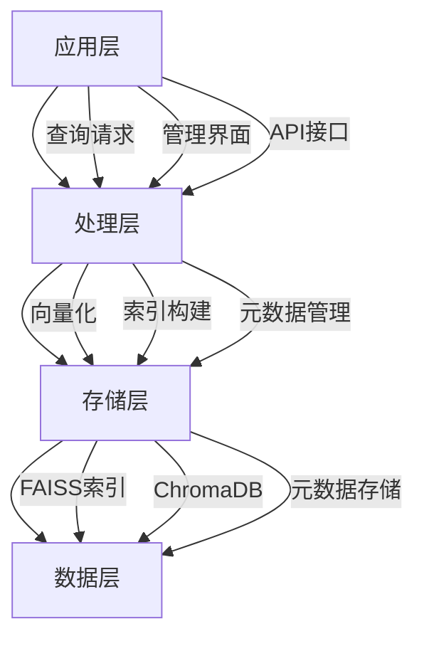
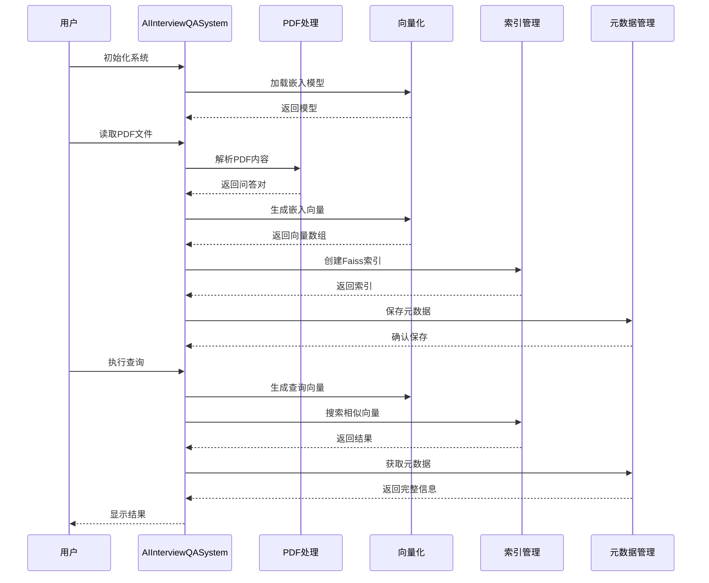

# 向量数据库与元数据管理系统 - 技术架构

## 架构概览

向量数据库与元数据管理系统采用分层架构设计，包含数据层、处理层、存储层和应用层四个核心层次，确保系统的可扩展性、可维护性和高性能。



## 核心组件架构

### 1. AIInterviewQASystem类架构

```python
class AIInterviewQASystem:
    """
    AI产品经理面试题向量数据库系统
    核心功能模块：
    - PDF解析模块
    - 向量化模块  
    - 索引管理模块
    - 元数据管理模块
    - 搜索查询模块
    """
    
    def __init__(self, model_name: str = "paraphrase-multilingual-MiniLM-L12-v2"):
        # 初始化嵌入模型
        # 初始化Faiss索引
        # 初始化元数据存储
        # 设置项目路径
```

### 2. 数据处理流程



## 技术栈详解

### 1. 向量化技术

#### Sentence Transformers
```python
# 使用paraphrase-multilingual-MiniLM-L12-v2模型
model = SentenceTransformer("paraphrase-multilingual-MiniLM-L12-v2")

# 向量化处理
def generate_embeddings(self, texts: List[str]) -> np.ndarray:
    embeddings = self.model.encode(texts, show_progress_bar=True)
    return embeddings
```

**技术特点：**
- **中文优化**: 专门针对中文文本优化
- **语义理解**: 捕捉深层语义关系
- **批量处理**: 支持高效批量向量化

#### 向量维度
- **输出维度**: 384维
- **数值类型**: float32
- **归一化**: L2归一化处理

### 2. 向量数据库

#### FAISS索引结构
```python
# 创建L2距离索引
self.index = faiss.IndexFlatL2(dimension)

# 添加向量
self.index.add(embeddings)

# 搜索操作
distances, indices = self.index.search(query_embedding, top_k)
```

**索引类型：**
- **IndexFlatL2**: 暴力搜索，精度最高
- **IndexIVFFlat**: 分块索引，平衡精度和速度
- **IndexHNSWFlat**: HNSW图索引，适合大规模数据

#### ChromaDB集成
```python
# ChromaDB客户端
chroma_client = chromadb.PersistentClient(
    path=get_project_path('model', 'chroma_db')
)

# 创建集合
collection = chroma_client.create_collection(
    name="documents",
    metadata={"hnsw:space": "cosine"}
)
```

### 3. 元数据管理系统

#### 数据结构设计
```python
qa_pair = {
    "id": f"qa_{question_count:03d}",
    "category": current_category,
    "question_number": question_number,
    "question_title": "",
    "question": question_text,
    "answer": answer_content,
    "full_text": f"{question_text} {answer_content}"
}
```

#### 存储策略
- **JSON格式**: 人类可读，便于调试
- **Pickle格式**: Python原生，加载速度快
- **内存缓存**: 实时访问优化

### 4. 文档处理模块

#### PDF解析架构
```python
# 类别映射
category_patterns = [
    (r'一、个人情况类', '个人情况类'),
    (r'二、个人经历类', '个人经历类'),
    # ... 其他类别
]

# 问题匹配
question_pattern = r'\(([一二三四五六七八九十]+)\)\s*([^\n]+)'

# 答案提取
answer_pattern = r'参考答案[:：]\s*(.*?)(?=(?:\([一二三四五六七八九十]+\)|一、|二、|三、|四、|五、|六、|七、|八、|九、|目录|$))'
```

## 系统配置架构

### 1. 项目路径管理
```python
def get_project_path(*paths: str) -> str:
    try:
        current_dir = os.path.dirname(os.path.abspath(__file__))
        project_dir = os.path.dirname(current_dir)
        return os.path.join(project_dir, *paths)
    except NameError:
        return os.path.join(os.getcwd(), *paths)
```

### 2. 目录结构
```
CASE-向量数据库与元数据管理/
├── data/                    # 原始数据
│   └── AI产品经理面试题65道.pdf
├── model/                   # 模型和数据存储
│   ├── faiss_index.bin      # FAISS索引文件
│   ├── metadata.json        # 元数据JSON
│   ├── metadata.pkl         # 元数据Pickle
│   ├── config.json          # 系统配置
│   └── chroma_db/           # ChromaDB数据库
├── output/                  # 输出结果
├── code/                    # 代码文件
└── docs/                    # 文档
```

### 3. 配置管理
```python
config = {
    'model_name': system.model_name,
    'dimension': system.dimension,
    'total_qa_pairs': len(qa_pairs),
    'faiss_index_path': os.path.join(system.model_dir, 'faiss_index.bin'),
    'metadata_path': os.path.join(system.model_dir, 'metadata.json'),
    'created_at': '2026-01-21'
}
```

## 性能优化架构

### 1. 内存管理
```python
# 向量化批量处理
def generate_embeddings(self, texts: List[str]) -> np.ndarray:
    # 分批处理，避免内存溢出
    batch_size = 100
    embeddings = []
    for i in range(0, len(texts), batch_size):
        batch = texts[i:i+batch_size]
        batch_embeddings = self.model.encode(batch)
        embeddings.append(batch_embeddings)
    
    return np.vstack(embeddings)
```

### 2. 索引优化
```python
# 多层索引策略
if len(vectors) < 10000:
    index = faiss.IndexFlatL2(dimension)
elif len(vectors) < 100000:
    index = faiss.IndexIVFFlat(dimension, 100, faiss.METRIC_L2)
else:
    index = faiss.IndexHNSWFlat(dimension, 32)
```

### 3. 缓存机制
```python
# 多级缓存策略
class VectorCache:
    def __init__(self):
        self.memory_cache = {}  # 内存缓存
        self.disk_cache = {}    # 磁盘缓存
        self.metadata_store = [] # 元数据存储
    
    def get_vector(self, text: str):
        # 先查内存缓存
        if text in self.memory_cache:
            return self.memory_cache[text]
        
        # 再查磁盘缓存
        if text in self.disk_cache:
            self.memory_cache[text] = self.disk_cache[text]
            return self.disk_cache[text]
        
        # 生成新向量
        vector = self.model.encode([text])[0]
        self.memory_cache[text] = vector
        return vector
```

## 安全架构

### 1. 数据安全
- **输入验证**: 对所有输入进行格式和内容验证
- **异常处理**: 完善的异常捕获和处理机制
- **数据备份**: 定期备份重要数据和配置

### 2. 访问控制
- **路径安全**: 使用绝对路径，防止路径遍历攻击
- **文件权限**: 合理设置文件和目录权限
- **敏感信息**: 不在代码中硬编码敏感信息

### 3. 隐私保护
- **数据脱敏**: 对敏感数据进行适当处理
- **日志管理**: 避免在日志中记录敏感信息
- **传输安全**: 支持加密传输

## 扩展架构

### 1. 插件化设计
```python
class VectorDatabasePlugin:
    def __init__(self, plugin_name: str):
        self.plugin_name = plugin_name
    
    def load_data(self, data_path: str) -> List[Dict]:
        raise NotImplementedError
    
    def search(self, query: str, top_k: int) -> List[Dict]:
        raise NotImplementedError
```

### 2. 多数据库支持
```python
class DatabaseManager:
    def __init__(self):
        self.databases = {
            'faiss': FAISSDatabase(),
            'chroma': ChromaDatabase(),
            'pinecone': PineconeDatabase()
        }
    
    def get_database(self, db_type: str) -> VectorDatabase:
        return self.databases[db_type]
```

### 3. 自适应学习
```python
class AdaptiveLearning:
    def __init__(self, system):
        self.system = system
        self.performance_metrics = {}
    
    def optimize_config(self):
        # 基于性能指标自动优化配置
        pass
    
    def update_model(self):
        # 根据新数据更新模型
        pass
```

---

*最后更新: 2026年1月24日*
*架构版本: v1.0*
*技术负责人: AI系统架构组*