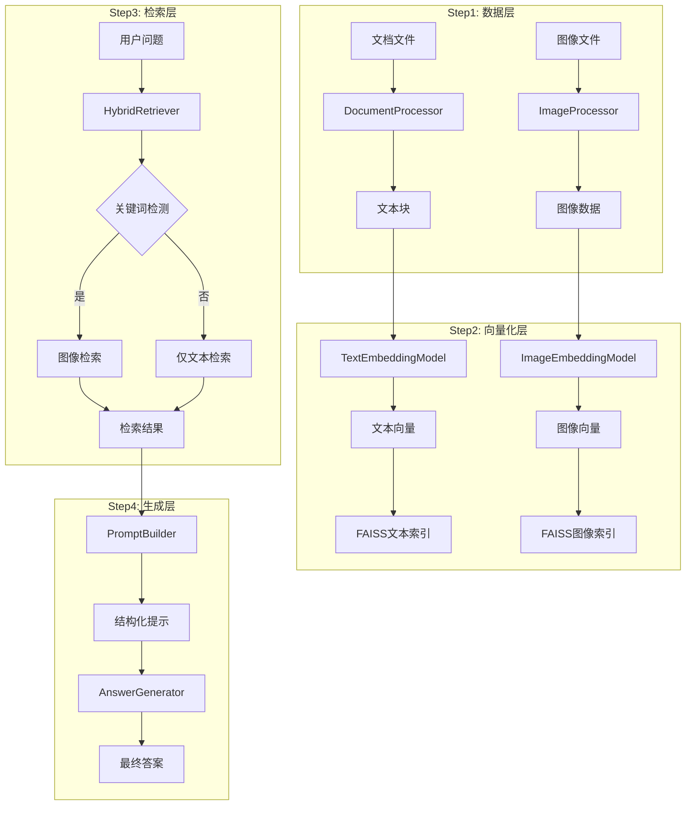

# 迪士尼RAG问答助手 - 项目概述

## 项目简介

迪士尼RAG问答助手是一个基于RAG（Retrieval-Augmented Generation，检索增强生成）技术的智能问答系统。该系统能够基于迪士尼相关文档和图像进行准确的问题回答，支持文档处理、图像OCR识别、混合检索和智能问答等高级功能。

### 什么是RAG？

RAG是一种结合检索和生成的AI技术架构：
1. **检索阶段**: 从知识库中检索与问题相关的文档片段
2. **增强阶段**: 将检索结果作为上下文信息
3. **生成阶段**: 基于上下文生成准确、可靠的答案

### 项目定位

本项目是一个**原生RAG应用**，具有以下特点：
- **多模态支持**: 同时处理文本和图像
- **双索引系统**: 文本和图像独立索引
- **智能触发**: 自动检测图像检索需求
- **完整流程**: 从数据处理到答案生成的端到端实现

---

## 核心功能

### Step1: 数据层

| 功能 | 说明 | 支持格式 |
|------|------|----------|
| 📄 文档处理 | 解析文档内容，提取文本和表格 | `.docx`, `.txt`, `.md` |
| 🖼️ 图像处理 | OCR识别图像中的文字 | `.png`, `.jpg`, `.jpeg`, `.gif`, `.bmp`, `.webp` |
| 📊 表格提取 | 将Word表格转换为Markdown格式 | Word内嵌表格 |

### Step2: 向量化层

| 功能 | 说明 | 技术方案 |
|------|------|----------|
| 🎯 文本Embedding | 将文本转换为向量表示 | 阿里云百炼 text-embedding-v4 (1024维) |
| 🌟 图像Embedding | 提取图像视觉特征 | CLIP模型 (512维) |
| 🗄️ 双索引系统 | 分别构建文本和图像索引 | FAISS向量数据库 |

### Step3: 检索层

| 功能 | 说明 | 实现方式 |
|------|------|----------|
| 🔍 文本检索 | 基于语义相似度检索文档 | L2距离 + 相似度转换 |
| 🖼️ 图像检索 | 基于CLIP编码器检索图像 | 文本→图像跨模态检索 |
| ⚡ 关键词触发 | 自动检测图像检索需求 | 预设关键词列表 |
| 📈 相似度计算 | L2距离转相似度分数 | `1/(1+distance)` |

### Step4: 生成层

| 功能 | 说明 | 技术方案 |
|------|------|----------|
| 🤖 上下文组织 | 将检索结果组织成结构化提示 | PromptBuilder |
| 💬 智能问答 | 基于上下文生成准确答案 | 通义千问/DeepSeek |
| 🔄 流式输出 | 支持流式生成答案 | OpenAI兼容API |

---

## 应用场景

### 🎠 场景1: 迪士尼知识问答

```
用户: 迪士尼有哪些经典动画电影？

系统: 迪士尼有许多经典动画电影，包括：
1. 米老鼠系列 - 1928年创造的经典角色
2. 《白雪公主与七个小矮人》(1937) - 迪士尼第一部动画长片
3. 《狮子王》(1994) - 最成功的迪士尼电影之一
...
```

### 🎫 场景2: 门票规则查询

```
用户: 上海迪士尼门票价格是多少？

系统: 根据文档信息，上海迪士尼门票价格如下：
- 常规日门票：435元
- 特别常规日门票：545元
- 高峰日门票：659元
- 特别高峰日门票：769元
...
```

### 🏨 场景3: 酒店会员查询

```
用户: 迪士尼乐园酒店会员有什么权益？

系统: 迪士尼乐园酒店会员享有以下权益：
1. 优先入住和退房
2. 专属会员礼品
3. 餐饮折扣优惠
...
```

### 🖼️ 场景4: 图像内容查询

```
用户: 展示一下迪士尼的海报

系统: 找到以下相关图像：
- 图像1 (来源: lion_king_poster.jpg, 相似度: 0.856)
- 图像2 (来源: snow_white_poster.jpg, 相似度: 0.832)
...
```

---

## 技术特点

### ✨ 特色功能

#### 1. 多模态支持
- 同时支持文本和图像的处理与检索
- 文本使用专门的文本Embedding模型
- 图像使用CLIP视觉语言模型

#### 2. 双索引系统
- 文本索引：1024维向量，支持语义相似度检索
- 图像索引：512维向量，支持跨模态检索
- 独立存储，互不干扰

#### 3. 智能触发机制
- 自动检测查询中的图像关键词
- 无需用户显式指定检索类型
- 支持自定义关键词列表

#### 4. 灵活的文档处理
- 支持Word文档的段落和表格提取
- 表格自动转换为Markdown格式
- 智能分块保持语义完整性

---

## 项目结构

```
15-CASE-迪士尼RAG助手/
├── code/                       # 核心代码
│   ├── __init__.py            # 模块初始化
│   ├── config.py              # 配置管理
│   ├── utils.py               # 工具函数
│   ├── data_processor.py      # 数据处理层（Step1）
│   ├── embedding.py           # 向量化层（Step2）
│   ├── retrieval.py           # 检索层（Step3）
│   ├── generator.py           # 生成层（Step4）
│   └── main.py                # 主程序入口
├── data/                       # 数据目录
│   ├── documents/             # 文档数据
│   ├── images/                # 图像数据
│   ├── 1-上海迪士尼门票规则.docx
│   ├── 2-迪士尼老人票价规定.docx
│   ├── 3-迪士尼乐园游玩攻略清单.docx
│   └── 4-上海迪士尼乐园酒店会员制度.docx
├── docs/                       # 文档目录
│   ├── 00-文档索引.md
│   ├── 01-项目概述.md
│   ├── 02-技术架构.md
│   ├── 03-使用指南.md
│   ├── 04-代码实现.md
│   ├── 05-测试和部署.md
│   ├── USAGE.md
│   ├── TROUBLESHOOTING.md
│   └── workflow.md
├── user_data/                  # 用户数据目录
│   ├── indexes/               # FAISS索引文件
│   │   ├── text_index.faiss   # 文本向量索引
│   │   ├── text_documents.pkl # 文本文档数据
│   │   ├── image_index.faiss  # 图像向量索引
│   │   └── image_documents.pkl # 图像数据
│   └── cache/                 # 缓存目录
├── output/                     # 输出目录
│   └── logs/                  # 日志文件
├── tests/                      # 测试目录
└── README.md                   # 项目说明
```

---

## 技术栈

### 核心框架

| 技术 | 版本 | 用途 |
|------|------|------|
| Python | >= 3.11 | 编程语言 |
| LangChain | >= 1.2.9 | LLM应用开发框架 |
| FAISS | >= 1.13.2 | 向量相似度搜索 |

### 大模型服务

| 服务 | 模型 | 用途 |
|------|------|------|
| 阿里云百炼 | text-embedding-v4 | 文本向量化 (1024维) |
| 阿里云百炼 | qwen-max/deepseek-chat | 答案生成 |

### 视觉模型

| 技术 | 模型 | 用途 |
|------|------|------|
| Transformers | CLIP ViT-B/32 | 图像特征提取 |
| PyTorch | >= 2.10.0 | 深度学习框架 |
| Tesseract | OCR | 图像文字识别 |

### 文档处理

| 技术 | 用途 |
|------|------|
| python-docx | Word文档处理 |
| Pillow | 图像处理 |

---

## 性能指标

### 检索性能

| 指标 | 数值 | 说明 |
|------|------|------|
| 文本检索延迟 | < 100ms | 单次查询响应时间 |
| 图像检索延迟 | < 200ms | 包含CLIP编码时间 |
| Top-5准确率 | > 85% | 前5个结果包含正确答案 |

### 向量化性能

| 指标 | 数值 | 说明 |
|------|------|------|
| 文本向量化 | ~50ms/个 | DashScope API调用 |
| 图像向量化 | ~100ms/个 | CLIP本地推理 |
| 批量处理 | 支持 | 自动批量向量化 |

### 生成性能

| 指标 | 数值 | 说明 |
|------|------|------|
| 答案生成延迟 | 1-3秒 | 取决于LLM响应速度 |
| 流式输出 | 支持 | 实时显示生成内容 |
| 上下文长度 | 2000 tokens | 可配置 |

---

## 系统工作流程



---

## 项目价值

### 学习价值

1. **RAG技术实践**: 完整的RAG流程实现，从数据处理到答案生成
2. **多模态理解**: 学习如何处理文本和图像的混合场景
3. **向量数据库**: 掌握FAISS向量数据库的使用
4. **大模型集成**: 学习如何集成和使用大语言模型API

### 应用价值

1. **知识库问答**: 可应用于企业知识库、产品文档等场景
2. **智能客服**: 结合业务知识提供智能问答服务
3. **内容检索**: 快速检索和定位相关文档内容
4. **多模态搜索**: 支持文本和图像的混合检索

---

## 发展规划

### 短期目标 (v1.x)

- [ ] 增加PDF文档支持
- [ ] 支持更多图像格式
- [ ] 优化OCR识别效果
- [ ] 添加Web界面

### 中期目标 (v2.x)

- [ ] 支持增量索引更新
- [ ] 添加多语言支持
- [ ] 实现分布式部署
- [ ] 集成更多LLM选项

### 长期目标 (v3.x)

- [ ] 知识图谱集成
- [ ] 自动问答优化
- [ ] 用户反馈学习
- [ ] 多租户支持

---

## 相关资源

### 项目文档

- [技术架构](02-技术架构.md) - 详细的技术架构设计
- [使用指南](03-使用指南.md) - 完整的使用说明
- [代码实现](04-代码实现.md) - 核心代码解析
- [测试和部署](05-测试和部署.md) - 测试和部署指南

### 外部资源

- [LangChain官方文档](https://python.langchain.com/docs/)
- [FAISS官方文档](https://faiss.ai/)
- [CLIP模型介绍](https://openai.com/research/clip)
- [DashScope API文档](https://help.aliyun.com/zh/dashscope/)

---

*最后更新: 2026年2月15日*
*文档版本: v1.0*
