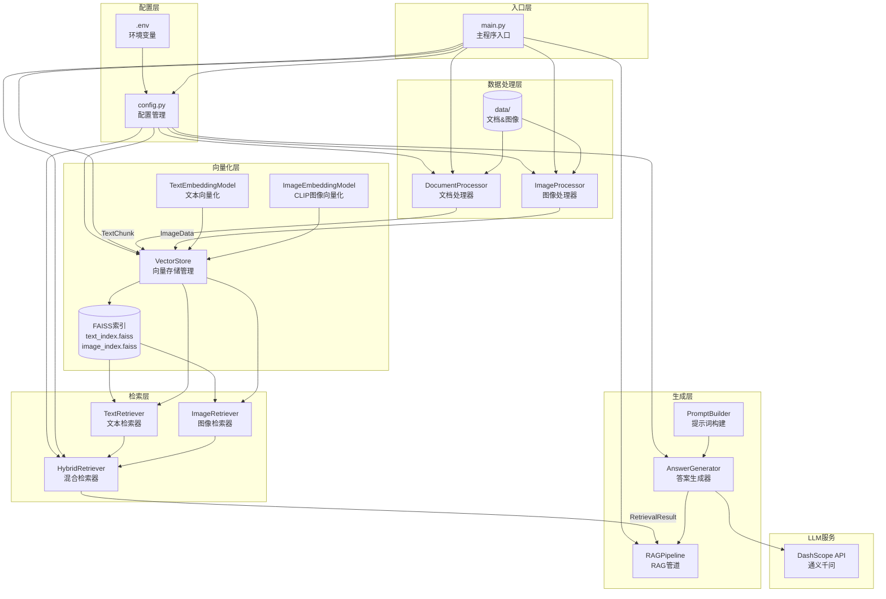
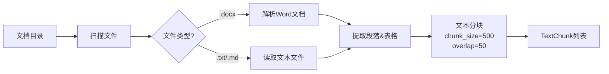
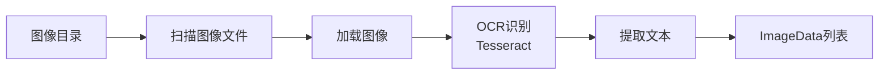
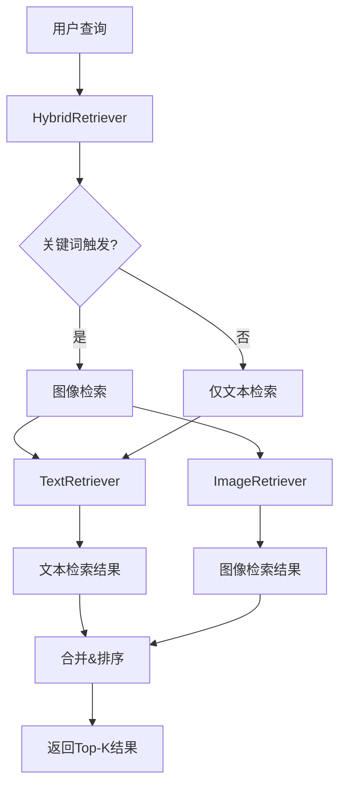
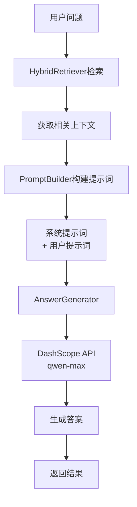
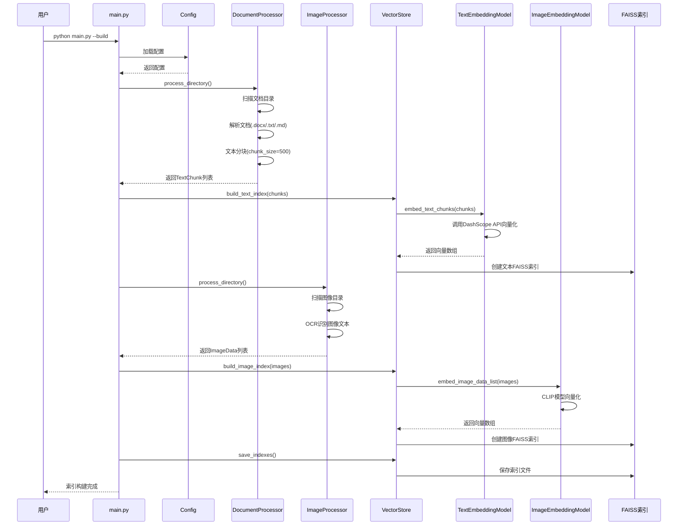
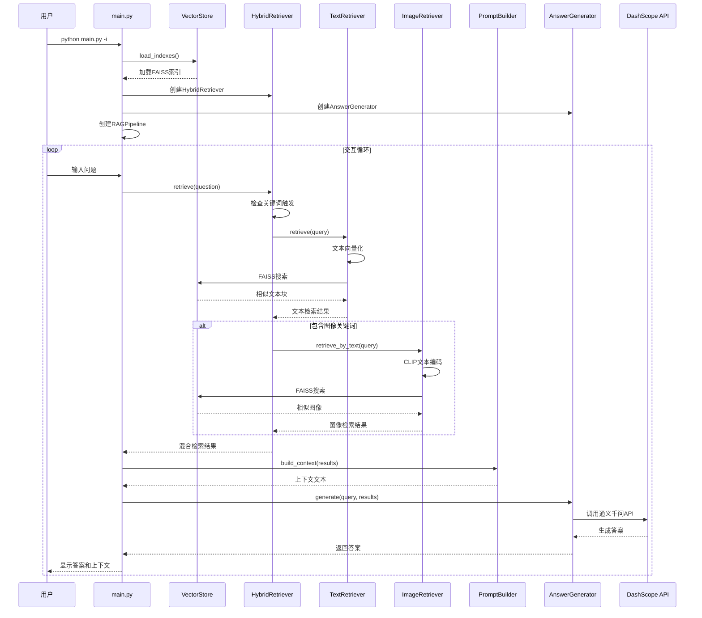
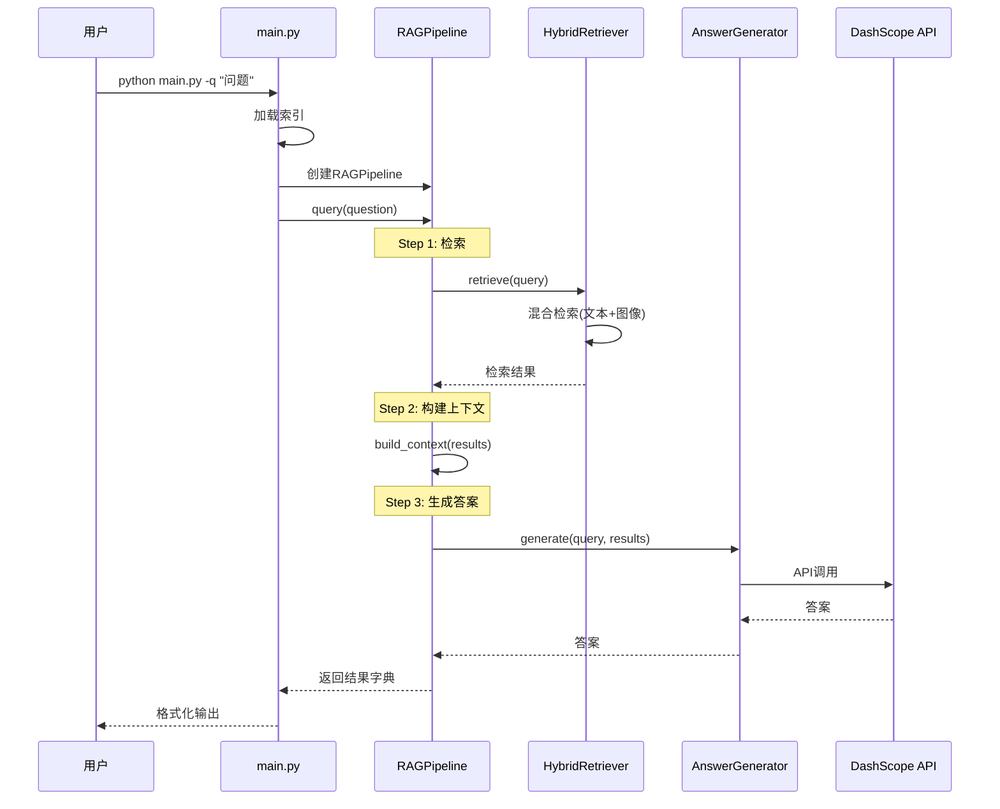
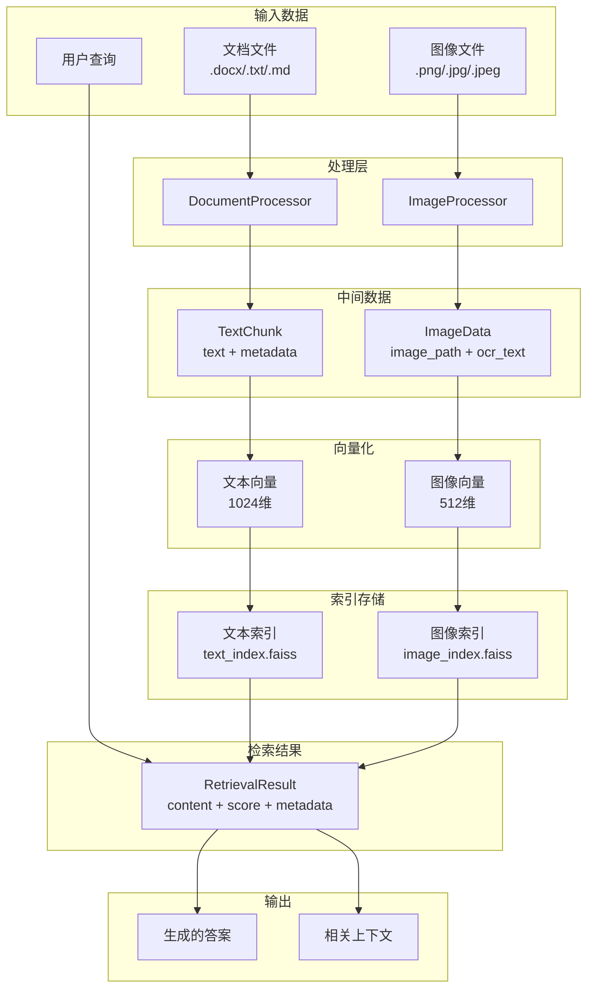
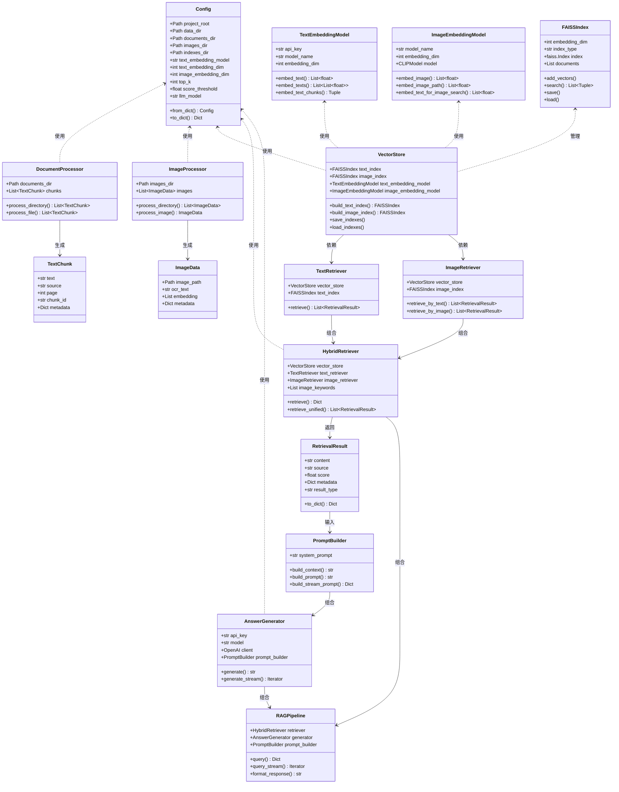

# Disney RAG问答助手 - 工作流程图

本文档描述了 `main.py` 的整体工作流程和系统架构。

## 系统架构概览



## 模块详细说明

### 1. 入口层 (main.py)

主程序入口，提供三种运行模式：

| 命令参数 | 功能 | 描述 |
|---------|------|------|
| `--build` | 构建索引 | 处理文档和图像，构建FAISS向量索引 |
| `--build-text-only` | 仅构建文本索引 | 跳过图像处理，仅构建文本索引 |
| `--interactive` / `-i` | 交互式问答 | 启动交互式问答会话 |
| `--query` / `-q` | 单次查询 | 执行单次查询并返回结果 |

### 2. 配置层 (config.py)

管理项目所有配置参数：

```python
@dataclass
class Config:
    # 路径配置
    project_root: Path
    data_dir: Path          # 数据目录
    documents_dir: Path     # 文档目录
    images_dir: Path        # 图像目录
    indexes_dir: Path       # 索引目录
    
    # Embedding配置
    text_embedding_model: str    # 文本向量化模型
    text_embedding_dim: int      # 文本向量维度 (1024)
    image_embedding_dim: int     # 图像向量维度 (512)
    
    # 检索配置
    top_k: int              # 返回结果数量 (5)
    score_threshold: float  # 相似度阈值 (0.7)
    
    # LLM配置
    llm_model: str          # 模型名称 (qwen-max)
    llm_temperature: float  # 温度参数 (0.7)
```

### 3. 数据处理层 (data_processor.py)

#### DocumentProcessor - 文档处理器



#### ImageProcessor - 图像处理器



### 4. 向量化层 (embedding.py)

#### 文本向量化流程


#### 图像向量化流程


### 5. 检索层 (retrieval.py)

#### 混合检索流程



**关键词触发机制**：当查询包含以下关键词时触发图像检索：
- 海报、图片、图像、照片、截图、展示

### 6. 生成层 (generator.py)

#### RAG管道流程




## 完整工作流程图

### 模式一：构建索引流程 (`--build`)




### 模式二：交互式问答流程 (`--interactive`)




### 模式三：单次查询流程 (`--query`)



## 数据流图

### 数据流向概览




## 核心类关系图




## 技术栈

| 层级 | 技术组件 | 用途 |
|------|---------|------|
| **数据处理** | python-docx, pytesseract, PIL | 文档解析、OCR识别 |
| **文本向量化** | DashScope TextEmbedding API | 文本转向量 (1024维) |
| **图像向量化** | CLIP (clip-vit-base-patch32) | 图像转向量 (512维) |
| **向量存储** | FAISS (IndexFlatL2) | 向量相似度搜索 |
| **LLM生成** | DashScope (qwen-max) | 答案生成 |
| **配置管理** | python-dotenv, dataclass | 环境变量、配置类 |
| **日志系统** | loguru | 日志记录 |

## 文件结构

```
practice/15-CASE-迪士尼RAG助手/
├── code/
│   ├── main.py           # 主程序入口
│   ├── config.py         # 配置管理
│   ├── data_processor.py # 数据处理层
│   ├── embedding.py      # 向量化层
│   ├── retrieval.py      # 检索层
│   ├── generator.py      # 生成层
│   └── utils.py          # 工具函数
├── data/
│   ├── documents/        # 文档目录
│   └── images/           # 图像目录
├── user_data/
│   └── indexes/          # FAISS索引存储
│       ├── text_index.faiss
│       ├── text_documents.pkl
│       ├── image_index.faiss
│       └── image_documents.pkl
├── docs/
│   ├── workflow.md       # 本文档
│   └── USAGE.md          # 使用说明
├── output/               # 输出目录
├── .env                  # 环境变量
└── pyproject.toml        # 项目配置
```

## 关键参数配置

| 参数 | 默认值 | 说明 |
|------|--------|------|
| `text_embedding_dim` | 1024 | 文本向量维度 |
| `image_embedding_dim` | 512 | 图像向量维度 |
| `top_k` | 5 | 检索返回结果数 |
| `score_threshold` | 0.7 | 相似度阈值 |
| `llm_temperature` | 0.7 | LLM温度参数 |
| `llm_max_tokens` | 2000 | 最大生成token数 |
| `chunk_size` | 500 | 文本分块大小 |
| `chunk_overlap` | 50 | 分块重叠字符数 |

---

*文档生成时间: 2026-02-12*
