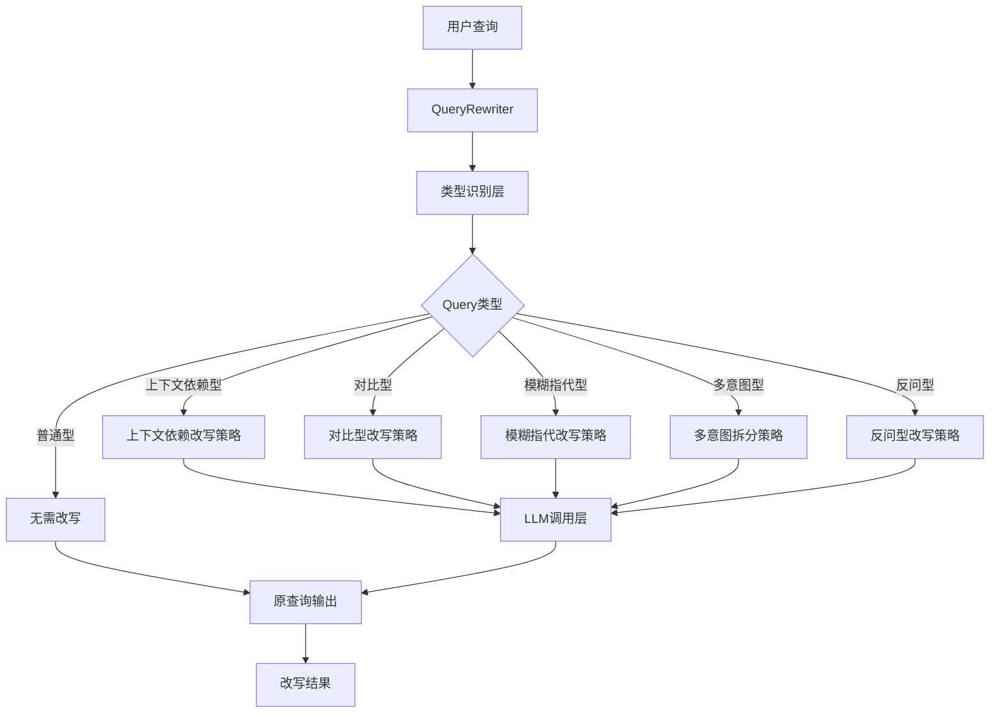
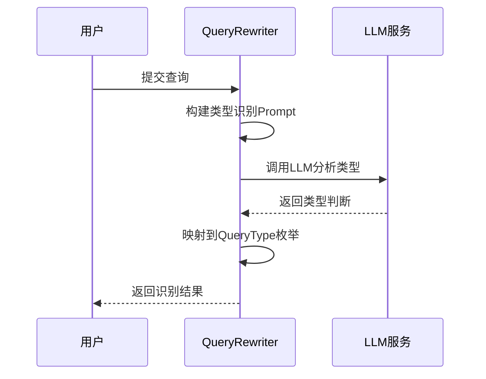
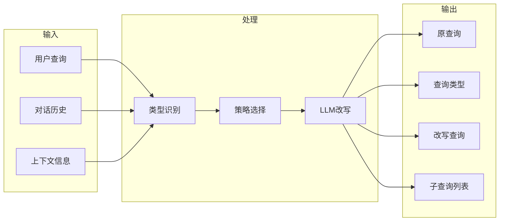
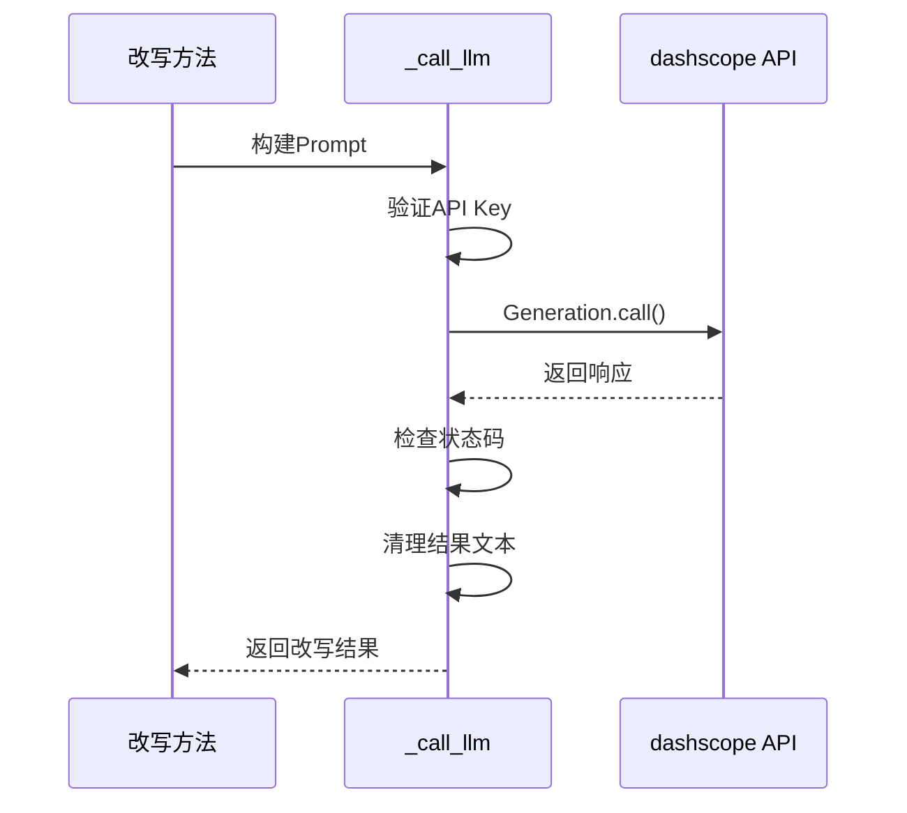

# Query改写系统 - 技术架构

## 架构概览

Query改写系统采用策略模式设计，包含类型识别层、改写策略层和LLM调用层三个核心层次，确保系统的灵活性、可扩展性和高性能。



## 核心组件架构

### 1. QueryRewriter类架构

```python
class QueryRewriter:
    """
    Query改写器核心类
    
    组件职责：
    - LLM调用管理
    - Query类型识别
    - 改写策略调度
    - 结果格式化输出
    """
    
    def __init__(self, model: str = "qwen-turbo-latest"):
        self.model = model          # LLM模型配置
        self.api_key = api_key      # API密钥管理
    
    # 核心方法
    def identify_query_type()      # 类型识别
    def auto_rewrite_query()       # 自动改写
    
    # 策略方法
    def rewrite_context_dependent_query()   # 上下文依赖型
    def rewrite_comparative_query()         # 对比型
    def rewrite_vague_reference_query()     # 模糊指代型
    def rewrite_multi_intent_query()        # 多意图型
    def rewrite_rhetorical_query()          # 反问型
```

### 2. Query类型识别流程



### 3. 数据流架构



## Query类型识别机制

### 1. 类型识别Prompt设计

```python
# 类型识别Prompt模板
IDENTIFY_TYPE_PROMPT = """请分析以下用户查询的类型。

对话历史：
{conversation_history}

当前查询：{query}

Query类型定义：
1. 上下文依赖型：包含"还有"、"其他"、"另外"等需要上下文理解的词汇
2. 对比型：包含"哪个"、"比较"、"更"、"区别"等比较词汇
3. 模糊指代型：包含"它"、"他们"、"这个"、"那个"、"都"等指代词
4. 多意图型：包含多个独立问题，通常用"和"、"同时"、"另外"连接
5. 反问型：包含"不会"、"难道"、"不是吗"等反问语气
6. 普通型：不属于以上任何类型的普通查询

请直接返回类型名称（如：上下文依赖型），不要有其他内容。"""
```

### 2. 类型映射机制

```python
# 类型字符串到枚举的映射
TYPE_MAPPING = {
    "上下文依赖型": QueryType.CONTEXT_DEPENDENT,
    "对比型": QueryType.COMPARATIVE,
    "模糊指代型": QueryType.VAGUE_REFERENCE,
    "多意图型": QueryType.MULTI_INTENT,
    "反问型": QueryType.RHETORICAL,
    "普通型": QueryType.NORMAL,
}

def map_to_enum(result: str) -> QueryType:
    """将LLM返回的字符串映射为枚举值"""
    for key, value in TYPE_MAPPING.items():
        if key in result:
            return value
    return QueryType.NORMAL  # 默认返回普通型
```

### 3. QueryType枚举设计

```python
class QueryType(Enum):
    """Query类型枚举"""
    
    CONTEXT_DEPENDENT = "上下文依赖型"  # 需要对话历史
    COMPARATIVE = "对比型"              # 需要对比信息
    VAGUE_REFERENCE = "模糊指代型"      # 需要指代消解
    MULTI_INTENT = "多意图型"           # 需要拆分
    RHETORICAL = "反问型"               # 需要语气转换
    NORMAL = "普通型"                   # 无需改写
```

## 改写策略设计

### 1. 上下文依赖型改写

#### 问题分析
```
场景：
用户: 我想了解Python的异步编程。
助手: Python的异步编程主要使用asyncio库...
用户: 还有其他方式吗？  ← 缺少"其他方式"的具体上下文
```

#### 改写策略
```python
def rewrite_context_dependent_query(self, query: str, conversation_history: str) -> str:
    """
    改写策略：
    1. 提取对话历史中的关键信息
    2. 识别查询中省略的内容
    3. 补充完整形成独立查询
    """
    prompt = f"""你是一个查询改写专家。请根据对话历史，将用户的上下文依赖型查询改写为独立完整的查询。

对话历史：
{conversation_history}

当前查询：{query}

改写要求：
1. 补充查询中缺失的上下文信息
2. 使查询独立完整，不需要依赖对话历史
3. 保持用户原始意图
4. 直接输出改写后的查询，不要有任何解释

改写后的查询："""
    return self._call_llm(prompt)
```

#### 改写示例
```
输入：
  - 查询: "还有其他方式吗？"
  - 历史: "用户: 我想了解Python的异步编程。助手: Python的异步编程主要使用asyncio库..."
  
输出: "Python除了asyncio库之外，还有哪些异步编程方式？"
```

---

### 2. 对比型改写

#### 问题分析
```
查询: "Python和Java哪个更好？"
问题: 查询过于宽泛，"更好"缺少具体维度
```

#### 改写策略
```python
def rewrite_comparative_query(self, query: str, context_info: str = "") -> str:
    """
    改写策略：
    1. 识别对比对象
    2. 补充常见对比维度
    3. 形成结构化检索查询
    """
    prompt = f"""你是一个查询改写专家。请将用户的对比型查询改写为更明确的检索查询。

上下文信息：
{context_info if context_info else "无"}

当前查询：{query}

改写要求：
1. 明确对比的对象和维度
2. 拆分为多个具体的检索点
3. 保持对比意图
4. 直接输出改写后的查询

改写后的查询："""
    return self._call_llm(prompt)
```

#### 改写示例
```
输入:
  - 查询: "Python和Java哪个更好？"
  - 上下文: "Python和Java都是流行的编程语言"
  
输出: "Python和Java在性能、语法简洁性、生态系统、学习曲线方面的对比分析"
```

---

### 3. 模糊指代型改写

#### 问题分析
```
场景：
用户: 我最近在研究Transformer模型，它比RNN效果好很多。
助手: Transformer确实在NLP领域表现出色。
用户: 它的主要优势是什么？  ← "它"指代不明确
```

#### 改写策略
```python
def rewrite_vague_reference_query(self, query: str, conversation_history: str) -> str:
    """
    改写策略：
    1. 识别代词（它、他们、这个、那个等）
    2. 从对话历史确定指代对象
    3. 替换代词为具体实体
    """
    prompt = f"""你是一个查询改写专家。请根据对话历史，将用户查询中的模糊指代替换为具体对象。

对话历史：
{conversation_history}

当前查询：{query}

改写要求：
1. 识别查询中的代词（它、他们、这个、那个等）
2. 根据对话历史确定代词指代的具体对象
3. 将代词替换为具体对象名称
4. 直接输出改写后的查询

改写后的查询："""
    return self._call_llm(prompt)
```

#### 改写示例
```
输入:
  - 查询: "它的主要优势是什么？"
  - 历史: "用户: 我最近在研究Transformer模型..."
  
输出: "Transformer模型的主要优势是什么？"
```

---

### 4. 多意图型改写

#### 问题分析
```
查询: "什么是RAG？如何搭建？有什么优缺点？"
问题: 单一查询包含多个独立问题，需要分别检索
```

#### 改写策略
```python
def rewrite_multi_intent_query(self, query: str) -> list[str]:
    """
    改写策略：
    1. 识别查询中的多个独立问题
    2. 按语义边界拆分
    3. 保持每个子查询的完整性
    """
    prompt = f"""你是一个查询改写专家。请将用户的多意图查询拆分为多个独立的子查询。

当前查询：{query}

拆分要求：
1. 识别查询中的多个独立问题
2. 每个子查询保持完整独立
3. 保持原始意图不变
4. 每行输出一个子查询，不要编号和其他内容

拆分后的子查询："""
    
    result = self._call_llm(prompt)
    queries = [q.strip() for q in result.split("\n") if q.strip()]
    return queries if queries else [query]
```

#### 改写示例
```
输入: "什么是RAG？如何搭建？有什么优缺点？"

输出:
  1. "什么是RAG？"
  2. "如何搭建RAG系统？"
  3. "RAG有什么优缺点？"
```

---

### 5. 反问型改写

#### 问题分析
```
查询: "难道深度学习不需要大量数据吗？"
问题: 反问句式不利于检索匹配
```

#### 改写策略
```python
def rewrite_rhetorical_query(self, query: str) -> str:
    """
    改写策略：
    1. 识别反问语气
    2. 转换为正面提问
    3. 保持原意
    """
    prompt = f"""你是一个查询改写专家。请将用户的反问型查询改写为正面直接的查询。

当前查询：{query}

改写要求：
1. 去除反问语气
2. 转换为正面直接的提问方式
3. 保持原始意图
4. 直接输出改写后的查询

改写后的查询："""
    return self._call_llm(prompt)
```

#### 改写示例
```
输入: "难道深度学习不需要大量数据吗？"
输出: "深度学习为什么需要大量数据？"
```

## LLM调用架构

### 1. 调用封装

```python
def _call_llm(self, prompt: str) -> str:
    """
    LLM调用统一封装
    
    功能：
    - API调用管理
    - 错误处理
    - 结果清理
    """
    try:
        response = Generation.call(
            model=self.model,
            prompt=prompt,
            api_key=self.api_key,
        )
        if response.status_code == 200:
            return response.output.text.strip()
        else:
            logger.error(f"LLM调用失败: {response.code} - {response.message}")
            return ""
    except Exception as e:
        logger.error(f"LLM调用异常: {e}")
        return ""
```

### 2. 调用流程



### 3. 错误处理机制

```python
# 错误处理层次
ERROR_HANDLING = {
    "API_KEY_MISSING": {
        "level": "warning",
        "action": "提示用户配置环境变量"
    },
    "API_CALL_FAILED": {
        "level": "error",
        "action": "记录错误日志，返回空字符串"
    },
    "RESPONSE_PARSE_ERROR": {
        "level": "error",
        "action": "记录解析错误，返回空字符串"
    }
}
```

## Prompt设计原则

### 1. 结构化设计

```python
# Prompt标准结构
PROMPT_STRUCTURE = """
1. 角色定义：明确AI扮演的角色
2. 上下文：提供必要的背景信息
3. 任务描述：清晰说明需要完成的任务
4. 改写要求：列出具体的改写规则
5. 输出格式：指定期望的输出形式
"""
```

### 2. 约束性指令

```python
# 关键约束示例
CONSTRAINTS = [
    "直接输出改写后的查询",      # 避免解释性输出
    "不要有任何解释",            # 确保输出简洁
    "保持用户原始意图",          # 确保意图一致性
    "每行输出一个子查询",        # 格式化多意图输出
]
```

### 3. 一致性保证

```python
# 所有改写Prompt共享的结构
COMMON_PROMPT_HEADER = "你是一个查询改写专家。"
COMMON_PROMPT_FOOTER = "改写后的查询："
```

## 扩展架构

### 1. 新增Query类型

```python
# 扩展步骤
EXTENSION_STEPS = """
1. 在QueryType枚举中添加新类型
2. 在identify_query_type的Prompt中添加类型定义
3. 实现对应的改写方法
4. 在auto_rewrite_query中添加类型判断分支
5. 更新TYPE_MAPPING映射
"""
```

### 2. 自定义模型支持

```python
# 支持其他LLM模型
class QueryRewriter:
    def __init__(self, model: str = "qwen-turbo-latest", 
                 llm_provider: str = "dashscope"):
        self.model = model
        self.llm_provider = llm_provider
        
        if llm_provider == "dashscope":
            self._call_llm = self._call_dashscope
        elif llm_provider == "openai":
            self._call_llm = self._call_openai
        # ... 其他provider
```

### 3. Prompt模板管理

```python
# Prompt模板配置化
PROMPT_TEMPLATES = {
    "identify_type": "templates/identify_type.txt",
    "context_dependent": "templates/context_dependent.txt",
    "comparative": "templates/comparative.txt",
    "vague_reference": "templates/vague_reference.txt",
    "multi_intent": "templates/multi_intent.txt",
    "rhetorical": "templates/rhetorical.txt",
}

def load_prompt_template(template_name: str, **kwargs) -> str:
    """加载并填充Prompt模板"""
    template_path = PROMPT_TEMPLATES[template_name]
    with open(template_path, 'r', encoding='utf-8') as f:
        template = f.read()
    return template.format(**kwargs)
```

---

*最后更新: 2026年2月15日*
*架构版本: v1.0*
*技术负责人: AI系统架构组*
