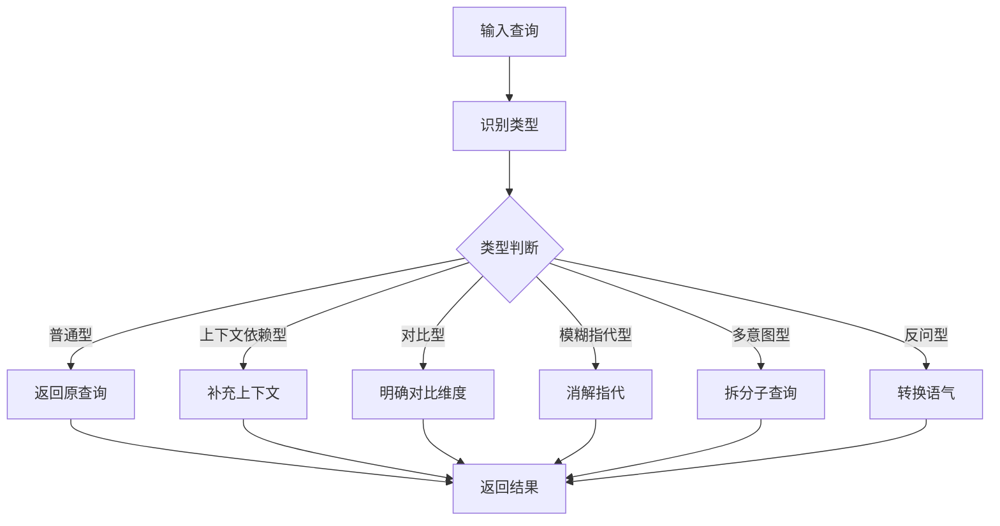

# Query改写系统 - 代码实现详解

## 核心代码结构

### 1. 模块导入

```python
import os
from enum import Enum
from pathlib import Path

from dashscope import Generation
from dotenv import load_dotenv
from loguru import logger
```

**模块职责**:
- `os`: 环境变量读取
- `Enum`: 查询类型枚举定义
- `Path`: 项目路径管理
- `dashscope`: 阿里云LLM API调用
- `dotenv`: 环境变量加载
- `loguru`: 日志记录

### 2. 环境变量加载

```python
# 加载根目录的 .env 文件
project_root = Path(__file__).parent.parent.parent.parent
env_file = project_root / ".env"
load_dotenv(env_file)
```

**设计要点**:
- 从当前文件向上查找到项目根目录
- 统一使用根目录的 `.env` 文件
- 避免每个子项目单独配置环境变量

## QueryType枚举设计

### 1. 枚举定义

```python
class QueryType(Enum):
    """Query类型枚举"""
    
    CONTEXT_DEPENDENT = "上下文依赖型"  # 需要对话历史补充
    COMPARATIVE = "对比型"              # 需要明确对比维度
    VAGUE_REFERENCE = "模糊指代型"      # 需要指代消解
    MULTI_INTENT = "多意图型"           # 需要拆分为子查询
    RHETORICAL = "反问型"               # 需要语气转换
    NORMAL = "普通型"                   # 无需改写
```

### 2. 枚举使用场景

```python
# 类型判断
query_type = QueryType.CONTEXT_DEPENDENT
print(query_type.value)  # 输出: "上下文依赖型"

# 类型比较
if query_type == QueryType.MULTI_INTENT:
    # 处理多意图型
    pass

# 类型映射
type_mapping = {
    QueryType.CONTEXT_DEPENDENT: "需要对话历史",
    QueryType.COMPARATIVE: "需要对比信息",
    # ...
}
```

## QueryRewriter类核心实现

### 1. 初始化方法

```python
class QueryRewriter:
    """
    Query改写器
    通过LLM自动识别Query类型并进行改写，提升RAG检索效果
    """

    def __init__(self, model: str = "qwen-turbo-latest"):
        """
        初始化Query改写器

        Args:
            model: 使用的LLM模型名称
        """
        self.model = model
        self.api_key = os.environ.get("DASHSCOPE_API_KEY")
        if not self.api_key:
            logger.warning("DASHSCOPE_API_KEY未设置，请检查环境变量")
```

**初始化流程**:
1. 保存模型配置
2. 读取API密钥
3. 验证必要配置

### 2. LLM调用封装

```python
def _call_llm(self, prompt: str) -> str:
    """
    调用LLM生成响应

    Args:
        prompt: 输入提示词

    Returns:
        LLM生成的响应文本
    """
    try:
        response = Generation.call(
            model=self.model,
            prompt=prompt,
            api_key=self.api_key,
        )
        if response.status_code == 200:
            return response.output.text.strip()
        else:
            logger.error(f"LLM调用失败: {response.code} - {response.message}")
            return ""
    except Exception as e:
        logger.error(f"LLM调用异常: {e}")
        return ""
```

**设计要点**:
- 统一的LLM调用入口
- 完善的错误处理
- 结果清理（strip）
- 日志记录

## 类型识别方法

### 1. identify_query_type实现

```python
def identify_query_type(self, query: str, conversation_history: str = "") -> QueryType:
    """
    识别Query类型

    Args:
        query: 用户查询
        conversation_history: 对话历史

    Returns:
        Query类型枚举值
    """
    prompt = f"""请分析以下用户查询的类型。

对话历史：
{conversation_history if conversation_history else "无"}

当前查询：{query}

Query类型定义：
1. 上下文依赖型：包含"还有"、"其他"、"另外"等需要上下文理解的词汇
2. 对比型：包含"哪个"、"比较"、"更"、"区别"等比较词汇
3. 模糊指代型：包含"它"、"他们"、"这个"、"那个"、"都"等指代词
4. 多意图型：包含多个独立问题，通常用"和"、"同时"、"另外"连接
5. 反问型：包含"不会"、"难道"、"不是吗"等反问语气
6. 普通型：不属于以上任何类型的普通查询

请直接返回类型名称（如：上下文依赖型），不要有其他内容。"""

    result = self._call_llm(prompt)
    
    # 类型映射
    type_mapping = {
        "上下文依赖型": QueryType.CONTEXT_DEPENDENT,
        "对比型": QueryType.COMPARATIVE,
        "模糊指代型": QueryType.VAGUE_REFERENCE,
        "多意图型": QueryType.MULTI_INTENT,
        "反问型": QueryType.RHETORICAL,
        "普通型": QueryType.NORMAL,
    }
    
    for key, value in type_mapping.items():
        if key in result:
            return value
    
    return QueryType.NORMAL
```

**实现要点**:
- 结构化的Prompt设计
- 清晰的类型定义
- 模糊匹配策略（`if key in result`）
- 默认返回普通型

### 2. Prompt模板设计

```python
# 类型识别Prompt结构
"""
1. 角色定义: 隐式（通过任务描述体现）
2. 输入数据: 对话历史 + 当前查询
3. 类型定义: 6种类型及其特征
4. 输出要求: 直接返回类型名称
"""
```

## 各类型改写方法详解

### 1. 上下文依赖型改写

```python
def rewrite_context_dependent_query(
    self, query: str, conversation_history: str
) -> str:
    """
    上下文依赖型Query改写

    Args:
        query: 用户查询
        conversation_history: 对话历史

    Returns:
        改写后的完整查询
    """
    prompt = f"""你是一个查询改写专家。请根据对话历史，将用户的上下文依赖型查询改写为独立完整的查询。

对话历史：
{conversation_history}

当前查询：{query}

改写要求：
1. 补充查询中缺失的上下文信息
2. 使查询独立完整，不需要依赖对话历史
3. 保持用户原始意图
4. 直接输出改写后的查询，不要有任何解释

改写后的查询："""

    return self._call_llm(prompt)
```

**Prompt设计要点**:
| 元素 | 内容 |
|------|------|
| 角色 | 查询改写专家 |
| 输入 | 对话历史 + 当前查询 |
| 约束 | 4条改写要求 |
| 输出 | 改写后的查询 |

### 2. 对比型改写

```python
def rewrite_comparative_query(
    self, query: str, context_info: str = ""
) -> str:
    """
    对比型Query改写

    Args:
        query: 用户查询
        context_info: 相关上下文信息

    Returns:
        改写后的查询
    """
    prompt = f"""你是一个查询改写专家。请将用户的对比型查询改写为更明确的检索查询。

上下文信息：
{context_info if context_info else "无"}

当前查询：{query}

改写要求：
1. 明确对比的对象和维度
2. 拆分为多个具体的检索点
3. 保持对比意图
4. 直接输出改写后的查询

改写后的查询："""

    return self._call_llm(prompt)
```

### 3. 模糊指代型改写

```python
def rewrite_vague_reference_query(
    self, query: str, conversation_history: str
) -> str:
    """
    模糊指代型Query改写

    Args:
        query: 用户查询
        conversation_history: 对话历史

    Returns:
        改写后的明确查询
    """
    prompt = f"""你是一个查询改写专家。请根据对话历史，将用户查询中的模糊指代替换为具体对象。

对话历史：
{conversation_history}

当前查询：{query}

改写要求：
1. 识别查询中的代词（它、他们、这个、那个等）
2. 根据对话历史确定代词指代的具体对象
3. 将代词替换为具体对象名称
4. 直接输出改写后的查询

改写后的查询："""

    return self._call_llm(prompt)
```

### 4. 多意图型改写

```python
def rewrite_multi_intent_query(self, query: str) -> list[str]:
    """
    多意图型Query改写

    Args:
        query: 用户查询

    Returns:
        拆分后的多个独立查询列表
    """
    prompt = f"""你是一个查询改写专家。请将用户的多意图查询拆分为多个独立的子查询。

当前查询：{query}

拆分要求：
1. 识别查询中的多个独立问题
2. 每个子查询保持完整独立
3. 保持原始意图不变
4. 每行输出一个子查询，不要编号和其他内容

拆分后的子查询："""

    result = self._call_llm(prompt)
    queries = [q.strip() for q in result.split("\n") if q.strip()]
    return queries if queries else [query]
```

**特殊处理**:
- 返回类型为 `list[str]`
- 按换行符分割结果
- 过滤空行
- 失败时返回原查询

### 5. 反问型改写

```python
def rewrite_rhetorical_query(self, query: str) -> str:
    """
    反问型Query改写

    Args:
        query: 用户查询

    Returns:
        改写后的正面查询
    """
    prompt = f"""你是一个查询改写专家。请将用户的反问型查询改写为正面直接的查询。

当前查询：{query}

改写要求：
1. 去除反问语气
2. 转换为正面直接的提问方式
3. 保持原始意图
4. 直接输出改写后的查询

改写后的查询："""

    return self._call_llm(prompt)
```

## 自动改写方法

### 1. auto_rewrite_query实现

```python
def auto_rewrite_query(
    self,
    query: str,
    conversation_history: str = "",
    context_info: str = "",
) -> dict:
    """
    自动识别Query类型并进行改写

    Args:
        query: 用户查询
        conversation_history: 对话历史
        context_info: 相关上下文信息

    Returns:
        包含原查询、类型、改写结果的字典
    """
    result = {
        "original_query": query,
        "query_type": "",
        "rewritten_query": "",
        "sub_queries": [],
    }

    # 识别Query类型
    query_type = self.identify_query_type(query, conversation_history)
    result["query_type"] = query_type.value
    logger.info(f"识别Query类型: {query_type.value}")

    # 根据类型进行改写
    if query_type == QueryType.NORMAL:
        result["rewritten_query"] = query
        logger.info("普通型查询，无需改写")

    elif query_type == QueryType.CONTEXT_DEPENDENT:
        rewritten = self.rewrite_context_dependent_query(
            query, conversation_history
        )
        result["rewritten_query"] = rewritten
        logger.info(f"上下文依赖型改写: {query} -> {rewritten}")

    elif query_type == QueryType.COMPARATIVE:
        rewritten = self.rewrite_comparative_query(query, context_info)
        result["rewritten_query"] = rewritten
        logger.info(f"对比型改写: {query} -> {rewritten}")

    elif query_type == QueryType.VAGUE_REFERENCE:
        rewritten = self.rewrite_vague_reference_query(query, conversation_history)
        result["rewritten_query"] = rewritten
        logger.info(f"模糊指代型改写: {query} -> {rewritten}")

    elif query_type == QueryType.MULTI_INTENT:
        sub_queries = self.rewrite_multi_intent_query(query)
        result["sub_queries"] = sub_queries
        result["rewritten_query"] = " | ".join(sub_queries)
        logger.info(f"多意图型拆分: {query} -> {sub_queries}")

    elif query_type == QueryType.RHETORICAL:
        rewritten = self.rewrite_rhetorical_query(query)
        result["rewritten_query"] = rewritten
        logger.info(f"反问型改写: {query} -> {rewritten}")

    return result
```

**处理流程**:


## 演示程序实现

### 1. main.py结构

```python
"""
Query改写演示程序
演示5种Query类型的改写效果
"""

try:
    from .query_rewriter import QueryRewriter
except ImportError:
    from query_rewriter import QueryRewriter


def print_separator(title: str = ""):
    """打印分隔线"""
    if title:
        print(f"\n{'=' * 60}")
        print(f" {title}")
        print(f"{'=' * 60}")
    else:
        print("-" * 60)


def demo_context_dependent():
    """演示上下文依赖型Query改写"""
    print_separator("上下文依赖型 Query 改写")
    # ... 演示代码
```

### 2. 各类型演示函数

```python
def demo_context_dependent():
    """上下文依赖型演示"""
    rewriter = QueryRewriter()

    conversation_history = "用户：巴黎是法国的首都，有很多著名景点。\n助手：是的，巴黎有埃菲尔铁塔、卢浮宫等著名景点。"
    query = "还有其他景点吗？"

    print(f"对话历史：\n{conversation_history}")
    print(f"\n原查询：{query}")

    result = rewriter.auto_rewrite_query(query, conversation_history)
    print(f"查询类型：{result['query_type']}")
    print(f"改写后：{result['rewritten_query']}")


def demo_multi_intent():
    """多意图型演示"""
    rewriter = QueryRewriter()

    query = "RAG系统如何搭建，需要哪些组件，有什么优缺点？"

    print(f"原查询：{query}")

    result = rewriter.auto_rewrite_query(query)
    print(f"查询类型：{result['query_type']}")
    print(f"拆分后的子查询：")
    for i, sub_query in enumerate(result['sub_queries'], 1):
        print(f"  {i}. {sub_query}")
```

### 3. 交互式演示

```python
def interactive_demo():
    """交互式演示"""
    print_separator("交互式 Query 改写演示")

    rewriter = QueryRewriter()

    print("请输入您的查询（输入 'quit' 退出）：")

    while True:
        query = input("查询: ").strip()

        if query.lower() in ['quit', 'exit', 'q']:
            print("退出演示。")
            break

        if not query:
            continue

        # 可选：输入对话历史
        print("是否需要提供对话历史？(y/n，默认n): ", end="")
        need_history = input().strip().lower() == 'y'

        conversation_history = ""
        if need_history:
            print("请输入对话历史（多行输入，以空行结束）：")
            lines = []
            while True:
                line = input()
                if not line:
                    break
                lines.append(line)
            conversation_history = "\n".join(lines)

        # 执行改写
        result = rewriter.auto_rewrite_query(query, conversation_history)

        print()
        print(f"查询类型: {result['query_type']}")
        if result['sub_queries']:
            print("拆分后的子查询:")
            for i, sub_query in enumerate(result['sub_queries'], 1):
                print(f"  {i}. {sub_query}")
        else:
            print(f"改写后: {result['rewritten_query']}")
```

## Prompt模板设计

### 1. 通用结构

所有改写Prompt遵循统一结构：

```
[角色定义]
你是一个查询改写专家。

[输入数据]
对话历史/上下文信息：{data}
当前查询：{query}

[改写要求]
1. 具体要求1
2. 具体要求2
3. ...

[输出格式]
改写后的查询：
```

### 2. 约束性指令对比

| 类型 | 核心约束 |
|------|----------|
| 上下文依赖型 | 补充上下文、保持意图 |
| 对比型 | 明确对象和维度 |
| 模糊指代型 | 替换代词为具体对象 |
| 多意图型 | 每行一个子查询 |
| 反问型 | 去除反问语气 |

### 3. 输出格式规范

```python
# 统一的输出格式要求
OUTPUT_FORMAT = {
    "context_dependent": "直接输出改写后的查询",
    "comparative": "直接输出改写后的查询",
    "vague_reference": "直接输出改写后的查询",
    "multi_intent": "每行输出一个子查询，不要编号",
    "rhetorical": "直接输出改写后的查询"
}
```

## 错误处理机制

### 1. API调用错误

```python
def _call_llm(self, prompt: str) -> str:
    try:
        response = Generation.call(...)
        if response.status_code == 200:
            return response.output.text.strip()
        else:
            logger.error(f"LLM调用失败: {response.code}")
            return ""
    except Exception as e:
        logger.error(f"LLM调用异常: {e}")
        return ""
```

### 2. 结果解析错误

```python
def rewrite_multi_intent_query(self, query: str) -> list[str]:
    result = self._call_llm(prompt)
    queries = [q.strip() for q in result.split("\n") if q.strip()]
    
    # 失败时返回原查询
    return queries if queries else [query]
```

### 3. 类型识别失败

```python
def identify_query_type(self, query: str, ...) -> QueryType:
    result = self._call_llm(prompt)
    
    # 模糊匹配，无匹配时返回普通型
    for key, value in type_mapping.items():
        if key in result:
            return value
    
    return QueryType.NORMAL
```

---

*最后更新: 2026年2月15日*
*代码实现版本: v1.0*
*开发团队: AI系统开发组*
