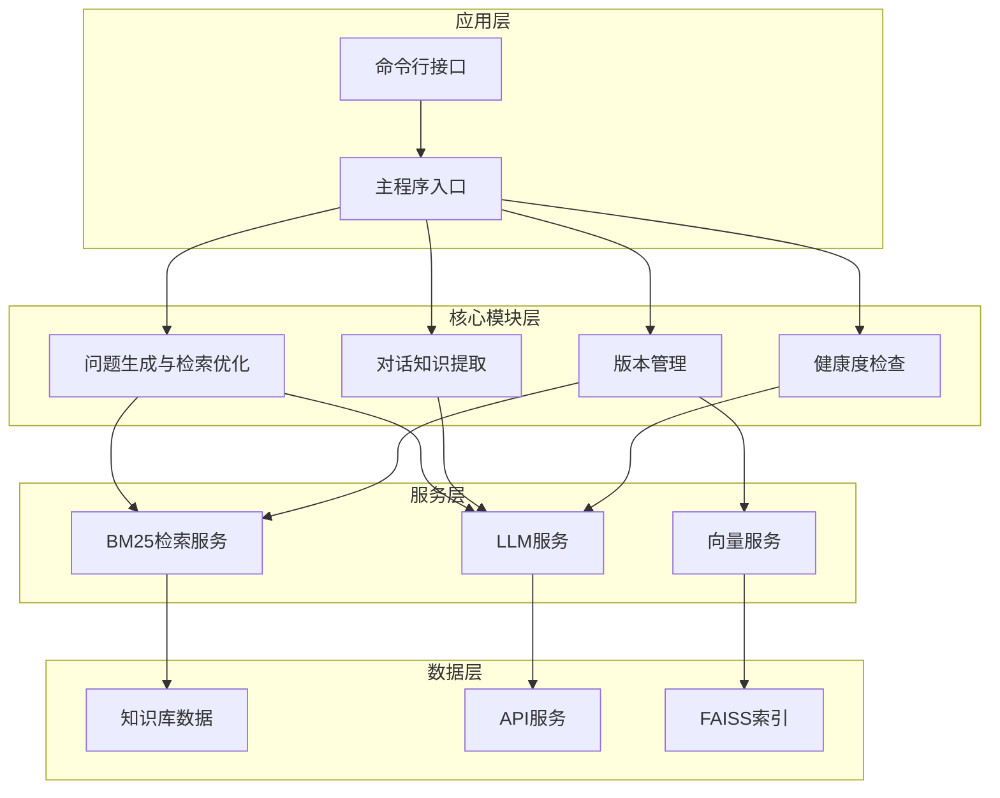
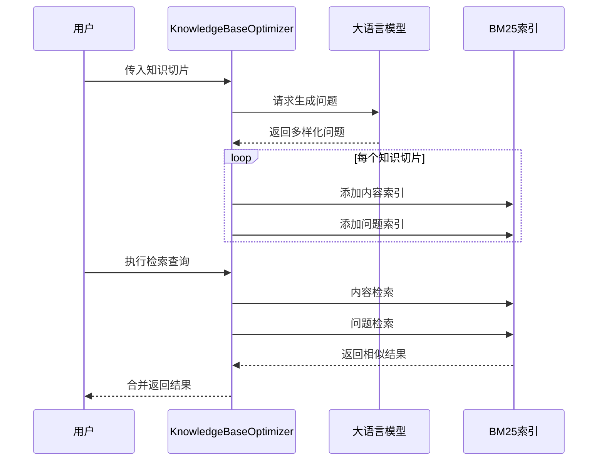
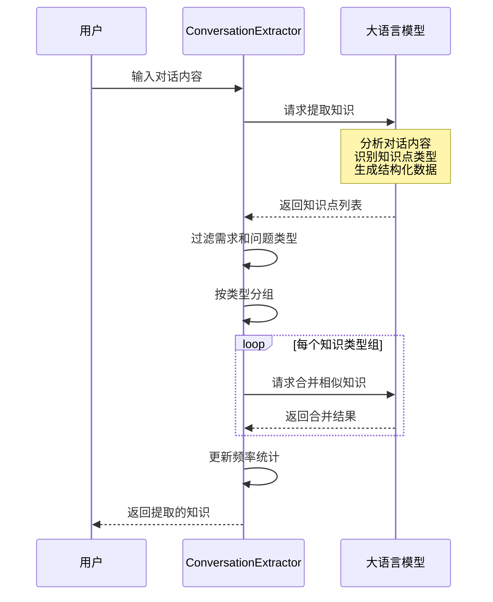
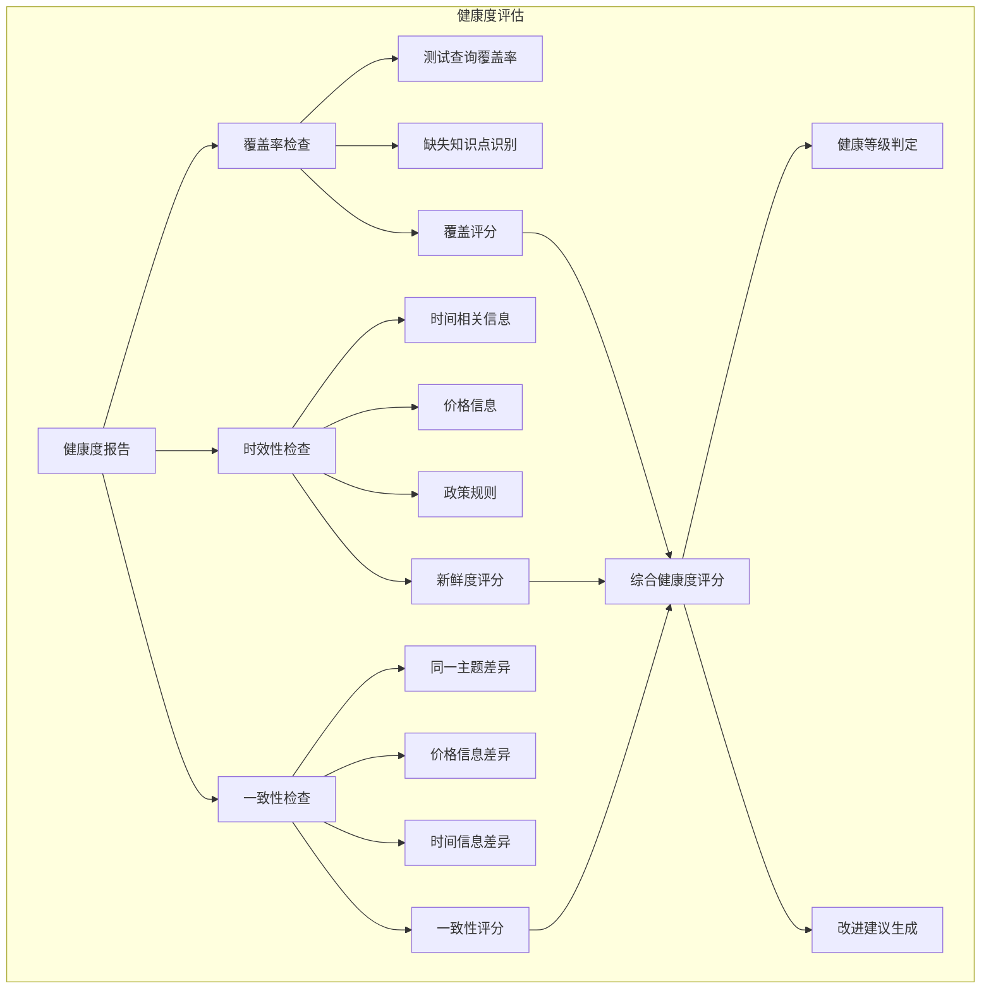
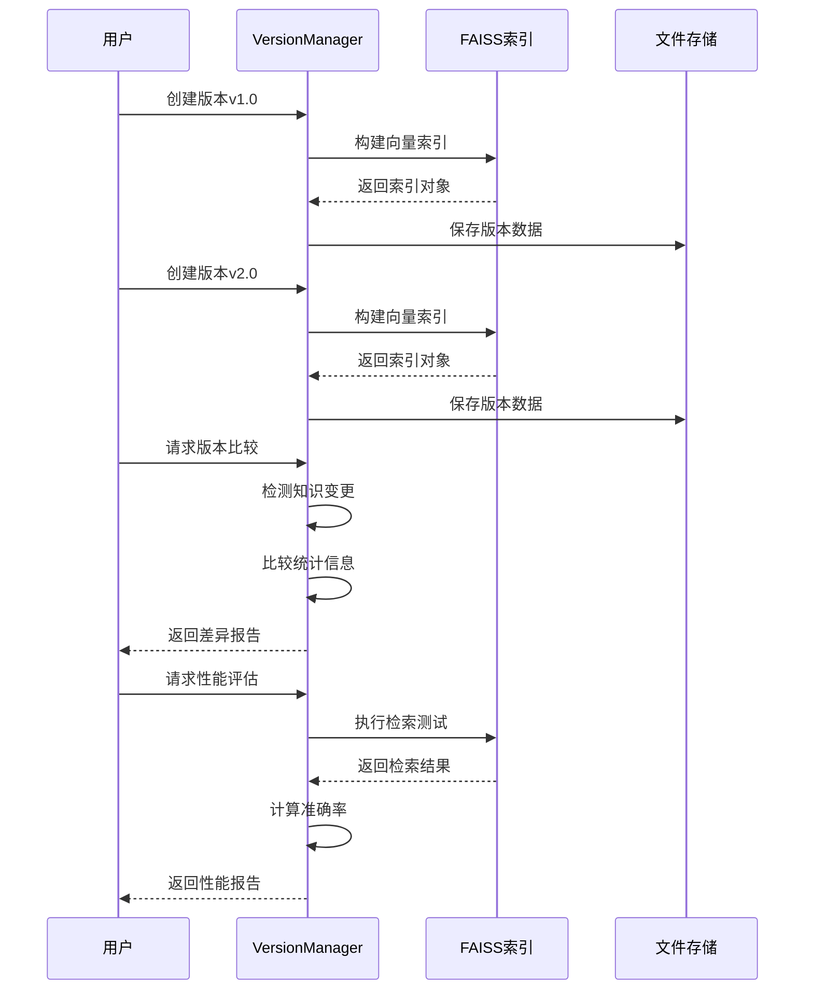
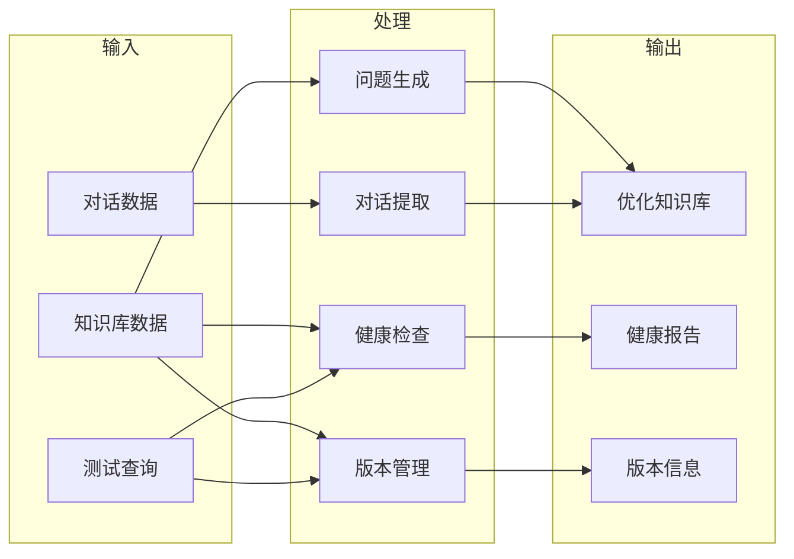

# 知识库处理系统 - 技术架构

## 架构概览

知识库处理系统采用模块化架构设计，包含四大核心模块：问题生成与检索优化、对话知识提取、健康度检查和版本管理。系统通过统一的配置管理和工具函数支撑，实现了高度可扩展和可维护的知识库处理能力。



## 核心组件架构

### 1. 主程序架构

```python
# main.py - 主程序入口
def main():
    """
    主函数 - 提供命令行接口运行各种知识库处理功能
    
    支持的功能：
    - --question/-q: 问题生成与检索优化
    - --conversation/-c: 对话知识提取
    - --health/-H: 健康度检查
    - --version/-v: 版本管理
    - --all/-a: 运行所有功能
    """
    parser = argparse.ArgumentParser(description="知识库处理工具")
    parser.add_argument("--question", "-q", action="store_true")
    parser.add_argument("--conversation", "-c", action="store_true")
    parser.add_argument("--health", "-H", action="store_true")
    parser.add_argument("--version", "-v", action="store_true")
    parser.add_argument("--all", "-a", action="store_true")
    parser.add_argument("--data", type=str, default=None)
```

### 2. 配置管理架构

```python
# config.py - 统一配置管理
@dataclass
class Config:
    """配置类 - 集中管理所有配置参数"""
    
    # 路径配置
    project_root: Path
    data_dir: Path
    indexes_dir: Path
    versions_dir: Path
    cache_dir: Path
    output_dir: Path
    
    # Embedding配置
    text_embedding_model: str = "text-embedding-v4"
    text_embedding_dim: int = 1024
    
    # LLM配置
    llm_model: str = "qwen-turbo-latest"
    llm_temperature: float = 0.3
    llm_max_tokens: int = 2000
    
    # 检索配置
    top_k: int = 5
    score_threshold: float = 0.7
    
    # 健康度检查权重
    coverage_weight: float = 0.4
    freshness_weight: float = 0.3
    consistency_weight: float = 0.3
```

## 核心模块架构

### 1. 问题生成与检索优化模块

#### KnowledgeBaseOptimizer类架构

```python
class KnowledgeBaseOptimizer:
    """
    知识库优化器 - 基于BM25的问题生成与检索优化
    
    核心功能：
    - 为知识切片生成多样化问题
    - 构建双索引（内容索引+问题索引）
    - 检索效果评估和对比
    """
    
    def __init__(self):
        self.knowledge_base: List[Dict] = []
        self.content_bm25: BM25Okapi      # 内容索引
        self.question_bm25: BM25Okapi     # 问题索引
        self.client: OpenAI               # LLM客户端
```

#### 数据处理流程



### 2. 对话知识提取模块

#### ConversationKnowledgeExtractor类架构

```python
class ConversationKnowledgeExtractor:
    """
    对话知识提取器 - 从对话中提取和沉淀知识
    
    核心功能：
    - 从对话中提取知识点
    - 知识分类和打标
    - 相似知识合并
    - 频率统计分析
    """
    
    def __init__(self):
        self.extracted_knowledge: List[Dict] = []
        self.knowledge_frequency: Counter = Counter()
        self.client: OpenAI
```

#### 对话处理流程



### 3. 健康度检查模块

#### KnowledgeBaseHealthChecker类架构

```python
class KnowledgeBaseHealthChecker:
    """
    知识库健康度检查器 - 检查完整性、时效性和一致性
    
    核心功能：
    - 缺少知识检测
    - 过期知识识别
    - 冲突知识检测
    - 综合健康度评分
    """
    
    def __init__(self):
        self.health_report: Dict[str, Any] = {}
        self.client: OpenAI
```

#### 健康度评估体系



#### 健康度计算公式

```python
def _calculate_overall_health_score(
    self, 
    missing_result: Dict, 
    outdated_result: Dict, 
    conflicting_result: Dict
) -> float:
    """
    综合健康度 = 覆盖率评分 × 0.4 
               + 新鲜度评分 × 0.3 
               + 一致性评分 × 0.3
    """
    coverage_score = missing_result.get('coverage_score', 0)
    freshness_score = outdated_result.get('freshness_score', 0)
    consistency_score = conflicting_result.get('consistency_score', 0)
    
    overall_score = (
        coverage_score * config.coverage_weight +
        freshness_score * config.freshness_weight +
        consistency_score * config.consistency_weight
    )
    
    return overall_score
```

### 4. 版本管理模块

#### KnowledgeBaseVersionManager类架构

```python
class KnowledgeBaseVersionManager:
    """
    知识库版本管理器 - 版本创建、比较和性能评估
    
    核心功能：
    - 版本创建和存储
    - 版本差异比较
    - 版本性能评估
    - 回归测试支持
    """
    
    def __init__(self):
        self.versions: Dict[str, Dict] = {}
        self.client: OpenAI
```

#### 版本管理流程



## 技术栈详解

### 1. BM25检索算法

#### 算法原理
```python
# BM25评分公式
score(D, Q) = Σ IDF(qi) · (f(qi, D) · (k1 + 1)) / (f(qi, D) + k1 · (1 - b + b · |D|/avgdl))

# 其中：
# - f(qi, D): 词qi在文档D中的频率
# - |D|: 文档D的长度
# - avgdl: 平均文档长度
# - k1, b: 调节参数（默认k1=1.5, b=0.75）
# - IDF(qi): 逆文档频率
```

#### 实现代码
```python
from rank_bm25 import BM25Okapi
import jieba

def preprocess_text(text: str, stop_words: List[str]) -> List[str]:
    """文本预处理和分词"""
    # 移除标点符号
    text = re.sub(r'[^\w\s]', '', text)
    # jieba分词
    words = jieba.lcut(text)
    # 过滤停用词
    words = [w for w in words if len(w) > 1 and w not in stop_words]
    return words

# 创建BM25索引
corpus = [preprocess_text(doc, stop_words) for doc in documents]
bm25 = BM25Okapi(corpus)

# 搜索
query_words = preprocess_text(query, stop_words)
scores = bm25.get_scores(query_words)
```

### 2. 向量化技术

#### Embedding模型
```python
# text-embedding-v4 配置
TEXT_EMBEDDING_MODEL = "text-embedding-v4"
TEXT_EMBEDDING_DIM = 1024

def _get_text_embedding(self, text: str) -> List[float]:
    """获取文本的Embedding"""
    response = self.client.embeddings.create(
        model=TEXT_EMBEDDING_MODEL,
        input=text,
        dimensions=TEXT_EMBEDDING_DIM
    )
    return list(response.data[0].embedding)
```

#### FAISS索引构建
```python
import faiss
import numpy as np

# 创建索引
text_index = faiss.IndexFlatL2(TEXT_EMBEDDING_DIM)
text_index_map = faiss.IndexIDMap(text_index)

# 添加向量
text_vectors = np.array(embeddings).astype('float32')
text_ids = np.array(ids)
text_index_map.add_with_ids(text_vectors, text_ids)

# 搜索
query_vector = np.array([embedding]).astype('float32')
distances, indices = text_index_map.search(query_vector, k)
```

### 3. LLM集成

#### API配置
```python
from openai import OpenAI

# 初始化客户端
client = OpenAI(
    api_key=os.getenv("DASHSCOPE_API_KEY"),
    base_url="https://dashscope.aliyuncs.com/compatible-mode/v1"
)

# 调用LLM
def get_completion(prompt: str, model: str = "qwen-turbo-latest") -> str:
    response = client.chat.completions.create(
        model=model,
        messages=[{"role": "user", "content": prompt}],
        temperature=0.3,
    )
    return response.choices[0].message.content or ""
```

### 4. 中文分词

#### jieba分词配置
```python
import jieba

# 精确模式（默认）
words = jieba.lcut(text)

# 全模式
words = jieba.lcut(text, cut_all=True)

# 搜索引擎模式
words = jieba.lcut_for_search(text)

# 自定义词典
jieba.load_userdict("user_dict.txt")
```

## 系统配置架构

### 1. 目录结构
```
CASE-知识库处理/
├── code/                    # 代码目录
├── data/                    # 原始数据
│   └── knowledge_base.json
├── user_data/               # 用户数据
│   ├── indexes/             # 索引存储
│   ├── versions/            # 版本存储
│   └── cache/               # 缓存存储
├── output/                  # 输出结果
└── docs/                    # 文档
```

### 2. 配置管理
```python
@dataclass
class Config:
    # 路径配置
    project_root: Path
    data_dir: Path
    indexes_dir: Path
    versions_dir: Path
    cache_dir: Path
    output_dir: Path
    
    # 模型配置
    text_embedding_model: str = "text-embedding-v4"
    text_embedding_dim: int = 1024
    llm_model: str = "qwen-turbo-latest"
    
    # 检索配置
    top_k: int = 5
    score_threshold: float = 0.7
    
    # 健康度权重
    coverage_weight: float = 0.4
    freshness_weight: float = 0.3
    consistency_weight: float = 0.3
    
    # 停用词
    stop_words: List[str] = ['的', '了', '在', ...]
```

## 数据流架构

### 完整处理流程



## 扩展架构

### 1. 插件化设计
```python
class KnowledgeProcessorPlugin:
    """知识处理插件基类"""
    
    def process(self, knowledge_base: List[Dict]) -> List[Dict]:
        """处理知识库"""
        raise NotImplementedError
    
    def validate(self, knowledge: Dict) -> bool:
        """验证知识有效性"""
        raise NotImplementedError
```

### 2. 自定义LLM支持
```python
class LLMProvider:
    """LLM提供商接口"""
    
    def generate(self, prompt: str) -> str:
        """生成文本"""
        raise NotImplementedError
    
    def embed(self, text: str) -> List[float]:
        """生成向量"""
        raise NotImplementedError
```

### 3. 多存储后端
```python
class StorageBackend:
    """存储后端接口"""
    
    def save(self, key: str, data: Any) -> None:
        """保存数据"""
        raise NotImplementedError
    
    def load(self, key: str) -> Any:
        """加载数据"""
        raise NotImplementedError
```

---

*最后更新: 2026年2月14日*
*架构版本: v1.0*
*技术负责人: AI系统架构组*
