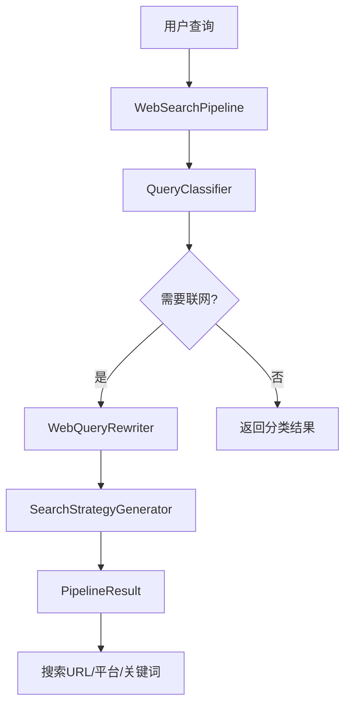
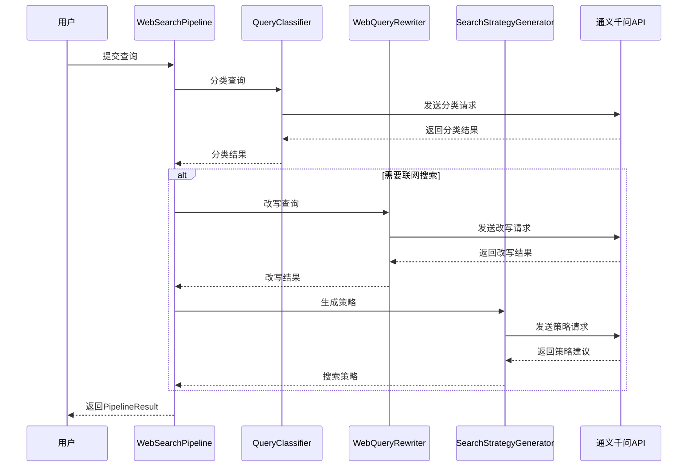

# Query+联网搜索改写系统 - 技术架构

## 架构概览

Query+联网搜索改写系统采用模块化架构设计，包含查询分类、查询改写、搜索策略生成和整合管道四个核心模块，确保系统的可扩展性、可维护性和灵活性。



## 核心组件架构

### 1. 模块架构图

```
┌─────────────────────────────────────────────────────────┐
│                    WebSearchPipeline                     │
│                      (整合管道)                          │
└───────────────────────┬─────────────────────────────────┘
                        │
        ┌───────────────┼───────────────┐
        │               │               │
        ▼               ▼               ▼
┌───────────────┐ ┌───────────────┐ ┌───────────────┐
│QueryClassifier│ │WebQueryRewriter│ │StrategyGen   │
│  查询分类器   │→│  查询改写器   │→│搜索策略生成器│
└───────┬───────┘ └───────────────┘ └───────────────┘
        │
        ▼
  SearchNeedType (Enum)
  - TIME_SENSITIVE (时效性)
  - WEATHER (天气)
  - NEWS (新闻资讯)
  - PRICE (价格行情)
  - REALTIME_DATA (实时数据)
  - NOT_NEEDED (不需要联网)
```

### 2. 数据处理流程



## 技术栈详解

### 1. LLM服务集成

#### OpenAI兼容模式
```python
from openai import OpenAI

# 初始化OpenAI客户端（兼容DashScope）
client = OpenAI(
    api_key=os.environ.get("DASHSCOPE_API_KEY"),
    base_url="https://dashscope.aliyuncs.com/compatible-mode/v1"
)

# 调用模型
response = client.chat.completions.create(
    model="qwen-max",
    messages=[
        {"role": "system", "content": system_prompt},
        {"role": "user", "content": user_prompt}
    ],
    temperature=0.1,
    max_tokens=500
)
```

**技术特点：**
- **兼容性**: 使用OpenAI SDK调用阿里云DashScope
- **灵活性**: 可轻松切换到其他兼容API
- **稳定性**: 企业级API服务保障

#### 模型参数配置
```python
# 分类任务参数
temperature=0.1  # 低温度确保分类稳定性
max_tokens=500   # 分类结果较短

# 改写任务参数
temperature=0.3  # 中等温度允许一定创造性
max_tokens=1000  # 改写结果需要更多空间
```

### 2. 查询分类模块

#### SearchNeedType枚举
```python
class SearchNeedType(Enum):
    """搜索需求类型枚举"""
    TIME_SENSITIVE = "时效性"
    WEATHER = "天气"
    NEWS = "新闻资讯"
    PRICE = "价格行情"
    REALTIME_DATA = "实时数据"
    NOT_NEEDED = "不需要联网"
```

#### 分类流程
```python
def classify(self, query: str) -> dict:
    # 1. 构建系统提示词
    system_prompt = """你是一个专业的查询分析助手..."""
    
    # 2. 构建用户提示词
    user_prompt = f"""请分析以下查询是否需要联网搜索：{query}"""
    
    # 3. 调用LLM
    result_text = self._call_llm(system_prompt, user_prompt)
    
    # 4. 解析JSON结果
    result = json.loads(json_str)
    
    # 5. 返回标准化结果
    return {
        "query": query,
        "need_web_search": result.get("need_web_search", False),
        "search_type": result.get("search_type", "不需要联网"),
        "reason": result.get("reason", ""),
        "suggested_platforms": result.get("suggested_platforms", [])
    }
```

### 3. 查询改写模块

#### 改写策略配置
```python
REWRITE_STRATEGIES = {
    SearchNeedType.TIME_SENSITIVE: "添加时间限定词，明确时间范围",
    SearchNeedType.WEATHER: "添加地点和时间限定，使用标准天气查询格式",
    SearchNeedType.NEWS: "添加'最新'、'新闻'等关键词，优化新闻搜索",
    SearchNeedType.PRICE: "添加'实时'、'当前'等关键词，明确查询时间点",
    SearchNeedType.REALTIME_DATA: "添加'实时'、'最新'等关键词",
}
```

#### 时间信息注入
```python
from datetime import datetime

# 获取当前时间信息
current_time = datetime.now().strftime("%Y年%m月%d日")

# 注入到提示词中
user_prompt = f"""
原始查询: {query}
当前日期: {current_time}
"""
```

### 4. 搜索策略生成模块

#### 平台特性配置
```python
PLATFORM_FEATURES = {
    "Google": {
        "适合类型": ["时效性", "新闻资讯", "价格行情", "实时数据"],
        "优势": "全球最大搜索引擎，覆盖面广",
        "搜索技巧": ["使用site:限定网站", "使用引号精确匹配"]
    },
    "百度": {
        "适合类型": ["时效性", "新闻资讯", "天气"],
        "优势": "中文搜索优化，本地化程度高",
        "搜索技巧": ["使用site:限定网站", "使用intitle:标题搜索"]
    },
    # ... 更多平台配置
}
```

#### 搜索URL生成
```python
url_templates = {
    "Google": "https://www.google.com/search?q={query}",
    "百度": "https://www.baidu.com/s?wd={query}",
    "必应": "https://www.bing.com/search?q={query}",
    "知乎": "https://www.zhihu.com/search?q={query}",
    "微博": "https://s.weibo.com/weibo/{query}",
    # ... 更多URL模板
}

def generate_search_url(self, query: str, platform: str) -> str:
    template = url_templates.get(platform)
    if template:
        return template.format(query=query)
    return ""
```

### 5. 整合管道模块

#### PipelineResult数据类
```python
@dataclass
class PipelineResult:
    """处理管道结果数据类"""
    original_query: str           # 原始查询
    need_web_search: bool         # 是否需要联网
    search_type: str              # 搜索类型
    classification_reason: str    # 分类理由
    rewritten_query: str = ""     # 改写后查询
    keywords: list[str] = field(default_factory=list)
    platforms: list[str] = field(default_factory=list)
    search_operators: list[str] = field(default_factory=list)
    priority: int = 0
    notes: str = ""
    search_urls: dict[str, str] = field(default_factory=dict)
```

#### 处理流程
```python
def process(self, query: str, generate_urls: bool = True) -> PipelineResult:
    # Step 1: 分类
    classification = self.classifier.classify(query)
    
    # 如果不需要联网，直接返回
    if not classification["need_web_search"]:
        return PipelineResult(need_web_search=False, ...)
    
    # Step 2: 改写
    search_type = self.classifier.quick_classify(query)
    rewrite_result = self.rewriter.rewrite(query, search_type)
    
    # Step 3: 生成搜索策略
    strategy = self.strategy_generator.generate(
        query=rewrite_result["rewritten_query"],
        search_type=search_type,
        keywords=rewrite_result["keywords"]
    )
    
    # Step 4: 生成搜索URL
    if generate_urls:
        for platform in strategy.platforms[:3]:
            url = self.strategy_generator.generate_search_url(...)
            result.search_urls[platform] = url
    
    return result
```

## 系统配置架构

### 1. 配置类设计
```python
@dataclass
class Config:
    """配置类"""
    # 路径配置
    project_root: Path
    output_dir: Path
    
    # LLM配置
    llm_model: str = "qwen-max"
    llm_temperature: float = 0.7
    llm_max_tokens: int = 2000
    
    # 搜索配置
    search_platforms: list = field(default_factory=lambda: [...])
    
    # 关键词配置
    time_sensitive_keywords: list = field(default_factory=lambda: [...])
    weather_keywords: list = field(default_factory=lambda: [...])
    news_keywords: list = field(default_factory=lambda: [...])
    price_keywords: list = field(default_factory=lambda: [...])
```

### 2. 环境变量管理
```python
# .env文件配置
DASHSCOPE_API_KEY=your_api_key_here

# 代码中加载
from dotenv import load_dotenv

load_dotenv()
api_key = os.environ.get("DASHSCOPE_API_KEY")
```

### 3. 目录结构
```
16-Query+联网搜索/
├── code/                    # 核心代码
│   ├── __init__.py         # 模块导出
│   ├── config.py           # 配置管理
│   ├── query_classifier.py # 查询分类器
│   ├── query_rewriter.py   # 查询改写器
│   ├── search_strategy.py  # 搜索策略生成器
│   ├── pipeline.py         # 整合管道
│   └── main.py             # 主程序
├── output/                  # 输出目录
├── docs/                    # 文档目录
└── README.md               # 项目说明
```

## 性能优化架构

### 1. 并行处理
```python
def process_batch(self, queries: list[str]) -> list[PipelineResult]:
    """批量处理查询"""
    results = []
    for query in queries:
        result = self.process(query)
        results.append(result)
    return results

# 可扩展为异步并行处理
import asyncio

async def process_batch_async(self, queries: list[str]) -> list[PipelineResult]:
    tasks = [self.process_async(q) for q in queries]
    return await asyncio.gather(*tasks)
```

### 2. 结果缓存
```python
from functools import lru_cache

@lru_cache(maxsize=100)
def classify_cached(self, query: str) -> dict:
    """带缓存的分类"""
    return self.classify(query)
```

### 3. 错误处理
```python
def _call_llm(self, system_prompt: str, user_prompt: str) -> str:
    try:
        response = self.client.chat.completions.create(...)
        return response.choices[0].message.content or ""
    except Exception as e:
        logger.error(f"LLM调用失败: {e}")
        return ""
```

## 扩展架构

### 1. 自定义分类器
```python
class CustomQueryClassifier(QueryClassifier):
    """自定义查询分类器"""
    
    def __init__(self, custom_rules: dict):
        super().__init__()
        self.custom_rules = custom_rules
    
    def classify(self, query: str) -> dict:
        # 先应用自定义规则
        for rule_name, rule_func in self.custom_rules.items():
            if rule_func(query):
                return self._create_result(rule_name)
        
        # 再使用LLM分类
        return super().classify(query)
```

### 2. 多LLM支持
```python
class MultiLLMClassifier:
    """支持多种LLM的分类器"""
    
    def __init__(self, providers: dict):
        self.providers = providers
        self.current_provider = "dashscope"
    
    def switch_provider(self, provider_name: str):
        """切换LLM提供商"""
        self.current_provider = provider_name
```

### 3. 插件化平台扩展
```python
class PlatformPlugin:
    """搜索平台插件"""
    
    def __init__(self, name: str, url_template: str):
        self.name = name
        self.url_template = url_template
    
    def generate_url(self, query: str) -> str:
        return self.url_template.format(query=query)

# 注册新平台
strategy_generator.register_platform(
    PlatformPlugin("新平台", "https://example.com/search?q={query}")
)
```

---

*最后更新: 2026年2月15日*
*架构版本: v1.0*
*技术负责人: AI系统架构组*
