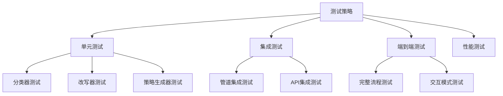

# Query+联网搜索改写系统 - 测试和部署

## 测试策略

### 测试概览

本项目采用多层次测试策略，包括单元测试、集成测试和端到端测试，确保系统的稳定性和可靠性。



## 单元测试

### 1. 测试环境配置

创建测试配置文件 `tests/conftest.py`：

```python
"""
测试配置文件
"""
import pytest
import os
from pathlib import Path

# 设置测试环境变量
os.environ["DASHSCOPE_API_KEY"] = "test_api_key"

@pytest.fixture
def sample_queries():
    """测试查询样本"""
    return {
        "weather": "今天北京的天气怎么样？",
        "time_sensitive": "最新的iPhone价格是多少？",
        "news": "最近有什么AI新闻？",
        "price": "特斯拉今天的股价是多少？",
        "not_needed": "什么是RAG技术？",
        "realtime": "比赛比分是多少？"
    }

@pytest.fixture
def expected_classifications():
    """预期分类结果"""
    return {
        "weather": "天气",
        "time_sensitive": "时效性",
        "news": "新闻资讯",
        "price": "价格行情",
        "not_needed": "不需要联网",
        "realtime": "实时数据"
    }
```

### 2. 分类器测试

创建 `tests/test_classifier.py`：

```python
"""
查询分类器单元测试
"""
import pytest
from unittest.mock import Mock, patch
from query_classifier import QueryClassifier, SearchNeedType


class TestQueryClassifier:
    """查询分类器测试类"""

    @pytest.fixture
    def classifier(self):
        """创建分类器实例"""
        with patch.object(QueryClassifier, '_init_client'):
            return QueryClassifier()

    def test_init(self, classifier):
        """测试初始化"""
        assert classifier is not None
        assert classifier.model == "qwen-max"

    def test_search_need_type_enum(self):
        """测试枚举类型"""
        assert SearchNeedType.TIME_SENSITIVE.value == "时效性"
        assert SearchNeedType.WEATHER.value == "天气"
        assert SearchNeedType.NEWS.value == "新闻资讯"
        assert SearchNeedType.PRICE.value == "价格行情"
        assert SearchNeedType.REALTIME_DATA.value == "实时数据"
        assert SearchNeedType.NOT_NEEDED.value == "不需要联网"

    @patch.object(QueryClassifier, '_call_llm')
    def test_classify_weather(self, mock_llm, classifier, sample_queries):
        """测试天气查询分类"""
        mock_llm.return_value = '''
        {
            "need_web_search": true,
            "search_type": "天气",
            "reason": "查询包含天气相关词汇",
            "suggested_platforms": ["中国天气网", "墨迹天气"]
        }
        '''
        
        result = classifier.classify(sample_queries["weather"])
        
        assert result["need_web_search"] == True
        assert result["search_type"] == "天气"
        assert "天气" in result["reason"]

    @patch.object(QueryClassifier, '_call_llm')
    def test_classify_not_needed(self, mock_llm, classifier, sample_queries):
        """测试不需要联网的查询"""
        mock_llm.return_value = '''
        {
            "need_web_search": false,
            "search_type": "不需要联网",
            "reason": "这是一个通用知识问题",
            "suggested_platforms": []
        }
        '''
        
        result = classifier.classify(sample_queries["not_needed"])
        
        assert result["need_web_search"] == False
        assert result["search_type"] == "不需要联网"

    @patch.object(QueryClassifier, '_call_llm')
    def test_quick_classify(self, mock_llm, classifier):
        """测试快速分类"""
        mock_llm.return_value = '''
        {
            "need_web_search": true,
            "search_type": "天气",
            "reason": "",
            "suggested_platforms": []
        }
        '''
        
        result = classifier.quick_classify("今天天气怎么样？")
        assert result == SearchNeedType.WEATHER

    def test_search_scenario_description(self, classifier):
        """测试场景描述获取"""
        desc = classifier.get_search_scenario_description(SearchNeedType.WEATHER)
        assert "天气" in desc or "气象" in desc


class TestQueryClassifierEdgeCases:
    """边界情况测试"""

    @pytest.fixture
    def classifier(self):
        with patch.object(QueryClassifier, '_init_client'):
            return QueryClassifier()

    @patch.object(QueryClassifier, '_call_llm')
    def test_empty_query(self, mock_llm, classifier):
        """测试空查询"""
        mock_llm.return_value = '{}'
        result = classifier.classify("")
        assert "query" in result

    @patch.object(QueryClassifier, '_call_llm')
    def test_malformed_json(self, mock_llm, classifier):
        """测试畸形JSON响应"""
        mock_llm.return_value = "这不是一个有效的JSON"
        result = classifier.classify("测试查询")
        assert result["need_web_search"] == False  # 应该返回默认值
```

### 3. 改写器测试

创建 `tests/test_rewriter.py`：

```python
"""
查询改写器单元测试
"""
import pytest
from unittest.mock import Mock, patch
from query_rewriter import WebQueryRewriter
from query_classifier import SearchNeedType


class TestWebQueryRewriter:
    """查询改写器测试类"""

    @pytest.fixture
    def rewriter(self):
        """创建改写器实例"""
        with patch.object(WebQueryRewriter, '_init_client'):
            return WebQueryRewriter()

    def test_init(self, rewriter):
        """测试初始化"""
        assert rewriter is not None
        assert rewriter.model == "qwen-max"

    def test_rewrite_strategies_defined(self, rewriter):
        """测试改写策略定义"""
        assert SearchNeedType.WEATHER in rewriter.REWRITE_STRATEGIES
        assert SearchNeedType.TIME_SENSITIVE in rewriter.REWRITE_STRATEGIES

    @patch.object(WebQueryRewriter, '_call_llm')
    def test_rewrite_weather_query(self, mock_llm, rewriter):
        """测试天气查询改写"""
        mock_llm.return_value = '''
        {
            "rewritten_query": "北京天气 2026年2月15日",
            "keywords": ["北京", "天气", "今天"],
            "explanation": "添加了具体日期"
        }
        '''
        
        result = rewriter.rewrite(
            "今天北京的天气怎么样？",
            SearchNeedType.WEATHER
        )
        
        assert result["rewritten_query"] != ""
        assert len(result["keywords"]) > 0

    def test_rewrite_not_needed(self, rewriter):
        """测试不需要联网的查询改写"""
        result = rewriter.rewrite(
            "什么是RAG？",
            SearchNeedType.NOT_NEEDED
        )
        
        assert result["rewritten_query"] == "什么是RAG？"
        assert result["rewrite_strategy"] == "无需改写"

    @patch.object(WebQueryRewriter, '_call_llm')
    def test_extract_keywords(self, mock_llm, rewriter):
        """测试关键词提取"""
        mock_llm.return_value = "RAG\n技术\n检索\n增强"
        
        keywords = rewriter.extract_keywords("什么是RAG检索增强生成技术？")
        
        assert len(keywords) > 0
        assert len(keywords) <= 5

    @patch.object(WebQueryRewriter, '_call_llm')
    def test_expand_query(self, mock_llm, rewriter):
        """测试查询扩展"""
        mock_llm.return_value = "今天天气\n当前天气\n实时天气"
        
        variants = rewriter.expand_query(
            "今天天气怎么样？",
            SearchNeedType.WEATHER
        )
        
        assert len(variants) > 0
        assert len(variants) <= 5
```

### 4. 搜索策略生成器测试

创建 `tests/test_strategy.py`：

```python
"""
搜索策略生成器单元测试
"""
import pytest
from unittest.mock import Mock, patch
from search_strategy import SearchStrategyGenerator, SearchStrategy
from query_classifier import SearchNeedType


class TestSearchStrategyGenerator:
    """搜索策略生成器测试类"""

    @pytest.fixture
    def generator(self):
        """创建生成器实例"""
        with patch.object(SearchStrategyGenerator, '_init_client'):
            return SearchStrategyGenerator()

    def test_init(self, generator):
        """测试初始化"""
        assert generator is not None
        assert len(generator.PLATFORM_FEATURES) > 0

    def test_platform_features_defined(self, generator):
        """测试平台特性定义"""
        assert "Google" in generator.PLATFORM_FEATURES
        assert "百度" in generator.PLATFORM_FEATURES
        assert "适合类型" in generator.PLATFORM_FEATURES["Google"]

    def test_search_operators_defined(self, generator):
        """测试搜索操作符定义"""
        assert "精确匹配" in generator.SEARCH_OPERATORS
        assert "标题搜索" in generator.SEARCH_OPERATORS

    @patch.object(SearchStrategyGenerator, '_call_llm')
    def test_generate_strategy(self, mock_llm, generator):
        """测试生成搜索策略"""
        mock_llm.return_value = '''
        {
            "platforms": ["中国天气网", "墨迹天气", "百度"],
            "keywords": ["北京", "天气"],
            "search_operators": ["北京天气"],
            "priority": 4,
            "notes": "建议查询具体城市"
        }
        '''
        
        strategy = generator.generate(
            "北京天气",
            SearchNeedType.WEATHER,
            ["北京", "天气"]
        )
        
        assert isinstance(strategy, SearchStrategy)
        assert len(strategy.platforms) > 0
        assert strategy.priority > 0

    def test_get_platform_recommendation(self, generator):
        """测试平台推荐"""
        platforms = generator.get_platform_recommendation(SearchNeedType.WEATHER)
        assert len(platforms) > 0
        assert len(platforms) <= 3

    def test_generate_search_url(self, generator):
        """测试生成搜索URL"""
        url = generator.generate_search_url("测试查询", "Google")
        assert "google.com" in url
        assert "测试查询" in url

        url = generator.generate_search_url("测试查询", "百度")
        assert "baidu.com" in url

    def test_default_strategy(self, generator):
        """测试默认策略"""
        strategy = generator._get_default_strategy(
            "测试查询",
            SearchNeedType.WEATHER
        )
        
        assert isinstance(strategy, SearchStrategy)
        assert len(strategy.platforms) > 0
```

### 5. 管道测试

创建 `tests/test_pipeline.py`：

```python
"""
整合管道单元测试
"""
import pytest
from unittest.mock import Mock, patch
from pipeline import WebSearchPipeline, PipelineResult


class TestWebSearchPipeline:
    """整合管道测试类"""

    @pytest.fixture
    def pipeline(self):
        """创建管道实例"""
        with patch.multiple(
            'pipeline',
            QueryClassifier=Mock(return_value=Mock()),
            WebQueryRewriter=Mock(return_value=Mock()),
            SearchStrategyGenerator=Mock(return_value=Mock())
        ):
            return WebSearchPipeline()

    def test_init(self, pipeline):
        """测试初始化"""
        assert pipeline is not None
        assert pipeline.classifier is not None
        assert pipeline.rewriter is not None
        assert pipeline.strategy_generator is not None

    @patch.multiple(
        'pipeline',
        QueryClassifier=Mock,
        WebQueryRewriter=Mock,
        SearchStrategyGenerator=Mock
    )
    def test_process_returns_pipeline_result(self):
        """测试处理返回正确类型"""
        pipeline = WebSearchPipeline()
        
        # Mock分类器返回
        pipeline.classifier.classify = Mock(return_value={
            "need_web_search": False,
            "search_type": "不需要联网",
            "reason": "测试"
        })
        pipeline.classifier.quick_classify = Mock(return_value=None)
        
        result = pipeline.process("测试查询")
        
        assert isinstance(result, PipelineResult)

    def test_pipeline_result_to_dict(self):
        """测试结果转换为字典"""
        result = PipelineResult(
            original_query="测试",
            need_web_search=True,
            search_type="天气",
            classification_reason="测试"
        )
        
        result_dict = result.to_dict()
        
        assert result_dict["original_query"] == "测试"
        assert result_dict["need_web_search"] == True

    def test_pipeline_result_format_summary(self):
        """测试结果格式化输出"""
        result = PipelineResult(
            original_query="测试查询",
            need_web_search=True,
            search_type="天气",
            classification_reason="包含天气词汇",
            rewritten_query="北京天气",
            keywords=["北京", "天气"],
            platforms=["中国天气网", "墨迹天气"]
        )
        
        summary = result.format_summary()
        
        assert "测试查询" in summary
        assert "需要联网搜索" in summary


class TestPipelineResultDataClass:
    """PipelineResult数据类测试"""

    def test_default_values(self):
        """测试默认值"""
        result = PipelineResult(
            original_query="测试",
            need_web_search=False,
            search_type="不需要联网",
            classification_reason=""
        )
        
        assert result.rewritten_query == ""
        assert result.keywords == []
        assert result.platforms == []
        assert result.search_urls == {}

    def test_to_dict_includes_all_fields(self):
        """测试字典包含所有字段"""
        result = PipelineResult(
            original_query="测试",
            need_web_search=True,
            search_type="天气",
            classification_reason="测试",
            rewritten_query="改写后",
            keywords=["关键词"],
            platforms=["平台"],
            search_operators=["操作符"],
            priority=3,
            notes="备注",
            search_urls={"Google": "url"}
        )
        
        result_dict = result.to_dict()
        
        assert "original_query" in result_dict
        assert "need_web_search" in result_dict
        assert "search_urls" in result_dict
```

## 集成测试

### 1. API集成测试

创建 `tests/test_integration.py`：

```python
"""
集成测试
"""
import pytest
import os
from pipeline import WebSearchPipeline


@pytest.mark.integration
class TestIntegration:
    """集成测试类"""

    @pytest.fixture
    def pipeline(self):
        """创建管道实例"""
        api_key = os.environ.get("DASHSCOPE_API_KEY")
        if not api_key:
            pytest.skip("DASHSCOPE_API_KEY未设置，跳过集成测试")
        return WebSearchPipeline()

    def test_end_to_end_weather_query(self, pipeline):
        """端到端天气查询测试"""
        result = pipeline.process("今天北京的天气怎么样？")
        
        assert result.need_web_search == True
        assert result.search_type == "天气"
        assert len(result.platforms) > 0

    def test_end_to_end_not_needed_query(self, pipeline):
        """端到端通用知识查询测试"""
        result = pipeline.process("什么是RAG技术？")
        
        assert result.need_web_search == False

    def test_batch_processing(self, pipeline):
        """批量处理测试"""
        queries = [
            "今天天气",
            "什么是机器学习",
            "最新新闻"
        ]
        
        results = pipeline.process_batch(queries)
        
        assert len(results) == 3
        for result in results:
            assert isinstance(result, PipelineResult)
```

### 2. 运行测试

```bash
# 运行所有单元测试
pytest tests/ -v

# 运行集成测试
pytest tests/ -v -m integration

# 运行特定测试文件
pytest tests/test_classifier.py -v

# 运行特定测试类
pytest tests/test_classifier.py::TestQueryClassifier -v

# 生成覆盖率报告
pytest tests/ --cov=. --cov-report=html
```

## 性能测试

### 1. 响应时间测试

创建 `tests/test_performance.py`：

```python
"""
性能测试
"""
import pytest
import time
from pipeline import WebSearchPipeline


class TestPerformance:
    """性能测试类"""

    @pytest.fixture
    def pipeline(self):
        return WebSearchPipeline()

    def test_classification_response_time(self, pipeline):
        """测试分类响应时间"""
        start = time.time()
        result = pipeline.classify_only("今天天气怎么样？")
        elapsed = time.time() - start
        
        # 分类应该在5秒内完成
        assert elapsed < 5.0

    def test_full_pipeline_response_time(self, pipeline):
        """测试完整管道响应时间"""
        start = time.time()
        result = pipeline.process("今天北京的天气怎么样？")
        elapsed = time.time() - start
        
        # 完整管道应该在15秒内完成
        assert elapsed < 15.0

    def test_batch_processing_performance(self, pipeline):
        """测试批量处理性能"""
        queries = ["测试查询"] * 10
        
        start = time.time()
        results = pipeline.process_batch(queries)
        elapsed = time.time() - start
        
        # 批量处理应该在60秒内完成
        assert elapsed < 60.0
        assert len(results) == 10
```

## 部署策略

### 1. 开发环境部署

#### 本地运行
```bash
# 克隆项目
cd practice/16-Query+联网搜索

# 安装依赖
uv pip install openai python-dotenv loguru

# 配置环境变量
echo "DASHSCOPE_API_KEY=your_key" > ../../.env

# 运行
uv run python code/main.py
```

### 2. Docker部署

#### Dockerfile
```dockerfile
# Dockerfile
FROM python:3.11-slim

WORKDIR /app

# 安装依赖
COPY requirements.txt .
RUN pip install --no-cache-dir -r requirements.txt

# 复制代码
COPY code/ ./code/

# 设置环境变量
ENV PYTHONUNBUFFERED=1

# 运行
CMD ["python", "code/main.py"]
```

#### requirements.txt
```
openai>=1.0.0
python-dotenv>=1.0.0
loguru>=0.7.0
```

#### 构建和运行
```bash
# 构建镜像
docker build -t query-search-system .

# 运行容器
docker run -e DASHSCOPE_API_KEY=your_key query-search-system
```

### 3. Docker Compose部署

#### docker-compose.yml
```yaml
version: '3.8'

services:
  query-search:
    build: .
    environment:
      - DASHSCOPE_API_KEY=${DASHSCOPE_API_KEY}
    volumes:
      - ./output:/app/output
    restart: unless-stopped
```

#### 运行
```bash
# 启动服务
docker-compose up -d

# 查看日志
docker-compose logs -f

# 停止服务
docker-compose down
```

### 4. Kubernetes部署

#### Deployment
```yaml
# k8s/deployment.yaml
apiVersion: apps/v1
kind: Deployment
metadata:
  name: query-search-system
spec:
  replicas: 2
  selector:
    matchLabels:
      app: query-search
  template:
    metadata:
      labels:
        app: query-search
    spec:
      containers:
      - name: query-search
        image: query-search-system:latest
        env:
        - name: DASHSCOPE_API_KEY
          valueFrom:
            secretKeyRef:
              name: api-secrets
              key: dashscope-api-key
        resources:
          requests:
            memory: "256Mi"
            cpu: "250m"
          limits:
            memory: "512Mi"
            cpu: "500m"
```

#### Service
```yaml
# k8s/service.yaml
apiVersion: v1
kind: Service
metadata:
  name: query-search-service
spec:
  selector:
    app: query-search
  ports:
  - port: 80
    targetPort: 8000
  type: ClusterIP
```

## CI/CD流水线

### GitHub Actions配置

创建 `.github/workflows/ci.yml`：

```yaml
name: CI

on:
  push:
    branches: [ main, develop ]
  pull_request:
    branches: [ main ]

jobs:
  test:
    runs-on: ubuntu-latest
    
    steps:
    - uses: actions/checkout@v3
    
    - name: Set up Python
      uses: actions/setup-python@v4
      with:
        python-version: '3.11'
    
    - name: Install dependencies
      run: |
        python -m pip install --upgrade pip
        pip install openai python-dotenv loguru pytest pytest-cov
    
    - name: Run tests
      run: |
        cd practice/16-Query+联网搜索
        pytest tests/ -v --cov=. --cov-report=xml
    
    - name: Upload coverage
      uses: codecov/codecov-action@v3
      with:
        file: ./coverage.xml

  lint:
    runs-on: ubuntu-latest
    
    steps:
    - uses: actions/checkout@v3
    
    - name: Set up Python
      uses: actions/setup-python@v4
      with:
        python-version: '3.11'
    
    - name: Install linters
      run: |
        pip install ruff mypy
    
    - name: Run Ruff
      run: ruff check .
    
    - name: Run MyPy
      run: mypy practice/16-Query+联网搜索/code/
```

## 监控和日志

### 1. 日志配置

```python
from loguru import logger
import sys

# 配置日志
logger.remove()
logger.add(
    sys.stdout,
    format="<green>{time:HH:mm:ss}</green> | <level>{level: <8}</level> | <level>{message}</level>",
    level="INFO"
)
logger.add(
    "logs/app.log",
    rotation="1 day",
    retention="7 days",
    level="DEBUG"
)
```

### 2. 健康检查

```python
def health_check() -> dict:
    """健康检查"""
    return {
        "status": "healthy",
        "timestamp": datetime.now().isoformat(),
        "components": {
            "classifier": "ok",
            "rewriter": "ok",
            "strategy_generator": "ok"
        }
    }
```

## 部署验证

### 1. 功能验证清单

- [ ] API密钥配置正确
- [ ] 分类功能正常工作
- [ ] 改写功能正常工作
- [ ] 策略生成功能正常工作
- [ ] 批量处理功能正常
- [ ] 日志记录正常

### 2. 性能验证清单

- [ ] 单次查询响应时间 < 10秒
- [ ] 批量处理吞吐量满足需求
- [ ] 内存使用 < 500MB
- [ ] CPU使用正常

---

*最后更新: 2026年2月15日*
*文档版本: v1.0*
*维护团队: build-your-own-ai项目团队*
