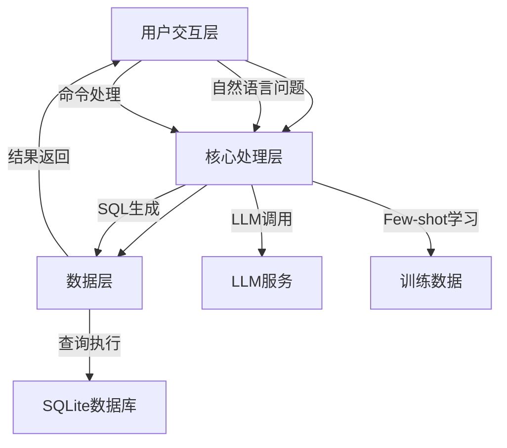
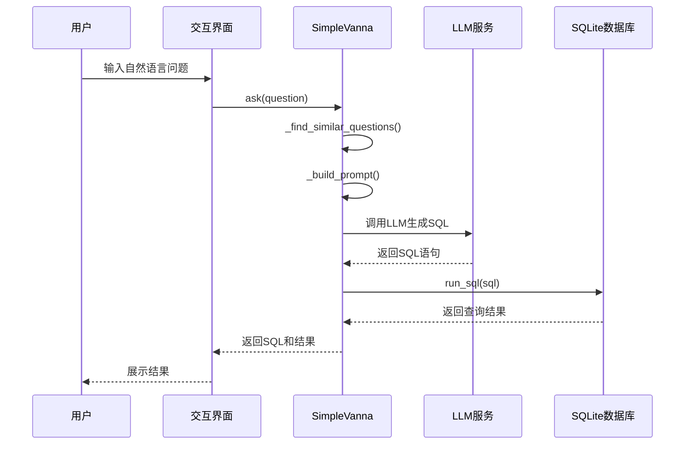
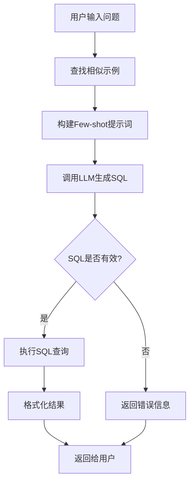

# Text2SQL智能查询系统 - 技术架构

## 架构概览

Text2SQL智能查询系统采用分层架构设计，包含用户交互层、核心处理层、数据层三个核心层次，确保系统的可扩展性、可维护性和灵活性。



## 核心组件架构

### 1. 系统架构图

```
┌─────────────────────────────────────────────────────────┐
│                    用户交互层                            │
│                    CLI (cli.py)                          │
│  - 交互式界面      - 命令处理       - 结果展示          │
└───────────────────────┬─────────────────────────────────┘
                        │
                        ▼
┌─────────────────────────────────────────────────────────┐
│                    核心处理层                            │
│              SimpleVanna (text2sql_vanna.py)             │
│  ┌─────────────┐  ┌─────────────┐  ┌─────────────────┐  │
│  │ LLM Client  │  │ 训练数据    │  │ 数据库连接      │  │
│  │ (多提供商)  │  │ (Few-shot)  │  │ (SQLite)        │  │
│  └─────────────┘  └─────────────┘  └─────────────────┘  │
│         ↓                ↓                ↓              │
│    generate_sql()   _build_prompt()   run_sql()         │
└─────────────────────────────────────────────────────────┘
        ↓                    ↓                    ↓
┌───────────────┐  ┌───────────────┐  ┌───────────────┐
│ 通义千问/OpenAI│  │ Few-shot示例  │  │ SQLite数据库  │
└───────────────┘  └───────────────┘  └───────────────┘
```

### 2. 数据处理流程



## 技术栈详解

### 1. LLM集成架构

#### 多提供商支持设计
```python
class SimpleVanna(BaseVanna):
    def _init_llm_client(self, provider: str):
        """初始化LLM客户端，支持多种提供商"""
        if provider == "dashscope":
            self.client = OpenAI(
                api_key=os.environ.get("DASHSCOPE_API_KEY"),
                base_url="https://dashscope.aliyuncs.com/compatible-mode/v1"
            )
            self.model = "qwen-turbo"
        elif provider == "openai":
            self.client = OpenAI(
                api_key=os.environ.get("OPENAI_API_KEY")
            )
            self.model = "gpt-4o-mini"
        elif provider == "ollama":
            self.client = OpenAI(
                base_url="http://localhost:11434/v1"
            )
            self.model = "deepseek-r1:7b"
```

**技术特点：**
- **统一接口**: 使用OpenAI SDK兼容模式
- **灵活切换**: 支持三种LLM提供商
- **易于扩展**: 可快速添加新的提供商

#### LLM调用参数配置
```python
def _call_llm(self, prompt: str) -> str:
    """调用LLM生成响应"""
    response = self.client.chat.completions.create(
        model=self.model,
        messages=[
            {"role": "system", "content": self.system_prompt},
            {"role": "user", "content": prompt}
        ],
        temperature=0.1,  # 低温度确保SQL生成稳定性
        max_tokens=1000
    )
    return response.choices[0].message.content or ""
```

### 2. Few-shot学习机制

#### 训练数据结构
```python
self.training_data = [
    {
        "question": "查询所有英雄的名称和定位",
        "sql": "SELECT hero_name, role FROM heros"
    },
    {
        "question": "查询所有战士类英雄",
        "sql": "SELECT * FROM heros WHERE role = '战士'"
    },
    {
        "question": "查询生命值最高的前5个英雄",
        "sql": "SELECT hero_name, health FROM heros ORDER BY health DESC LIMIT 5"
    },
    # ... 更多示例
]
```

#### 相似问题查找
```python
def _find_similar_questions(self, question: str, top_k: int = 3) -> list:
    """查找相似问题作为Few-shot示例"""
    # 基于关键词匹配的简单相似度计算
    question_keywords = set(question.lower().split())
    
    similarities = []
    for data in self.training_data:
        train_keywords = set(data["question"].lower().split())
        similarity = len(question_keywords & train_keywords) / len(question_keywords)
        similarities.append((similarity, data))
    
    # 返回最相似的top_k个示例
    similarities.sort(reverse=True, key=lambda x: x[0])
    return [item[1] for item in similarities[:top_k]]
```

### 3. 提示词构建

#### 系统提示词模板
```python
self.system_prompt = """你是一个专业的SQL生成助手。你的任务是根据用户的问题，生成正确的SQL查询语句。

规则：
1. 只返回SQL语句，不要有任何其他文字说明
2. SQL语句必须符合SQLite语法
3. 表名和字段名要使用正确的名称
4. 字符串值使用单引号包围
5. 不要使用Markdown代码块格式

可用的表：
{schema_info}"""
```

#### Few-shot提示词构建
```python
def _build_prompt(self, question: str) -> str:
    """构建Few-shot提示词"""
    # 查找相似问题
    similar_examples = self._find_similar_questions(question)
    
    # 构建提示词
    prompt_parts = []
    
    # 添加Few-shot示例
    for example in similar_examples:
        prompt_parts.append(f"问题: {example['question']}")
        prompt_parts.append(f"SQL: {example['sql']}")
        prompt_parts.append("")
    
    # 添加当前问题
    prompt_parts.append(f"问题: {question}")
    prompt_parts.append("SQL:")
    
    return "\n".join(prompt_parts)
```

### 4. 数据库连接模块

#### SQLite连接管理
```python
def _init_db_connection(self):
    """初始化数据库连接"""
    db_path = get_project_path("data", "heros.db")
    self.conn = sqlite3.connect(db_path)
    self.conn.row_factory = sqlite3.Row  # 返回字典格式

def run_sql(self, sql: str) -> list:
    """执行SQL查询"""
    try:
        cursor = self.conn.cursor()
        cursor.execute(sql)
        columns = [description[0] for description in cursor.description]
        results = [dict(zip(columns, row)) for row in cursor.fetchall()]
        return results
    except Exception as e:
        logger.error(f"SQL执行失败: {e}")
        return []
```

#### 表结构加载
```python
def _load_schema_info(self) -> str:
    """加载表结构信息"""
    cursor = self.conn.cursor()
    
    # 获取所有表名
    cursor.execute("SELECT name FROM sqlite_master WHERE type='table'")
    tables = cursor.fetchall()
    
    schema_info = []
    for table in tables:
        table_name = table[0]
        # 获取表结构
        cursor.execute(f"PRAGMA table_info({table_name})")
        columns = cursor.fetchall()
        
        column_info = ", ".join([f"{col[1]} {col[2]}" for col in columns])
        schema_info.append(f"{table_name}({column_info})")
    
    return "\n".join(schema_info)
```

## 系统配置架构

### 1. 项目路径管理
```python
def get_project_path(*paths: str) -> Path:
    """获取项目路径"""
    try:
        current_dir = Path(__file__).parent
        project_dir = current_dir.parent
        return project_dir.joinpath(*paths)
    except NameError:
        return Path.cwd().joinpath(*paths)
```

### 2. 目录结构
```
17-CASE-Text2SQL/
├── code/                    # 核心代码
│   ├── __init__.py         # 模块导出和示例
│   ├── text2sql_vanna.py   # 核心实现
│   ├── cli.py              # 交互界面
│   └── prepare_data.py     # 数据准备
├── data/                    # 数据目录
│   └── heros.db            # SQLite数据库
├── docs/                    # 文档目录
└── output/                  # 输出目录
```

### 3. 环境变量配置
```bash
# .env文件配置
DASHSCOPE_API_KEY=your_dashscope_key
OPENAI_API_KEY=your_openai_key
# Ollama无需配置，使用本地服务
```

## SQL生成流程

### 1. 完整流程


### 2. 核心方法
```python
def generate_sql(self, question: str) -> str:
    """生成SQL语句"""
    # 构建提示词
    prompt = self._build_prompt(question)
    
    # 调用LLM
    response = self._call_llm(prompt)
    
    # 清理SQL
    sql = self._clean_sql(response)
    
    return sql

def ask(self, question: str) -> dict:
    """完整的问答流程"""
    # 生成SQL
    sql = self.generate_sql(question)
    
    # 执行查询
    results = self.run_sql(sql)
    
    return {
        "question": question,
        "sql": sql,
        "results": results,
        "error": None
    }
```

## CLI交互界面架构

### 1. 命令处理架构
```python
class Text2SQLCLI:
    """交互式命令行界面"""
    
    COMMANDS = {
        "history": "查看历史查询",
        "train": "添加训练数据",
        "schema": "查看表结构",
        "help": "显示帮助",
        "quit": "退出程序",
        "exit": "退出程序"
    }
    
    def start(self):
        """启动交互界面"""
        while True:
            user_input = input("\n请输入问题或命令: ").strip()
            
            if user_input.lower() in self.COMMANDS:
                self._handle_command(user_input.lower())
            else:
                self._handle_question(user_input)
```

### 2. 结果展示
```python
def _display_results(self, sql: str, results: list):
    """美化展示查询结果"""
    from rich.console import Console
    from rich.table import Table
    from rich.syntax import Syntax
    
    console = Console()
    
    # 展示SQL
    syntax = Syntax(sql, "sql", theme="monokai")
    console.print("\n[bold green]生成的SQL:[/bold green]")
    console.print(syntax)
    
    # 展示结果表格
    if results:
        table = Table(show_header=True)
        for key in results[0].keys():
            table.add_column(key)
        for row in results:
            table.add_row(*[str(v) for v in row.values()])
        console.print(table)
```

## 扩展架构

### 1. 支持新的LLM提供商
```python
def _init_llm_client(self, provider: str):
    # 添加新的提供商
    if provider == "new_provider":
        self.client = NewProviderClient(
            api_key=os.environ.get("NEW_PROVIDER_KEY")
        )
        self.model = "model_name"
```

### 2. 支持新的数据库
```python
def _init_db_connection(self, db_type: str = "sqlite"):
    if db_type == "mysql":
        import mysql.connector
        self.conn = mysql.connector.connect(
            host=os.environ.get("MYSQL_HOST"),
            user=os.environ.get("MYSQL_USER"),
            password=os.environ.get("MYSQL_PASSWORD"),
            database=os.environ.get("MYSQL_DATABASE")
        )
```

### 3. 自定义训练数据
```python
def train(self, question: str, sql: str):
    """添加自定义训练数据"""
    self.training_data.append({
        "question": question,
        "sql": sql
    })
    logger.info(f"已添加训练数据: {question}")
```

---

*最后更新: 2026年2月15日*
*架构版本: v1.0*
*技术负责人: AI系统架构组*
