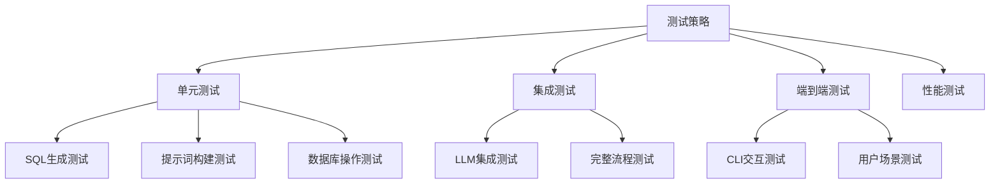

# Text2SQL智能查询系统 - 测试和部署

## 测试策略

### 测试概览

本项目采用多层次测试策略，包括单元测试、集成测试和端到端测试，确保SQL生成的准确性和系统的稳定性。



## 单元测试

### 1. 测试环境配置

创建测试配置文件 `tests/conftest.py`：

```python
"""
测试配置文件
"""
import pytest
import os
import sqlite3
from pathlib import Path
import tempfile


@pytest.fixture
def temp_db():
    """创建临时测试数据库"""
    with tempfile.NamedTemporaryFile(suffix=".db", delete=False) as f:
        db_path = Path(f.name)
    
    conn = sqlite3.connect(str(db_path))
    cursor = conn.cursor()
    
    # 创建测试表
    cursor.execute("""
    CREATE TABLE test_heros (
        hero_id INTEGER PRIMARY KEY,
        hero_name TEXT,
        role TEXT,
        health INTEGER
    )
    """)
    
    # 插入测试数据
    cursor.executemany(
        "INSERT INTO test_heros VALUES (?, ?, ?, ?)",
        [
            (1, "亚瑟", "战士", 3500),
            (2, "妲己", "法师", 2800),
            (3, "后羿", "射手", 2600)
        ]
    )
    
    conn.commit()
    
    yield db_path
    
    # 清理
    conn.close()
    db_path.unlink()


@pytest.fixture
def sample_questions():
    """测试问题样本"""
    return {
        "simple": "查询所有战士",
        "aggregation": "统计各个定位的英雄数量",
        "join": "查询英雄的技能信息",
        "complex": "查询生命值最高的前5个英雄"
    }


@pytest.fixture
def expected_sqls():
    """预期SQL结果"""
    return {
        "simple": "SELECT * FROM test_heros WHERE role = '战士'",
        "aggregation": "SELECT role, COUNT(*) FROM test_heros GROUP BY role",
    }
```

### 2. 核心模块测试

创建 `tests/test_vanna.py`：

```python
"""
Text2SQL核心模块单元测试
"""
import pytest
from unittest.mock import Mock, patch, MagicMock
from code.text2sql_vanna import SimpleVanna, BaseVanna


class TestSimpleVanna:
    """SimpleVanna类测试"""
    
    @pytest.fixture
    def vanna(self, temp_db):
        """创建测试实例"""
        with patch.dict(os.environ, {"DASHSCOPE_API_KEY": "test_key"}):
            with patch.object(SimpleVanna, '_init_llm_client'):
                vanna = SimpleVanna(llm_provider="dashscope")
                vanna.schema_info = "test_heros(hero_id INTEGER, hero_name TEXT, role TEXT, health INTEGER)"
                return vanna
    
    def test_init(self, vanna):
        """测试初始化"""
        assert vanna is not None
        assert vanna.training_data is not None
        assert len(vanna.training_data) > 0
    
    def test_training_data_loaded(self, vanna):
        """测试训练数据加载"""
        assert len(vanna.training_data) >= 10
        
        # 检查数据格式
        for item in vanna.training_data:
            assert "question" in item
            assert "sql" in item
    
    def test_find_similar_questions(self, vanna):
        """测试相似问题查找"""
        question = "查询所有战士类英雄"
        similar = vanna._find_similar_questions(question, top_k=3)
        
        assert len(similar) <= 3
        for item in similar:
            assert "question" in item
            assert "sql" in item
    
    def test_build_prompt(self, vanna):
        """测试提示词构建"""
        question = "查询所有战士"
        prompt = vanna._build_prompt(question)
        
        assert question in prompt
        assert "SQL:" in prompt
    
    def test_clean_sql(self, vanna):
        """测试SQL清理"""
        # 测试Markdown清理
        sql1 = "```sql\nSELECT * FROM heros\n```"
        assert vanna._clean_sql(sql1) == "SELECT * FROM heros"
        
        # 测试分号清理
        sql2 = "SELECT * FROM heros;"
        assert vanna._clean_sql(sql2) == "SELECT * FROM heros"
        
        # 测试空白清理
        sql3 = "  SELECT * FROM heros  "
        assert vanna._clean_sql(sql3) == "SELECT * FROM heros"
    
    @patch.object(SimpleVanna, '_call_llm')
    def test_generate_sql(self, mock_llm, vanna):
        """测试SQL生成"""
        mock_llm.return_value = "SELECT * FROM test_heros WHERE role = '战士'"
        
        sql = vanna.generate_sql("查询所有战士")
        
        assert "SELECT" in sql
        assert "FROM" in sql
        mock_llm.assert_called_once()
    
    def test_train(self, vanna):
        """测试训练数据添加"""
        initial_count = len(vanna.training_data)
        
        vanna.train(
            question="测试问题",
            sql="SELECT 1"
        )
        
        assert len(vanna.training_data) == initial_count + 1


class TestSimilarityCalculation:
    """相似度计算测试"""
    
    @pytest.fixture
    def vanna(self):
        with patch.dict(os.environ, {"DASHSCOPE_API_KEY": "test_key"}):
            with patch.object(SimpleVanna, '_init_llm_client'):
                with patch.object(SimpleVanna, '_init_db_connection'):
                    return SimpleVanna(llm_provider="dashscope")
    
    def test_exact_match(self, vanna):
        """测试完全匹配"""
        similar = vanna._find_similar_questions("查询所有战士类英雄")
        
        # 应该返回包含"战士"的训练数据
        assert len(similar) > 0
    
    def test_partial_match(self, vanna):
        """测试部分匹配"""
        similar = vanna._find_similar_questions("战士英雄")
        
        assert len(similar) <= 3
    
    def test_no_match(self, vanna):
        """测试无匹配情况"""
        similar = vanna._find_similar_questions("xyz123不存在的内容")
        
        # 即使无匹配也应该返回最多3个
        assert len(similar) <= 3


class TestSQLExecution:
    """SQL执行测试"""
    
    def test_run_sql_success(self, temp_db):
        """测试SQL执行成功"""
        with patch.dict(os.environ, {"DASHSCOPE_API_KEY": "test_key"}):
            with patch.object(SimpleVanna, '_init_llm_client'):
                vanna = SimpleVanna.__new__(SimpleVanna)
                vanna.conn = sqlite3.connect(str(temp_db))
                vanna.training_data = []
                
                results = vanna.run_sql("SELECT * FROM test_heros")
                
                assert len(results) == 3
                assert results[0]["hero_name"] == "亚瑟"
                
                vanna.conn.close()
    
    def test_run_sql_error(self, temp_db):
        """测试SQL执行错误"""
        with patch.dict(os.environ, {"DASHSCOPE_API_KEY": "test_key"}):
            with patch.object(SimpleVanna, '_init_llm_client'):
                vanna = SimpleVanna.__new__(SimpleVanna)
                vanna.conn = sqlite3.connect(str(temp_db))
                vanna.training_data = []
                
                results = vanna.run_sql("SELECT * FROM non_existent_table")
                
                assert results == []
                
                vanna.conn.close()
```

### 3. CLI测试

创建 `tests/test_cli.py`：

```python
"""
CLI模块测试
"""
import pytest
from unittest.mock import Mock, patch
from io import StringIO
import sys

from code.cli import Text2SQLCLI


class TestText2SQLCLI:
    """Text2SQLCLI类测试"""
    
    @pytest.fixture
    def cli(self):
        """创建CLI实例"""
        with patch('code.cli.create_vanna') as mock_create:
            mock_vanna = Mock()
            mock_vanna.ask.return_value = {
                "question": "测试问题",
                "sql": "SELECT 1",
                "results": [{"col": "val"}],
                "error": None
            }
            mock_create.return_value = mock_vanna
            
            return Text2SQLCLI()
    
    def test_commands_defined(self, cli):
        """测试命令定义"""
        assert "history" in cli.COMMANDS
        assert "train" in cli.COMMANDS
        assert "schema" in cli.COMMANDS
        assert "help" in cli.COMMANDS
        assert "quit" in cli.COMMANDS
    
    def test_handle_question(self, cli, capsys):
        """测试问题处理"""
        cli._handle_question("查询所有战士")
        
        # 验证vanna.ask被调用
        cli.vanna.ask.assert_called_once_with("查询所有战士")
    
    def test_handle_history_empty(self, cli, capsys):
        """测试空历史"""
        cli._handle_history()
        
        # 应该显示空历史提示
        captured = capsys.readouterr()
        assert "暂无" in captured.out or len(cli.history) == 0
```

## 集成测试

### 1. LLM集成测试

创建 `tests/test_integration.py`：

```python
"""
集成测试
"""
import pytest
import os
from code.text2sql_vanna import create_vanna


@pytest.mark.integration
class TestIntegration:
    """集成测试类"""
    
    @pytest.fixture
    def vanna(self):
        """创建实际Vanna实例"""
        api_key = os.environ.get("DASHSCOPE_API_KEY")
        if not api_key:
            pytest.skip("DASHSCOPE_API_KEY未设置，跳过集成测试")
        
        return create_vanna(llm_provider="dashscope")
    
    def test_end_to_end_simple_query(self, vanna):
        """端到端简单查询测试"""
        result = vanna.ask("查询所有战士类英雄")
        
        assert result["sql"] != ""
        assert "SELECT" in result["sql"].upper()
        assert result["error"] is None
    
    def test_end_to_end_aggregation(self, vanna):
        """端到端聚合查询测试"""
        result = vanna.ask("统计各个定位的英雄数量")
        
        assert result["sql"] != ""
        assert "GROUP BY" in result["sql"].upper()
        assert result["error"] is None
    
    def test_sql_validity(self, vanna):
        """测试SQL有效性"""
        test_queries = [
            "查询所有英雄",
            "查询生命值最高的前5个英雄",
            "统计各个定位的英雄数量"
        ]
        
        for query in test_queries:
            sql = vanna.generate_sql(query)
            results = vanna.run_sql(sql)
            
            # SQL应该能成功执行
            assert isinstance(results, list)
```

### 2. 运行测试

```bash
# 运行所有单元测试
pytest tests/ -v

# 运行集成测试
pytest tests/ -v -m integration

# 运行特定测试文件
pytest tests/test_vanna.py -v

# 生成覆盖率报告
pytest tests/ --cov=code --cov-report=html
```

## SQL生成准确性测试

### 1. 测试用例集

创建 `tests/test_accuracy.py`：

```python
"""
SQL生成准确性测试
"""
import pytest


class TestSQLAccuracy:
    """SQL生成准确性测试"""
    
    TEST_CASES = [
        {
            "question": "查询所有战士",
            "expected_keywords": ["SELECT", "FROM", "heros", "role", "战士"],
            "unexpected_keywords": ["DELETE", "UPDATE", "INSERT"]
        },
        {
            "question": "查询生命值最高的前5个英雄",
            "expected_keywords": ["SELECT", "ORDER BY", "DESC", "LIMIT 5"],
            "unexpected_keywords": []
        },
        {
            "question": "统计各个定位的英雄数量",
            "expected_keywords": ["SELECT", "GROUP BY", "COUNT"],
            "unexpected_keywords": []
        },
        {
            "question": "查询所有周免英雄",
            "expected_keywords": ["SELECT", "is_free", "1"],
            "unexpected_keywords": []
        }
    ]
    
    @pytest.fixture
    def vanna(self):
        with patch.dict(os.environ, {"DASHSCOPE_API_KEY": "test_key"}):
            with patch.object(SimpleVanna, '_init_llm_client'):
                with patch.object(SimpleVanna, '_init_db_connection'):
                    return SimpleVanna(llm_provider="dashscope")
    
    @pytest.mark.parametrize("test_case", TEST_CASES)
    def test_sql_keywords(self, vanna, test_case):
        """测试SQL包含预期关键词"""
        with patch.object(vanna, '_call_llm') as mock_llm:
            mock_llm.return_value = f"SELECT * FROM heros WHERE role = '战士'"
            
            sql = vanna.generate_sql(test_case["question"])
            
            for keyword in test_case["expected_keywords"]:
                assert keyword.upper() in sql.upper(), f"缺少关键词: {keyword}"
            
            for keyword in test_case["unexpected_keywords"]:
                assert keyword.upper() not in sql.upper(), f"不应包含: {keyword}"
```

## 部署策略

### 1. 开发环境部署

#### 本地运行
```bash
# 克隆项目
cd practice/17-CASE-Text2SQL

# 安装依赖
uv pip install openai loguru python-dotenv rich tabulate

# 配置环境变量
echo "DASHSCOPE_API_KEY=your_key" > ../../.env

# 准备数据库
uv run python code/prepare_data.py

# 运行
uv run python code/cli.py
```

### 2. Docker部署

#### Dockerfile
```dockerfile
FROM python:3.11-slim

WORKDIR /app

# 安装依赖
COPY requirements.txt .
RUN pip install --no-cache-dir -r requirements.txt

# 复制代码和数据
COPY code/ ./code/
COPY data/ ./data/

# 设置环境变量
ENV PYTHONUNBUFFERED=1

# 运行
CMD ["python", "code/cli.py"]
```

#### requirements.txt
```
openai>=1.0.0
loguru>=0.7.0
python-dotenv>=1.0.0
rich>=13.0.0
tabulate>=0.9.0
```

#### 构建和运行
```bash
# 构建镜像
docker build -t text2sql-system .

# 运行容器
docker run -it \
  -e DASHSCOPE_API_KEY=your_key \
  -v $(pwd)/data:/app/data \
  text2sql-system
```

### 3. Docker Compose部署

#### docker-compose.yml
```yaml
version: '3.8'

services:
  text2sql:
    build: .
    environment:
      - DASHSCOPE_API_KEY=${DASHSCOPE_API_KEY}
    volumes:
      - ./data:/app/data
      - ./output:/app/output
    stdin_open: true
    tty: true
```

#### 运行
```bash
# 启动服务
docker-compose up -d

# 进入交互模式
docker-compose exec text2sql python code/cli.py
```

### 4. Web API部署

#### Flask应用示例

创建 `api_server.py`：

```python
"""
Text2SQL Web API服务
"""
from flask import Flask, request, jsonify
from flask_cors import CORS
from code.text2sql_vanna import create_vanna

app = Flask(__name__)
CORS(app)

# 初始化Vanna
vanna = create_vanna(llm_provider="dashscope")


@app.route("/health", methods=["GET"])
def health():
    """健康检查"""
    return jsonify({"status": "healthy"})


@app.route("/query", methods=["POST"])
def query():
    """处理查询请求"""
    data = request.json
    question = data.get("question")
    
    if not question:
        return jsonify({"error": "问题不能为空"}), 400
    
    result = vanna.ask(question)
    return jsonify(result)


@app.route("/train", methods=["POST"])
def train():
    """添加训练数据"""
    data = request.json
    question = data.get("question")
    sql = data.get("sql")
    
    if not question or not sql:
        return jsonify({"error": "问题和SQL不能为空"}), 400
    
    vanna.train(question, sql)
    return jsonify({"message": "训练数据添加成功"})


@app.route("/schema", methods=["GET"])
def schema():
    """获取表结构"""
    return jsonify({"schema": vanna.schema_info})


if __name__ == "__main__":
    app.run(host="0.0.0.0", port=5000, debug=True)
```

## CI/CD流水线

### GitHub Actions配置

创建 `.github/workflows/ci.yml`：

```yaml
name: CI

on:
  push:
    branches: [ main, develop ]
  pull_request:
    branches: [ main ]

jobs:
  test:
    runs-on: ubuntu-latest
    
    steps:
    - uses: actions/checkout@v3
    
    - name: Set up Python
      uses: actions/setup-python@v4
      with:
        python-version: '3.11'
    
    - name: Install dependencies
      run: |
        python -m pip install --upgrade pip
        pip install openai loguru python-dotenv rich tabulate pytest pytest-cov
    
    - name: Prepare test database
      run: |
        cd practice/17-CASE-Text2SQL
        python code/prepare_data.py
    
    - name: Run tests
      run: |
        cd practice/17-CASE-Text2SQL
        pytest tests/ -v --cov=code --cov-report=xml
    
    - name: Upload coverage
      uses: codecov/codecov-action@v3
      with:
        file: ./coverage.xml

  lint:
    runs-on: ubuntu-latest
    
    steps:
    - uses: actions/checkout@v3
    
    - name: Set up Python
      uses: actions/setup-python@v4
      with:
        python-version: '3.11'
    
    - name: Install linters
      run: |
        pip install ruff mypy
    
    - name: Run Ruff
      run: ruff check practice/17-CASE-Text2SQL/code/
    
    - name: Run MyPy
      run: mypy practice/17-CASE-Text2SQL/code/
```

## 监控和日志

### 1. 日志配置

```python
from loguru import logger
import sys

# 配置日志
logger.remove()
logger.add(
    sys.stdout,
    format="<green>{time:HH:mm:ss}</green> | <level>{level: <8}</level> | <level>{message}</level>",
    level="INFO"
)
logger.add(
    "logs/text2sql.log",
    rotation="1 day",
    retention="30 days",
    level="DEBUG"
)
```

### 2. 性能监控

```python
import time
from functools import wraps

def timing_decorator(func):
    """计时装饰器"""
    @wraps(func)
    def wrapper(*args, **kwargs):
        start = time.time()
        result = func(*args, **kwargs)
        elapsed = time.time() - start
        logger.info(f"{func.__name__} 执行时间: {elapsed:.2f}秒")
        return result
    return wrapper


class SimpleVanna:
    @timing_decorator
    def generate_sql(self, question: str) -> str:
        # ...
    
    @timing_decorator
    def run_sql(self, sql: str) -> list:
        # ...
```

### 3. 健康检查

```python
def health_check() -> dict:
    """健康检查"""
    return {
        "status": "healthy",
        "timestamp": datetime.now().isoformat(),
        "components": {
            "database": "ok" if self.conn else "error",
            "llm_client": "ok" if self.client else "error",
            "training_data": len(self.training_data)
        }
    }
```

## 性能优化建议

### 1. 响应时间优化

- 使用更快的LLM模型（如qwen-turbo）
- 添加语义缓存机制
- 优化Few-shot示例选择

### 2. 准确性优化

- 增加高质量的训练数据
- 使用更强大的LLM模型
- 添加SQL验证机制

### 3. 可扩展性优化

- 支持数据库连接池
- 实现异步查询处理
- 添加查询结果缓存

---

*最后更新: 2026年2月15日*
*文档版本: v1.0*
*维护团队: build-your-own-ai项目团队*
