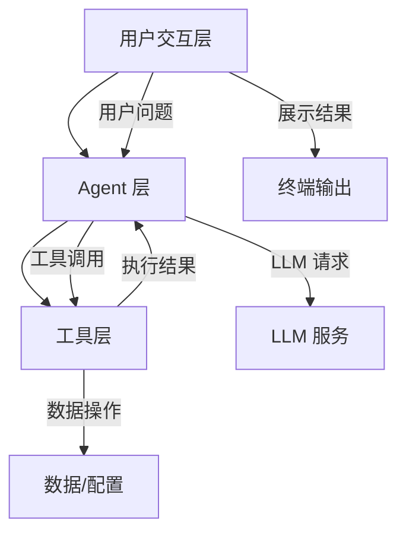
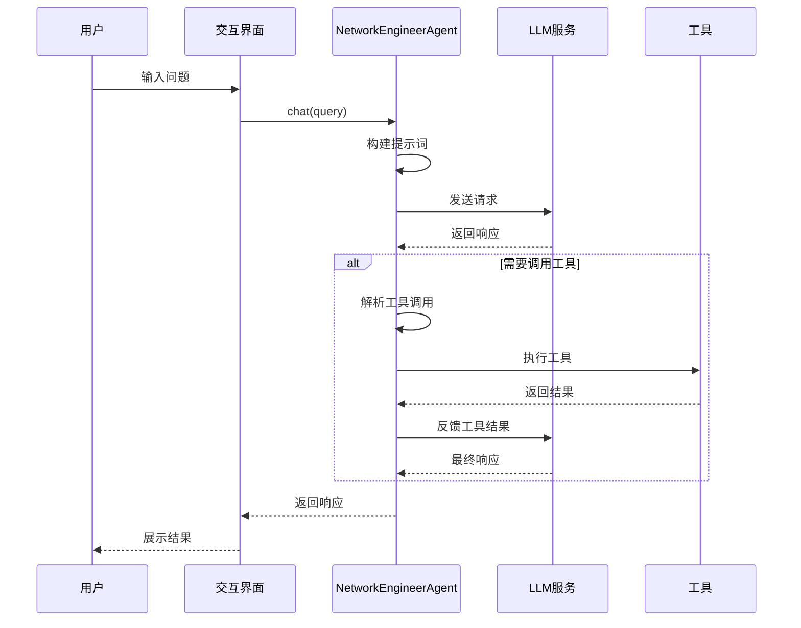

# LangChain 工具链组合设计 - 技术架构

## 架构概览

本项目采用分层架构设计，包含用户交互层、Agent 层、工具层三个核心层次，确保系统的可扩展性、可维护性和灵活性。



## 核心组件架构

### 1. 系统架构图

```
┌─────────────────────────────────────────────────────────────┐
│                      用户交互层                              │
│                      main.py                                │
│  ┌─────────────┐  ┌─────────────┐  ┌─────────────────────┐  │
│  │ 交互模式    │  │ 演示模式    │  │ 测试模式            │  │
│  └─────────────┘  └─────────────┘  └─────────────────────┘  │
└─────────────────────────┬───────────────────────────────────┘
                          │
                          ▼
┌─────────────────────────────────────────────────────────────┐
│                      Agent 层                                │
│              NetworkEngineerAgent                           │
│  ┌─────────────┐  ┌─────────────┐  ┌─────────────────────┐  │
│  │ LLM 客户端  │  │ 工具注册表  │  │ 对话记忆            │  │
│  │ (多提供商)  │  │ (6 个工具)  │  │ (历史记录)          │  │
│  └─────────────┘  └─────────────┘  └─────────────────────┘  │
│         ↓                ↓                ↓                  │
│    推理决策        工具选择执行      上下文管理               │
└─────────────────────────────────────────────────────────────┘
        ↓                    ↓                    ↓
┌───────────────┐  ┌───────────────────────────────────────┐
│ 通义千问/OpenAI│  │              工具层                   │
└───────────────┘  │  ┌─────────┐ ┌─────────┐ ┌─────────┐  │
                   │  │文本分析 │ │数据转换 │ │文本处理 │  │
                   │  └─────────┘ └─────────┘ └─────────┘  │
                   │  ┌─────────┐ ┌─────────┐ ┌─────────┐  │
                   │  │网络诊断 │ │配置分析 │ │日志分析 │  │
                   │  └─────────┘ └─────────┘ └─────────┘  │
                   └───────────────────────────────────────┘
```

### 2. 数据处理流程



## 技术栈详解

### 1. LangChain 集成架构

#### 核心组件
```python
from langchain_core.tools import Tool
from langchain_community.llms import Tongyi
from langchain_openai import ChatOpenAI
```

#### Tool 封装设计
```python
from langchain_core.tools import Tool

# 工具封装示例
tool = Tool(
    name="文本分析",           # 工具名称
    func=TextAnalysisTool().run,  # 执行函数
    description="..."            # 工具描述（LLM 用于选择工具）
)
```

### 2. 多 LLM 支持

#### LLM 初始化
```python
def _init_llm(self, llm_type: str, model_name: str, api_key: Optional[str]):
    """初始化 LLM，支持多种提供商"""
    if llm_type == "tongyi":
        return Tongyi(
            model_name=model_name,
            dashscope_api_key=api_key,
            temperature=0.7,
        )
    elif llm_type == "openai":
        return ChatOpenAI(
            model=model_name,
            openai_api_key=api_key,
            temperature=0.7,
        )
```

**技术特点：**
- **统一接口**: 使用 LangChain 的 LLM 抽象
- **灵活切换**: 支持两种 LLM 提供商
- **易于扩展**: 可快速添加新的提供商

#### LLM 配置参数
```python
# 通义千问配置
Tongyi(
    model_name="qwen-turbo",  # 模型选择
    temperature=0.7,          # 创造性（0-1）
)

# OpenAI 配置
ChatOpenAI(
    model="gpt-4o-mini",      # 模型选择
    temperature=0.7,          # 创造性（0-1）
)
```

## ReAct Agent 设计

### 1. ReAct 模式

ReAct（Reasoning + Acting）是一种让 LLM Agent 进行推理和行动的模式：

```
思考(Thought) → 行动(Action) → 观察(Observation) → 循环
```

### 2. 系统提示词设计

```python
system_prompt = """你是一个专业的网络工程师智能助手，擅长网络故障诊断、配置分析和日志处理。

你可以使用以下工具来帮助用户解决问题：

- 文本分析: 分析文本内容的工具...
- 数据转换: 数据格式转换工具...
- 文本处理: 文本处理工具...
- 网络诊断: 网络诊断工具...
- 配置分析: 网络设备配置分析工具...
- 日志分析: 日志分析工具...

当需要使用工具时，请按以下格式回复：
【使用工具：工具名称】
【输入参数：参数内容】

然后等待工具返回结果，再继续分析。

如果不需要使用工具，直接回答用户问题。

请始终用中文回复，保持专业和友好的态度。"""
```

### 3. 工具调用机制

#### 工具调用解析
```python
def _parse_tool_call(self, response: str) -> Optional[Dict[str, str]]:
    """解析 LLM 响应中的工具调用"""
    import re
    
    # 匹配工具调用格式
    tool_pattern = r'【使用工具[：:]\s*([^】]+)】'
    input_pattern = r'【输入参数[：:]\s*([^】]+)】'
    
    tool_match = re.search(tool_pattern, response)
    input_match = re.search(input_pattern, response)
    
    if tool_match:
        return {
            "tool_name": tool_match.group(1).strip(),
            "tool_input": input_match.group(1).strip() if input_match else ""
        }
    return None
```

#### 工具执行流程
```python
def run(self, query: str) -> str:
    """运行 Agent"""
    # 1. 构建对话上下文
    conversation = self._build_conversation(query)
    
    # 2. 获取 LLM 响应
    response = self.llm.invoke(conversation)
    
    # 3. 检查是否需要调用工具
    tool_call = self._parse_tool_call(response)
    
    if tool_call:
        # 4. 执行工具
        tool_result = self.tools_dict[tool_name].invoke(tool_input)
        
        # 5. 将结果反馈给 LLM
        conversation += f"工具返回结果：\n{tool_result}"
        final_response = self.llm.invoke(conversation)
        
        return final_response
    
    return response
```

## 工具层设计

### 1. 工具接口规范

所有工具遵循统一的接口设计：

```python
class BaseTool:
    """工具基类"""
    
    def __init__(self):
        self.name: str          # 工具名称
        self.description: str   # 工具描述
    
    def run(self, input_str: str) -> str:
        """
        执行工具
        
        Args:
            input_str: 输入参数字符串
            
        Returns:
            执行结果字符串
        """
        raise NotImplementedError
```

### 2. 工具输入格式

采用统一的输入格式，便于 LLM 生成调用参数：

```
格式1: "操作类型|数据内容"
格式2: "操作类型|参数|数据内容"
```

**示例：**
```
# 数据转换工具
"json2yaml|{"key": "value"}"

# 文本处理工具
"extract_ip|服务器日志：192.168.1.1 连接失败"

# 网络诊断工具
"ping|www.baidu.com"
"port|192.168.1.1|80"

# 配置分析工具
"security|完整 Cisco 配置"

# 日志分析工具
"errors|多行日志内容"
```

### 3. 工具注册机制

```python
def _init_tools(self) -> List[Tool]:
    """初始化工具列表"""
    tools = [
        Tool(
            name="文本分析",
            func=TextAnalysisTool().run,
            description="分析文本内容的工具..."
        ),
        Tool(
            name="数据转换",
            func=DataConversionTool().run,
            description="数据格式转换工具..."
        ),
        # ... 更多工具
    ]
    return tools
```

## 对话记忆设计

### 1. 记忆结构

```python
# 记忆存储
self.memory: List[Dict] = []

# 记忆格式
{
    "user": "用户问题",
    "assistant": "助手响应"
}
```

### 2. 记忆管理

```python
def _build_conversation(self, query: str) -> str:
    """构建对话上下文"""
    conversation = f"系统提示：{self.system_prompt}\n\n"
    
    # 只保留最近 5 轮对话
    for msg in self.memory[-5:]:
        conversation += f"用户：{msg['user']}\n"
        conversation += f"助手：{msg['assistant']}\n"
    
    conversation += f"用户：{query}\n助手："
    return conversation

def clear_memory(self):
    """清除对话记忆"""
    self.memory = []
```

## 扩展架构

### 1. 添加新工具

```python
# 1. 创建工具类
class MyCustomTool:
    def __init__(self):
        self.name = "自定义工具"
        self.description = "工具描述"
    
    def run(self, input_str: str) -> str:
        # 实现逻辑
        return "结果"

# 2. 在 Agent 中注册
tools.append(Tool(
    name="自定义工具",
    func=MyCustomTool().run,
    description="工具描述"
))
```

### 2. 添加新 LLM 提供商

```python
def _init_llm(self, llm_type: str, ...):
    if llm_type == "new_provider":
        from langchain_xxx import NewProviderLLM
        return NewProviderLLM(
            api_key=api_key,
            model=model_name,
        )
```

### 3. 自定义 Agent 行为

```python
class CustomAgent(NetworkEngineerAgent):
    def _build_system_prompt(self) -> str:
        """自定义系统提示词"""
        return "自定义的系统提示..."
    
    def _parse_tool_call(self, response: str):
        """自定义工具调用解析"""
        # 自定义解析逻辑
        pass
```

## 错误处理机制

### 1. 工具调用错误处理

```python
def run(self, input_str: str) -> str:
    try:
        # 执行工具逻辑
        return result
    except Exception as e:
        return f"执行过程中出现错误：{str(e)}"
```

### 2. LLM 调用错误处理

```python
def run(self, query: str) -> str:
    try:
        response = self.llm.invoke(conversation)
        return response
    except Exception as e:
        return f"执行过程中出现错误：{str(e)}"
```

## 性能考虑

### 1. 响应时间优化
- 使用较快的模型（qwen-turbo / gpt-4o-mini）
- 限制对话历史长度
- 优化提示词长度

### 2. 准确性优化
- 清晰的工具描述
- 详细的系统提示词
- 示例输入输出格式

### 3. 可扩展性优化
- 模块化工具设计
- 统一的接口规范
- 灵活的配置管理

---

*最后更新: 2026年2月17日*
*架构版本: v1.0*
*技术负责人: AI系统架构组*
