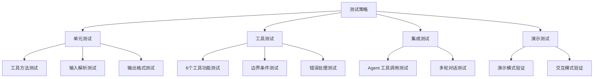

# LangChain 工具链组合设计 - 测试和部署

## 测试策略

### 测试概览

本项目采用多层次测试策略，包括单元测试、工具测试和集成测试，确保工具功能的正确性和 Agent 的可靠性。



## 单元测试

### 1. 测试文件结构

```
tests/
└── test_tool_chain.py    # 工具链测试文件
```

### 2. 测试配置

```python
"""
工具链测试文件
"""

import sys
import os
sys.path.insert(0, os.path.dirname(os.path.dirname(os.path.abspath(__file__))))

from tools import (
    TextAnalysisTool,
    DataConversionTool,
    TextProcessingTool,
    NetworkDiagnosisTool,
    ConfigAnalysisTool,
    LogAnalysisTool,
)
```

### 3. 工具测试

#### 文本分析工具测试
```python
def test_text_analysis():
    """测试文本分析工具"""
    tool = TextAnalysisTool()
    
    # 基础功能测试
    result = tool.run("这是一个测试文本")
    assert "字符总数" in result
    assert "情感倾向" in result
    
    # 空输入测试
    result = tool.run("")
    assert "错误" in result
    
    print("✅ 文本分析工具测试通过")


def test_text_analysis_keywords():
    """测试关键词提取"""
    tool = TextAnalysisTool()
    
    text = "网络工程师需要掌握路由器、交换机和防火墙的配置"
    result = tool.run(text)
    assert "关键词" in result
    
    print("✅ 关键词提取测试通过")
```

#### 数据转换工具测试
```python
def test_data_conversion():
    """测试数据转换工具"""
    tool = DataConversionTool()
    
    # JSON 格式化测试
    result = tool.run('format|{"key": "value"}')
    assert "key" in result
    
    # JSON 转 YAML 测试
    result = tool.run('json2yaml|{"name": "test"}')
    assert "name:" in result
    
    # JSON 验证测试
    result = tool.run('validate|{"valid": true}')
    assert "正确" in result
    
    print("✅ 数据转换工具测试通过")


def test_data_conversion_errors():
    """测试错误处理"""
    tool = DataConversionTool()
    
    # 无效 JSON
    result = tool.run('format|{invalid json}')
    assert "错误" in result
    
    # 不支持的转换类型
    result = tool.run('unknown|data')
    assert "不支持" in result
    
    print("✅ 错误处理测试通过")
```

#### 文本处理工具测试
```python
def test_text_processing():
    """测试文本处理工具"""
    tool = TextProcessingTool()
    
    # IP 提取测试
    result = tool.run('extract_ip|服务器 IP：192.168.1.1 和 10.0.0.1')
    assert "192.168.1.1" in result
    assert "10.0.0.1" in result
    
    # 文本清洗测试
    result = tool.run('clean|  多余  空白  ')
    assert "多余 空白" in result
    
    print("✅ 文本处理工具测试通过")


def test_text_processing_regex():
    """测试正则匹配"""
    tool = TextProcessingTool()
    
    # 日期匹配
    result = tool.run('regex|\d{4}-\d{2}-\d{2}|日期：2024-01-15')
    assert "2024-01-15" in result
    
    print("✅ 正则匹配测试通过")
```

#### 网络诊断工具测试
```python
def test_network_diagnosis():
    """测试网络诊断工具"""
    tool = NetworkDiagnosisTool()
    
    # Ping 测试
    result = tool.run('ping|www.baidu.com')
    assert "Ping" in result
    
    # DNS 测试
    result = tool.run('dns|www.google.com')
    assert "DNS" in result
    
    print("✅ 网络诊断工具测试通过")


def test_network_diagnosis_port():
    """测试端口检测"""
    tool = NetworkDiagnosisTool()
    
    # 端口检测
    result = tool.run('port|192.168.1.1|80')
    assert "端口" in result or "PORT" in result
    
    # 无效端口
    result = tool.run('port|192.168.1.1|99999')
    assert "错误" in result
    
    print("✅ 端口检测测试通过")
```

#### 配置分析工具测试
```python
def test_config_analysis():
    """测试配置分析工具"""
    tool = ConfigAnalysisTool()
    
    # 配置解析测试
    result = tool.run('parse|hostname TestRouter')
    assert "设备名称" in result or "TestRouter" in result
    
    print("✅ 配置分析工具测试通过")


def test_config_security():
    """测试安全检查"""
    tool = ConfigAnalysisTool()
    
    config = """
hostname Router1
!
line vty 0 4
 transport input ssh
!
service password-encryption
!
"""
    result = tool.run(f'security|{config}')
    assert "安全" in result
    
    print("✅ 安全检查测试通过")
```

#### 日志分析工具测试
```python
def test_log_analysis():
    """测试日志分析工具"""
    tool = LogAnalysisTool()
    
    # 日志摘要测试
    result = tool.run('summary|2024-01-15 ERROR Test message')
    assert "日志" in result
    
    print("✅ 日志分析工具测试通过")


def test_log_errors():
    """测试错误提取"""
    tool = LogAnalysisTool()
    
    logs = """
2024-01-15 ERROR Connection failed
2024-01-15 INFO Backup completed
2024-01-15 CRITICAL Disk full
"""
    result = tool.run(f'errors|{logs}')
    assert "ERROR" in result or "CRITICAL" in result
    
    print("✅ 错误提取测试通过")
```

### 4. 运行测试

```bash
# 运行所有测试
python code/main.py --mode test

# 或使用 pytest
pytest tests/test_tool_chain.py -v

# 运行单个测试
python -c "from tests.test_tool_chain import *; test_text_analysis()"
```

## 测试模式

### 1. 测试模式实现

```python
def test_mode():
    """测试模式 - 运行单元测试"""
    print_banner()
    print("\n🧪 测试模式 - 运行单元测试\n")
    
    test_file = PROJECT_ROOT / "tests" / "test_tool_chain.py"
    
    if test_file.exists():
        import subprocess
        result = subprocess.run(
            [sys.executable, "-m", "pytest", str(test_file), "-v"],
            cwd=str(PROJECT_ROOT)
        )
    else:
        print("❌ 测试文件不存在，正在创建...")
        create_test_file()
        print("✅ 测试文件已创建，请重新运行")
```

### 2. 测试文件生成

```python
def create_test_file():
    """创建测试文件"""
    test_content = '''"""
工具链测试文件
"""

import sys
import os
sys.path.insert(0, os.path.dirname(os.path.dirname(os.path.abspath(__file__))))

from tools import (
    TextAnalysisTool,
    DataConversionTool,
    TextProcessingTool,
    NetworkDiagnosisTool,
    ConfigAnalysisTool,
    LogAnalysisTool,
)


def test_text_analysis():
    """测试文本分析工具"""
    tool = TextAnalysisTool()
    result = tool.run("这是一个测试文本")
    assert "字符总数" in result
    print("✅ 文本分析工具测试通过")


def test_data_conversion():
    """测试数据转换工具"""
    tool = DataConversionTool()
    result = tool.run(\'format|{"key": "value"}\')
    assert "key" in result
    print("✅ 数据转换工具测试通过")


# ... 更多测试函数


if __name__ == "__main__":
    test_text_analysis()
    test_data_conversion()
    test_text_processing()
    test_network_diagnosis()
    test_config_analysis()
    test_log_analysis()
    print("\\n🎉 所有测试通过！")
'''
    
    test_file = PROJECT_ROOT / "tests" / "test_tool_chain.py"
    test_file.write_text(test_content, encoding="utf-8")
```

## 部署策略

### 1. 本地运行

#### 环境准备
```bash
# 克隆项目
cd /path/to/build-your-own-ai

# 激活虚拟环境
source .venv/bin/activate

# 配置环境变量
echo "DASHSCOPE_API_KEY=your_key" > .env
```

#### 运行程序
```bash
# 进入项目目录
cd practice/18-CASE-工具链组合设计

# 交互模式
python code/main.py --mode interactive

# 演示模式
python code/main.py --mode demo

# 测试模式
python code/main.py --mode test
```

### 2. Docker 部署

#### Dockerfile
```dockerfile
FROM python:3.11-slim

WORKDIR /app

# 安装依赖
COPY pyproject.toml .
RUN pip install --no-cache-dir langchain langchain-community langchain-openai loguru python-dotenv

# 复制代码
COPY code/ ./code/
COPY tests/ ./tests/

# 设置环境变量
ENV PYTHONUNBUFFERED=1

# 运行
CMD ["python", "code/main.py", "--mode", "interactive"]
```

#### 构建和运行
```bash
# 构建镜像
docker build -t tool-chain-agent .

# 运行容器
docker run -it \
  -e DASHSCOPE_API_KEY=your_key \
  tool-chain-agent
```

### 3. Docker Compose 部署

#### docker-compose.yml
```yaml
version: '3.8'

services:
  tool-chain-agent:
    build: .
    environment:
      - DASHSCOPE_API_KEY=${DASHSCOPE_API_KEY}
    volumes:
      - ./data:/app/data
      - ./output:/app/output
    stdin_open: true
    tty: true
```

#### 运行
```bash
# 启动服务
docker-compose up -d

# 进入交互模式
docker-compose exec tool-chain-agent python code/main.py --mode interactive
```

### 4. Web API 部署

#### Flask 应用示例

创建 `api_server.py`：

```python
"""
工具链组合 Web API 服务
"""
from flask import Flask, request, jsonify
from flask_cors import CORS
from agents import NetworkEngineerAgent

app = Flask(__name__)
CORS(app)

# 初始化 Agent
agent = NetworkEngineerAgent(verbose=False)


@app.route("/health", methods=["GET"])
def health():
    """健康检查"""
    return jsonify({"status": "healthy"})


@app.route("/chat", methods=["POST"])
def chat():
    """处理对话请求"""
    data = request.json
    question = data.get("question")
    
    if not question:
        return jsonify({"error": "问题不能为空"}), 400
    
    try:
        response = agent.chat(question)
        return jsonify({
            "response": response,
            "success": True
        })
    except Exception as e:
        return jsonify({
            "error": str(e),
            "success": False
        }), 500


@app.route("/tools", methods=["GET"])
def tools():
    """获取工具列表"""
    return jsonify({
        "tools": agent.get_tool_names(),
        "descriptions": agent.get_tool_descriptions()
    })


@app.route("/clear", methods=["POST"])
def clear():
    """清除对话记忆"""
    agent.clear_memory()
    return jsonify({"message": "对话记忆已清除"})


if __name__ == "__main__":
    app.run(host="0.0.0.0", port=5000, debug=True)
```

#### 运行 API 服务
```bash
# 安装 Flask
pip install flask flask-cors

# 运行服务
python api_server.py
```

#### API 使用示例
```bash
# 健康检查
curl http://localhost:5000/health

# 发送问题
curl -X POST http://localhost:5000/chat \
  -H "Content-Type: application/json" \
  -d '{"question": "帮我 ping 一下 www.baidu.com"}'

# 获取工具列表
curl http://localhost:5000/tools

# 清除记忆
curl -X POST http://localhost:5000/clear
```

## CI/CD 流水线

### GitHub Actions 配置

创建 `.github/workflows/ci.yml`：

```yaml
name: CI

on:
  push:
    branches: [ main, develop ]
  pull_request:
    branches: [ main ]

jobs:
  test:
    runs-on: ubuntu-latest
    
    steps:
    - uses: actions/checkout@v3
    
    - name: Set up Python
      uses: actions/setup-python@v4
      with:
        python-version: '3.11'
    
    - name: Install dependencies
      run: |
        python -m pip install --upgrade pip
        pip install langchain langchain-community langchain-openai loguru python-dotenv pytest
    
    - name: Run tests
      run: |
        cd practice/18-CASE-工具链组合设计
        pytest tests/ -v

  lint:
    runs-on: ubuntu-latest
    
    steps:
    - uses: actions/checkout@v3
    
    - name: Set up Python
      uses: actions/setup-python@v4
      with:
        python-version: '3.11'
    
    - name: Install linters
      run: |
        pip install ruff mypy
    
    - name: Run Ruff
      run: ruff check practice/18-CASE-工具链组合设计/code/
    
    - name: Run MyPy
      run: mypy practice/18-CASE-工具链组合设计/code/
```

## 监控和日志

### 1. 日志配置

```python
from loguru import logger
import sys

# 配置日志
logger.remove()
logger.add(
    sys.stdout,
    format="<green>{time:HH:mm:ss}</green> | <level>{level: <8}</level> | <level>{message}</level>",
    level="INFO"
)
logger.add(
    "logs/tool_chain.log",
    rotation="1 day",
    retention="7 days",
    level="DEBUG"
)
```

### 2. 性能监控

```python
import time
from functools import wraps

def timing_decorator(func):
    """计时装饰器"""
    @wraps(func)
    def wrapper(*args, **kwargs):
        start = time.time()
        result = func(*args, **kwargs)
        elapsed = time.time() - start
        logger.info(f"{func.__name__} 执行时间: {elapsed:.2f}秒")
        return result
    return wrapper


class NetworkEngineerAgent:
    @timing_decorator
    def run(self, query: str) -> str:
        # ...
```

### 3. 健康检查

```python
def health_check(agent) -> dict:
    """健康检查"""
    return {
        "status": "healthy",
        "components": {
            "llm": "ok" if agent.llm else "error",
            "tools": len(agent.tools),
            "memory_size": len(agent.memory)
        }
    }
```

## 性能优化建议

### 1. 响应时间优化

- 使用更快的 LLM 模型（qwen-turbo / gpt-4o-mini）
- 限制对话历史长度
- 缓存常用工具结果

### 2. 准确性优化

- 清晰的工具描述
- 详细的系统提示词
- 优化输入格式说明

### 3. 可扩展性优化

- 模块化工具设计
- 统一的接口规范
- 灵活的配置管理

---

*最后更新: 2026年2月17日*
*文档版本: v1.0*
*维护团队: build-your-own-ai项目团队*
