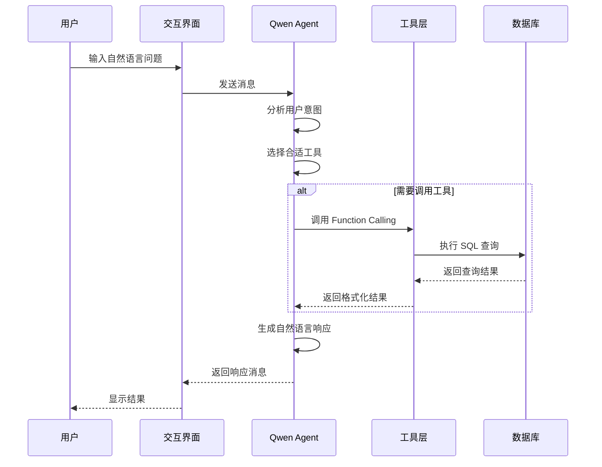

# 销售数据业务助手 - 技术架构

## 架构概览

销售数据业务助手采用分层架构设计，包含用户交互层、Agent 服务层、工具调用层和数据访问层四个核心层次，确保系统的可扩展性、可维护性和高性能。

```
┌─────────────────────────────────────────────────────────┐
│                    用户交互层                            │
│  ┌──────────────┐  ┌──────────────┐                    │
│  │ Web GUI 模式 │  │  TUI 终端模式 │                    │
│  └──────────────┘  └──────────────┘                    │
└────────────────────────┬────────────────────────────────┘
                         │
┌────────────────────────▼────────────────────────────────┐
│                    Agent 服务层                          │
│  ┌─────────────────────────────────────────────────┐   │
│  │              Qwen Agent (Assistant)              │   │
│  │  • 消息处理  • 意图识别  • 工具选择  • 响应生成  │   │
│  └─────────────────────────────────────────────────┘   │
└────────────────────────┬────────────────────────────────┘
                         │ Function Calling
┌────────────────────────▼────────────────────────────────┐
│                    工具调用层                            │
│  ┌──────────┐ ┌──────────┐ ┌──────────┐ ┌──────────┐  │
│  │月度销量  │ │环比增长  │ │省份销售  │ │Top渠道   │  │
│  │查询工具  │ │计算工具  │ │分析工具  │ │查询工具  │  │
│  └──────────┘ └──────────┘ └──────────┘ └──────────┘  │
│  ┌──────────────────────────────────────────────────┐  │
│  │               自定义 SQL 查询工具                  │  │
│  └──────────────────────────────────────────────────┘  │
└────────────────────────┬────────────────────────────────┘
                         │
┌────────────────────────▼────────────────────────────────┐
│                    数据访问层                            │
│  ┌─────────────────────────────────────────────────┐   │
│  │              SQLAlchemy 数据库抽象层              │   │
│  └─────────────────────────────────────────────────┘   │
│  ┌──────────────┐  ┌──────────────┐                   │
│  │   SQLite     │  │    MySQL     │                   │
│  └──────────────┘  └──────────────┘                   │
└─────────────────────────────────────────────────────────┘
```

## 核心组件架构

### 1. Agent 服务层

#### Assistant 类结构

```python
from qwen_agent.agents import Assistant

class Assistant:
    """
    Qwen Agent 核心类
    
    属性:
        llm: 大模型配置
        name: Agent 名称
        description: Agent 描述
        system_message: 系统提示词
        function_list: 可用工具列表
    """
    
    def run(self, messages: List[Dict]) -> Generator:
        """
        处理用户消息并生成响应
        
        Args:
            messages: 对话消息列表
            
        Yields:
            响应消息流
        """
        pass
```

#### Agent 初始化流程

```python
def init_agent_service() -> Assistant:
    """初始化业务助手服务"""
    
    # 大模型配置
    llm_cfg = {
        "model": "qwen-turbo-latest",
        "timeout": 60,
        "retry_count": 3,
    }
    
    # 创建 Assistant 实例
    bot = Assistant(
        llm=llm_cfg,
        name="销售数据助手",
        description="企业销售数据查询与分析助手",
        system_message=SYSTEM_PROMPT,
        function_list=[
            "get_monthly_sales",
            "get_monthly_sales_growth",
            "get_province_sales",
            "get_top_channels",
            "execute_custom_sql",
        ],
    )
    
    return bot
```

### 2. Function Calling 机制

#### 工具定义格式

```python
# OpenAI Function Calling 格式
FUNCTIONS_DESC = [
    {
        "name": "get_monthly_sales",
        "description": "查询某个月份的销量和销售额",
        "parameters": {
            "type": "object",
            "properties": {
                "month": {
                    "type": "string",
                    "description": "月份，格式 YYYY-MM，例如 2024-01",
                }
            },
            "required": ["month"],
        },
    },
    # ... 其他工具定义
]
```

#### 工具调用流程

```
用户输入
    │
    ▼
┌──────────────┐
│ 大模型分析    │
│ 识别意图      │
└──────────────┘
    │
    ▼
┌──────────────┐
│ 选择工具      │
│ 提取参数      │
└──────────────┘
    │
    ▼
┌──────────────┐
│ 执行工具调用  │
│ 获取结果      │
└──────────────┘
    │
    ▼
┌──────────────┐
│ 结果格式化    │
│ 生成响应      │
└──────────────┘
    │
    ▼
返回用户
```

### 3. 工具注册机制

#### BaseTool 基类

```python
from qwen_agent.tools.base import BaseTool, register_tool

class BaseTool:
    """工具基类"""
    
    description: str = ""      # 工具描述
    parameters: List[Dict] = [] # 参数定义
    
    def call(self, params: str, **kwargs) -> str:
        """
        执行工具调用
        
        Args:
            params: JSON 格式的参数字符串
            
        Returns:
            工具执行结果
        """
        raise NotImplementedError
```

#### 工具注册示例

```python
@register_tool("get_monthly_sales")
class GetMonthlySalesTool(BaseTool):
    """查询月度销量工具"""
    
    description = "查询某个月份的销量和销售额"
    parameters = [{
        "name": "month",
        "type": "string",
        "description": "月份，格式 YYYY-MM",
        "required": True,
    }]
    
    def call(self, params: str, **kwargs) -> str:
        args = json.loads(params)
        month = args.get("month")
        return get_monthly_sales(month)
```

### 4. Agent 工作流程



## 数据库连接架构

### 1. 连接管理

```python
def get_engine() -> Engine:
    """
    获取数据库连接引擎
    
    支持两种配置方式:
    1. DATABASE_URL 环境变量（推荐）
    2. 单独配置项（DB_HOST, DB_USER 等）
    """
    database_url = os.getenv("DATABASE_URL")
    
    if database_url:
        # SQLite 不支持连接池参数
        if database_url.startswith("sqlite"):
            return create_engine(database_url)
        # MySQL 使用连接池
        return create_engine(
            database_url,
            connect_args={"connect_timeout": 10},
            pool_size=10,
            max_overflow=20,
        )
    
    # 单独配置项
    connection_url = f"mysql+mysqlconnector://{user}:{password}@{host}:{port}/{db}"
    return create_engine(connection_url)
```

### 2. 数据库表结构

```sql
CREATE TABLE sales (
    id INT AUTO_INCREMENT PRIMARY KEY,
    order_date DATE NOT NULL COMMENT '订单日期',
    order_month VARCHAR(7) NOT NULL COMMENT '订单月份',
    province VARCHAR(50) NOT NULL COMMENT '省份',
    city VARCHAR(50) COMMENT '城市',
    channel VARCHAR(100) NOT NULL COMMENT '销售渠道',
    product_name VARCHAR(200) COMMENT '产品名称',
    quantity INT NOT NULL DEFAULT 0 COMMENT '销售数量',
    unit_price DECIMAL(10, 2) NOT NULL DEFAULT 0 COMMENT '单价',
    total_amount DECIMAL(12, 2) NOT NULL DEFAULT 0 COMMENT '销售金额',
    customer_id VARCHAR(50) COMMENT '客户ID',
    created_at TIMESTAMP DEFAULT CURRENT_TIMESTAMP,
    INDEX idx_order_date (order_date),
    INDEX idx_order_month (order_month),
    INDEX idx_province (province),
    INDEX idx_channel (channel)
);
```

### 3. 数据访问模式

```python
def execute_sql(sql: str, engine: Optional[Engine] = None) -> pd.DataFrame:
    """
    执行 SQL 查询并返回 DataFrame
    
    使用 pandas 的 read_sql 方法，
    自动处理连接管理和结果转换
    """
    if engine is None:
        engine = get_engine()
    
    return pd.read_sql(sql, engine)
```

## 用户交互架构

### 1. Web GUI 模式

```python
def run_gui():
    """Web 图形界面模式"""
    from qwen_agent.gui import WebUI
    
    bot = init_agent_service()
    
    chatbot_config = {
        "prompt.suggestions": [
            "2024年1月的销量是多少？",
            "2024年2月相比1月，销量环比增长多少？",
            "不同省份的销售额是多少？",
            "2024年第一季度销售金额Top3的渠道是哪些？",
        ]
    }
    
    WebUI(bot, chatbot_config=chatbot_config).run()
```

### 2. 终端交互模式

```python
def run_tui():
    """终端交互模式"""
    bot = init_agent_service()
    messages: List[Dict] = []
    
    while True:
        query = input("\n用户: ").strip()
        
        if query.lower() == "quit":
            break
        
        messages.append({"role": "user", "content": query})
        
        # 流式获取响应
        for response in bot.run(messages):
            for msg in response:
                if msg.get("role") == "assistant":
                    print(f"\n助手: {msg['content']}")
        
        messages.append({"role": "assistant", "content": response_text})
```

## 系统提示词设计

### 提示词结构

```python
SYSTEM_PROMPT = """
你是企业销售数据分析助手，可以帮助用户查询和分析销售数据。

## 数据库表结构

以下是销售数据表 `sales` 的字段说明：

| 字段名 | 类型 | 说明 |
|--------|------|------|
| id | INT | 主键ID |
| order_date | DATE | 订单日期 |
| order_month | VARCHAR(7) | 订单月份 |
| ... | ... | ... |

## 可用工具

1. `get_monthly_sales`: 查询某个月份的销量和销售额
2. `get_monthly_sales_growth`: 计算销量环比增长
3. `get_province_sales`: 查询各省份的销售额
4. `get_top_channels`: 查询销售金额 Top N 的渠道
5. `execute_custom_sql`: 执行自定义 SELECT 查询

## 回答规范

1. 使用中文回答
2. 销售金额保留两位小数，使用 ¥ 符号
3. 大数字使用千分位分隔符
4. 增长率使用百分比格式
"""
```

### 提示词设计原则

1. **明确角色定义**: 定义 Agent 的身份和职责
2. **提供上下文**: 包含数据库结构等必要信息
3. **工具说明**: 清晰描述每个工具的功能和参数
4. **输出规范**: 规定回答的格式和风格

## 安全架构

### 1. SQL 注入防护

```python
def execute_custom_sql(sql: str, engine: Optional[Any] = None) -> str:
    """执行自定义 SQL 查询"""
    
    # 安全检查：只允许 SELECT 语句
    sql_upper = sql.strip().upper()
    if not sql_upper.startswith("SELECT"):
        return "只允许执行 SELECT 查询语句"
    
    # 禁止危险操作
    dangerous_keywords = ["DROP", "DELETE", "TRUNCATE", "ALTER", "CREATE", "INSERT", "UPDATE"]
    for keyword in dangerous_keywords:
        if keyword in sql_upper:
            return f"禁止执行包含 {keyword} 的语句"
    
    # 执行查询
    return execute_sql(sql, engine)
```

### 2. 敏感信息保护

```python
# 环境变量管理
from dotenv import load_dotenv

load_dotenv()

# 从环境变量获取敏感配置
api_key = os.getenv("DASHSCOPE_API_KEY")
db_password = os.getenv("DB_PASSWORD")
```

### 3. 访问控制

- 数据库连接使用专用账户
- 最小权限原则
- 日志记录所有查询操作

## 扩展架构

### 1. 工具扩展机制

```python
# 添加新工具的步骤

# 1. 实现工具函数
def get_product_sales(product_name: str) -> str:
    """查询某产品的销售额"""
    sql = f"""
        SELECT product_name, SUM(total_amount) as total
        FROM sales
        WHERE product_name LIKE '%{product_name}%'
        GROUP BY product_name
    """
    df = execute_sql(sql)
    return df.to_markdown(index=False)

# 2. 注册工具类
@register_tool("get_product_sales")
class GetProductSalesTool(BaseTool):
    description = "查询某产品的销售额"
    parameters = [...]
    
    def call(self, params: str, **kwargs) -> str:
        args = json.loads(params)
        return get_product_sales(args["product_name"])

# 3. 更新系统提示词和 function_list
```

### 2. 多数据源支持

```python
class MultiDatabaseManager:
    """多数据源管理器"""
    
    def __init__(self):
        self.engines = {}
    
    def register_database(self, name: str, connection_url: str):
        """注册数据源"""
        self.engines[name] = create_engine(connection_url)
    
    def get_engine(self, name: str = "default") -> Engine:
        """获取数据源连接"""
        return self.engines.get(name)
```

### 3. 插件化设计

```python
class ToolPlugin:
    """工具插件基类"""
    
    name: str
    description: str
    parameters: List[Dict]
    
    def execute(self, **kwargs) -> str:
        """执行插件功能"""
        raise NotImplementedError

class PluginManager:
    """插件管理器"""
    
    def __init__(self):
        self.plugins: Dict[str, ToolPlugin] = {}
    
    def register(self, plugin: ToolPlugin):
        """注册插件"""
        self.plugins[plugin.name] = plugin
    
    def get_tool_class(self, name: str) -> type:
        """获取工具类"""
        plugin = self.plugins[name]
        
        class PluginTool(BaseTool):
            description = plugin.description
            parameters = plugin.parameters
            
            def call(self, params: str, **kwargs) -> str:
                args = json.loads(params)
                return plugin.execute(**args)
        
        return PluginTool
```

## 性能优化架构

### 1. 数据库连接池

```python
# 连接池配置
engine = create_engine(
    database_url,
    pool_size=10,        # 常驻连接数
    max_overflow=20,     # 最大溢出连接
    pool_timeout=30,     # 获取连接超时
    pool_recycle=3600,   # 连接回收时间
)
```

### 2. 查询优化

```python
# 使用索引优化查询
CREATE INDEX idx_order_month ON sales(order_month);
CREATE INDEX idx_province ON sales(province);
CREATE INDEX idx_channel ON sales(channel);

# 使用复合索引
CREATE INDEX idx_month_province ON sales(order_month, province);
```

### 3. 结果缓存

```python
from functools import lru_cache

@lru_cache(maxsize=100)
def get_cached_query(query_hash: str) -> pd.DataFrame:
    """缓存查询结果"""
    return execute_sql(query_hash)
```

---

*最后更新: 2026年2月22日*
*架构版本: v1.0*
*技术负责人: AI系统架构组*
