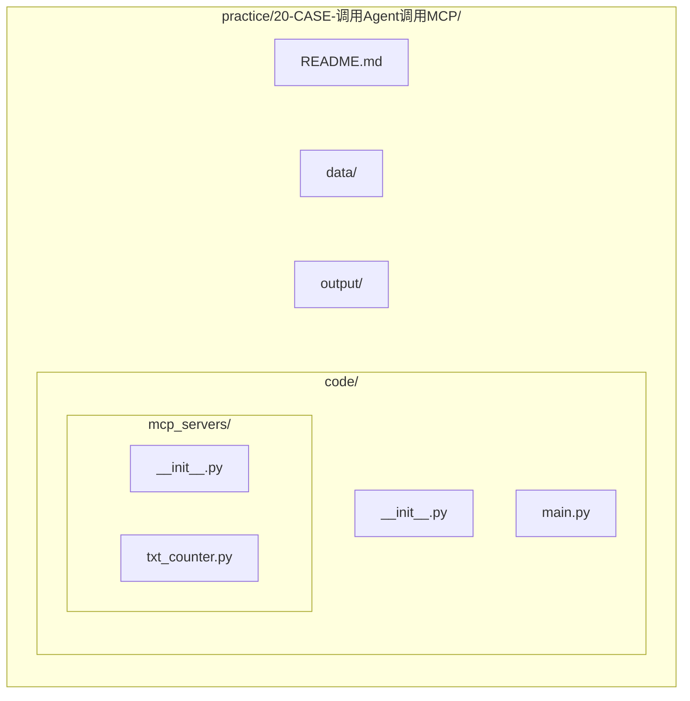
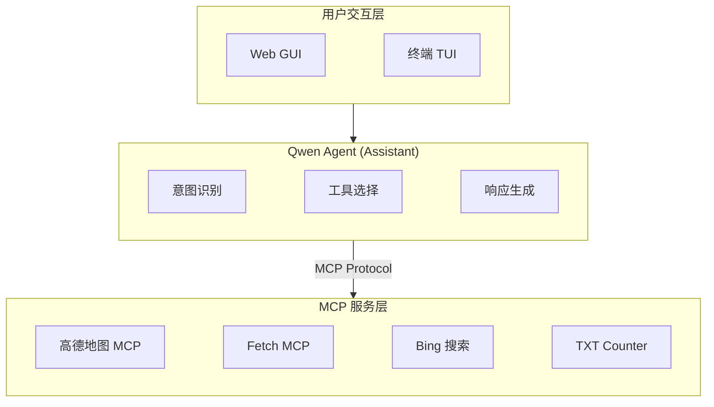

# MCP Agent 调用示例

本项目展示了如何使用 Qwen-Agent 集成多个 MCP 服务，通过自然语言实现多种功能。

## 功能特性

### 1. 自驾游规划
- 使用高德地图 MCP 服务规划自驾游路线
- 查找沿途景点、加油站、餐厅等
- 提供详细的行程建议

**示例**: "规划从北京到上海的7天自驾游"

### 2. 网页转 Markdown
- 获取指定网页的内容
- 将网页内容转换为 Markdown 格式
- 提取网页中的关键信息

**示例**: "获取网页 https://example.com 的内容并转为Markdown格式"

### 3. 新闻检索
- 搜索最新的新闻资讯
- 根据关键词检索相关新闻
- 提供新闻摘要和链接

**示例**: "搜索最新的关税新闻"

### 4. 文件管理
- 统计桌面上的 txt 文件数量
- 列出所有 txt 文件
- 读取指定 txt 文件的内容

**示例**: "统计桌面上的txt文件数量"

## 项目结构



## 环境配置

### 1. 安装依赖

```bash
# 在项目根目录执行
uv sync
```

### 2. 配置 API Key

在项目根目录的 `.env` 文件中配置以下 API Key：

```bash
# 通义千问 API Key（必需）
DASHSCOPE_API_KEY=your_dashscope_api_key

# 高德地图 API Key（用于自驾游规划）
AMAP_API_KEY=your_amap_api_key

# ModelScope API Key（用于 SSE 远程 MCP 服务，可选）
MODELSCOPE_API_KEY=your_modelscope_api_key

# 是否启用 SSE 远程 MCP 服务（默认禁用，避免连接问题）
ENABLE_SSE_MCP=false
```

> **注意**: SSE 远程服务（Fetch、Bing搜索）默认禁用。如需启用，请设置 `ENABLE_SSE_MCP=true` 并确保 `MODELSCOPE_API_KEY` 配置正确。

### 3. 前置要求

- **Node.js**: 高德地图 MCP 使用 npm 包方式，需要安装 Node.js
- **Python**: 3.11+

## 使用方法

### Web GUI 模式（推荐）

```bash
cd practice/20-CASE-调用Agent调用MCP
python code/main.py
```

启动后访问浏览器中显示的地址（通常是 `http://localhost:7860`）。

### 终端 TUI 模式

修改 `code/main.py` 中的 `__main__` 部分：

```python
if __name__ == '__main__':
    app_tui()  # 改为终端模式
```

然后运行：

```bash
python code/main.py
```

### 测试模式

```python
if __name__ == '__main__':
    test('统计桌面上的txt文件数量')
```

## MCP 服务配置

本项目集成了以下 MCP 服务：

| MCP 服务 | 类型 | 用途 |
|---------|------|------|
| amap-maps | npm 包 | 高德地图服务（自驾游规划） |
| fetch | SSE 远程 | 网页内容获取和转换 |
| bing-cn-mcp-server | SSE 远程 | Bing 中文搜索 |
| txt-counter | 本地 Python | 桌面 TXT 文件统计 |

## 技术架构



## 相关文档

- [MCP 官方文档](https://modelcontextprotocol.io/)
- [Qwen-Agent 文档](https://github.com/QwenLM/Qwen-Agent)
- [高德地图 MCP Server](https://www.npmjs.com/package/@amap/amap-maps-mcp-server)
