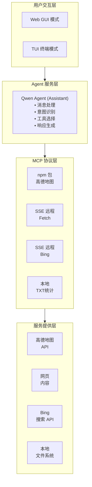
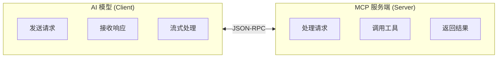
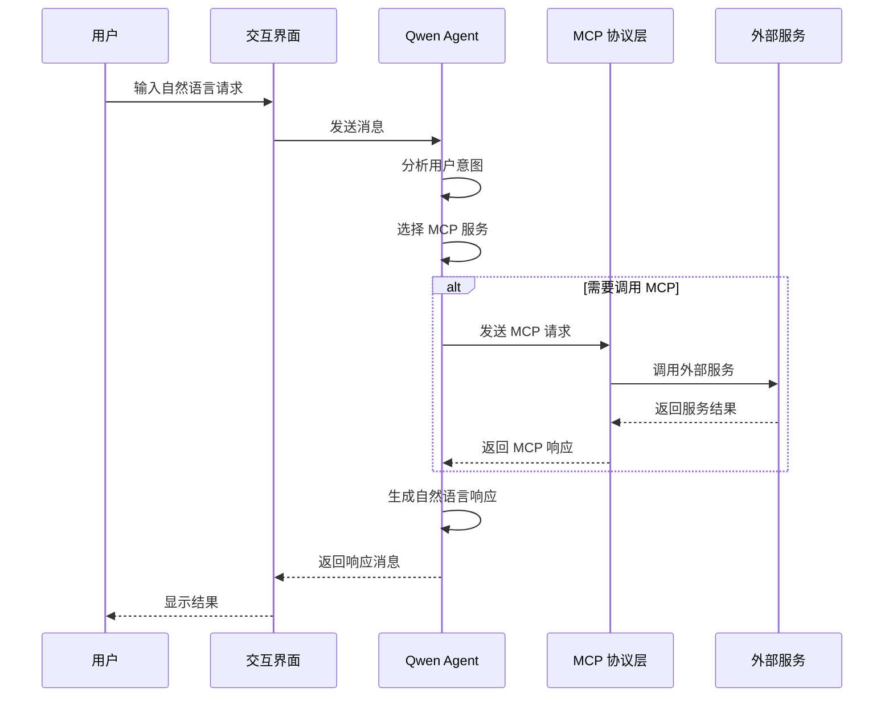
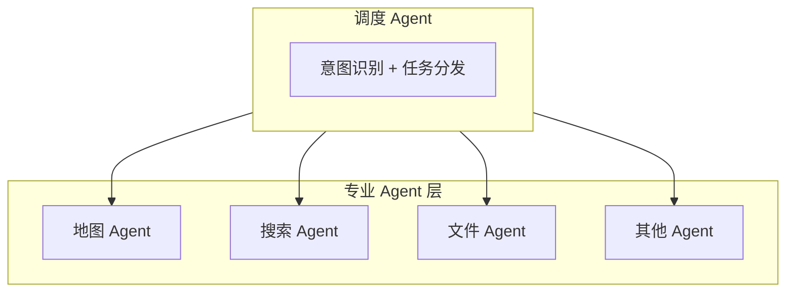

# MCP Agent 调用示例 - 技术架构

## 架构概览

MCP Agent 调用示例采用分层架构设计，包含用户交互层、Agent 服务层、MCP 协议层和服务提供层四个核心层次，实现了 AI 模型与外部工具的标准化集成。



## 核心组件架构

### 1. Agent 服务层

#### Qwen Agent 框架

```python
from qwen_agent.agents import Assistant

class Assistant:
    """
    Qwen Agent 核心类
    
    属性:
        llm: 大模型配置
        name: Agent 名称
        description: Agent 描述
        system_message: 系统提示词
        function_list: 可用工具列表（MCP 配置）
    """
    
    def run(self, messages: List[Dict]) -> Generator:
        """
        处理用户消息并生成响应
        
        Args:
            messages: 对话消息列表
            
        Yields:
            响应消息流
        """
        pass
```

#### Agent 初始化流程

```python
def init_agent_service() -> Assistant:
    """初始化 MCP Agent 服务"""
    
    # 大模型配置
    llm_cfg = {
        "model": "qwen-max",
        "timeout": 60,
        "retry_count": 3,
    }
    
    # MCP 工具配置
    tools = [get_mcp_config()]
    
    bot = Assistant(
        llm=llm_cfg,
        name='MCP 智能助手',
        description='集成高德地图/网页获取/Bing搜索/TXT文件统计的智能助手',
        system_message=SYSTEM_PROMPT,
        function_list=tools,
    )
    
    return bot
```

### 2. MCP 协议详解

#### 什么是 MCP？

MCP（Model Context Protocol）是一个开放协议，使 AI 模型能够安全地与外部数据源和工具进行交互。它提供了一种标准化的方式来：

1. **暴露工具**：服务端可以暴露一组工具供 AI 调用
2. **访问资源**：AI 可以访问文件、数据库等资源
3. **提供提示**：服务端可以提供预定义的提示模板

#### MCP 架构



#### MCP 消息类型

1. **请求（Request）**
```json
{
  "jsonrpc": "2.0",
  "id": 1,
  "method": "tools/call",
  "params": {
    "name": "count_desktop_txt_files",
    "arguments": {}
  }
}
```

2. **响应（Response）**
```json
{
  "jsonrpc": "2.0",
  "id": 1,
  "result": {
    "content": [
      {
        "type": "text",
        "text": "桌面上有 5 个 txt 文件"
      }
    ]
  }
}
```

#### MCP 工具定义

```python
# MCP 工具定义格式
{
    "name": "count_desktop_txt_files",
    "description": "统计桌面上 .txt 文件的数量",
    "inputSchema": {
        "type": "object",
        "properties": {},
        "required": []
    }
}
```

### 3. MCP 服务集成

#### 高德地图 MCP（npm 包方式）

```python
# 配置示例
mcp_servers["amap-maps"] = {
    "command": "npx",
    "args": ["-y", "@amap/amap-maps-mcp-server"],
    "env": {
        "AMAP_MAPS_API_KEY": amap_api_key
    }
}
```

**特点：**
- 通过 npx 运行 npm 包
- 需要配置高德 API Key
- 提供地图、路线规划、POI 搜索等功能

#### Fetch MCP（SSE 远程方式）

```python
# 配置示例
mcp_servers["fetch"] = {
    "type": "sse",
    "url": f"https://mcp.api-inference.modelscope.cn/sse/{api_key}"
}
```

**特点：**
- 通过 SSE（Server-Sent Events）连接远程服务
- 需要配置 ModelScope API Key
- 提供网页内容获取和转换功能

#### Bing 搜索 MCP（SSE 远程方式）

```python
# 配置示例
mcp_servers["bing-cn-mcp-server"] = {
    "type": "sse",
    "url": f"https://mcp.api-inference.modelscope.cn/sse/{api_key}"
}
```

**特点：**
- 通过 SSE 连接远程服务
- 提供 Bing 中文搜索功能
- 返回新闻和搜索结果

#### 自定义 MCP Server（本地 Python）

```python
# 配置示例
mcp_servers["txt-counter"] = {
    "command": "python3",
    "args": [txt_counter_path]
}
```

**特点：**
- 使用 FastMCP 框架开发
- 本地运行，响应速度快
- 可自定义任意功能

### 4. Agent 工作流程



## MCP 服务详解

### 1. 高德地图 MCP

#### 服务能力

| 工具名称 | 功能描述 | 参数 |
|---------|---------|------|
| maps_direction | 路线规划 | 起点、终点、方式 |
| maps_search_poi | POI 搜索 | 关键词、位置、类型 |
| maps_geocode | 地理编码 | 地址文本 |
| maps_regeocode | 逆地理编码 | 经纬度坐标 |

#### 使用场景

```
用户: 规划从北京到上海的7天自驾游

Agent 工作流程:
1. 识别意图：路线规划 + 景点推荐
2. 调用 maps_direction：北京 → 上海
3. 调用 maps_search_poi：沿途景点
4. 整合结果生成行程建议
```

### 2. Fetch MCP

#### 服务能力

| 工具名称 | 功能描述 | 参数 |
|---------|---------|------|
| fetch | 获取网页内容 | URL |
| fetch_as_markdown | 转为 Markdown | URL |

#### 使用场景

```
用户: 获取网页 https://example.com 的内容并转为Markdown格式

Agent 工作流程:
1. 识别意图：网页内容获取
2. 调用 fetch_as_markdown
3. 返回格式化内容
```

### 3. Bing 搜索 MCP

#### 服务能力

| 工具名称 | 功能描述 | 参数 |
|---------|---------|------|
| search | 搜索新闻/网页 | 关键词、数量 |

#### 使用场景

```
用户: 搜索最新的关税新闻

Agent 工作流程:
1. 识别意图：新闻搜索
2. 调用 search：关税
3. 返回新闻列表和摘要
```

### 4. 自定义 TXT 统计 MCP

#### 服务能力

| 工具名称 | 功能描述 | 参数 |
|---------|---------|------|
| count_desktop_txt_files | 统计 txt 文件数量 | 无 |
| list_desktop_txt_files | 列出所有 txt 文件 | 无 |
| read_txt_file | 读取文件内容 | 文件名 |

#### 使用场景

```
用户: 统计桌面上的txt文件数量

Agent 工作流程:
1. 识别意图：文件统计
2. 调用 count_desktop_txt_files
3. 返回文件数量
```

## MCP 配置管理

### 配置结构

```python
def get_mcp_config() -> dict:
    """获取 MCP 服务配置"""
    
    mcp_servers = {}
    
    # 1. 高德地图 MCP（npm 包方式）
    if amap_api_key:
        mcp_servers["amap-maps"] = {
            "command": "npx",
            "args": ["-y", "@amap/amap-maps-mcp-server"],
            "env": {"AMAP_MAPS_API_KEY": amap_api_key}
        }
    
    # 2. SSE 远程服务（可选）
    if enable_sse_mcp and modelscope_api_key:
        mcp_servers["fetch"] = {
            "type": "sse",
            "url": f"https://mcp.api-inference.modelscope.cn/sse/{modelscope_api_key}"
        }
    
    # 3. 本地 Python MCP
    mcp_servers["txt-counter"] = {
        "command": "python3",
        "args": [txt_counter_path]
    }
    
    return {"mcpServers": mcp_servers}
```

### 配置类型对比

| 类型 | 启动方式 | 适用场景 | 优点 | 缺点 |
|------|---------|---------|------|------|
| npm 包 | npx | Node.js 服务 | 生态丰富 | 需要 Node.js |
| SSE 远程 | HTTP SSE | 云端服务 | 无需本地部署 | 依赖网络 |
| 本地 Python | python | 自定义服务 | 灵活可控 | 需要开发 |

## 系统提示词设计

### 提示词结构

```python
SYSTEM_PROMPT = '''你是一个智能助手，集成了多个 MCP 服务，可以帮助用户完成以下任务：

## 1. 自驾游规划
- 使用高德地图服务规划自驾游路线
- 查找沿途景点、加油站、餐厅等
- 提供详细的行程建议

## 2. 网页内容获取
- 获取指定网页的内容
- 将网页内容转换为 Markdown 格式
- 提取网页中的关键信息

## 3. 新闻检索
- 搜索最新的新闻资讯
- 根据关键词检索相关新闻
- 提供新闻摘要和链接

## 4. 文件管理
- 统计桌面上的 txt 文件数量
- 列出所有 txt 文件
- 读取指定 txt 文件的内容

请根据用户的需求，选择合适的工具来完成任务。回答时请使用中文，并保持专业和友好的态度。
'''
```

### 设计原则

1. **明确角色定义**: 定义 Agent 的身份和能力边界
2. **服务能力说明**: 详细描述每个 MCP 服务的功能
3. **输出规范**: 规定回答的语言和风格
4. **用户引导**: 帮助用户了解可以做什么

## 安全架构

### 1. API Key 管理

```python
# 使用环境变量存储敏感信息
import os
from dotenv import load_dotenv

load_dotenv()

api_key = os.getenv('DASHSCOPE_API_KEY')
amap_key = os.getenv('AMAP_API_KEY')
```

### 2. MCP 服务权限

- 每个 MCP 服务独立运行
- 服务之间相互隔离
- 通过环境变量传递认证信息

### 3. 输入验证

```python
# MCP 服务端验证
def validate_input(params: dict) -> bool:
    """验证输入参数"""
    # 检查参数类型
    # 检查参数范围
    # 防止注入攻击
    return True
```

## 扩展架构

### 1. 添加新的 MCP 服务

```python
# 步骤1：在配置中添加服务
mcp_servers["new-service"] = {
    "command": "python3",
    "args": [service_path]
}

# 步骤2：更新系统提示词
SYSTEM_PROMPT += """
## 5. 新服务功能
- 功能描述
- 使用方法
"""
```

### 2. 开发自定义 MCP Server

```python
from mcp.server.fastmcp import FastMCP

mcp = FastMCP("服务名称")

@mcp.tool()
def my_tool(param: str) -> str:
    """工具描述"""
    return "结果"

if __name__ == "__main__":
    mcp.run()
```

### 3. 多 Agent 协作架构



## 性能优化

### 1. MCP 服务复用

```python
# 使用连接池管理 MCP 连接
class MCPConnectionPool:
    def __init__(self, max_connections: int = 10):
        self.pool = {}
        self.max_connections = max_connections
    
    def get_connection(self, service_name: str):
        if service_name not in self.pool:
            self.pool[service_name] = self._create_connection(service_name)
        return self.pool[service_name]
```

### 2. 结果缓存

```python
from functools import lru_cache

@lru_cache(maxsize=100)
def cached_mcp_call(service: str, tool: str, params_hash: str):
    """缓存 MCP 调用结果"""
    return mcp_call(service, tool, params)
```

### 3. 并行调用

```python
import asyncio

async def parallel_mcp_calls(calls: list):
    """并行执行多个 MCP 调用"""
    tasks = [mcp_call_async(*call) for call in calls]
    return await asyncio.gather(*tasks)
```

---

*最后更新: 2026年2月24日*
*架构版本: v1.0*
*技术负责人: AI系统架构组*
