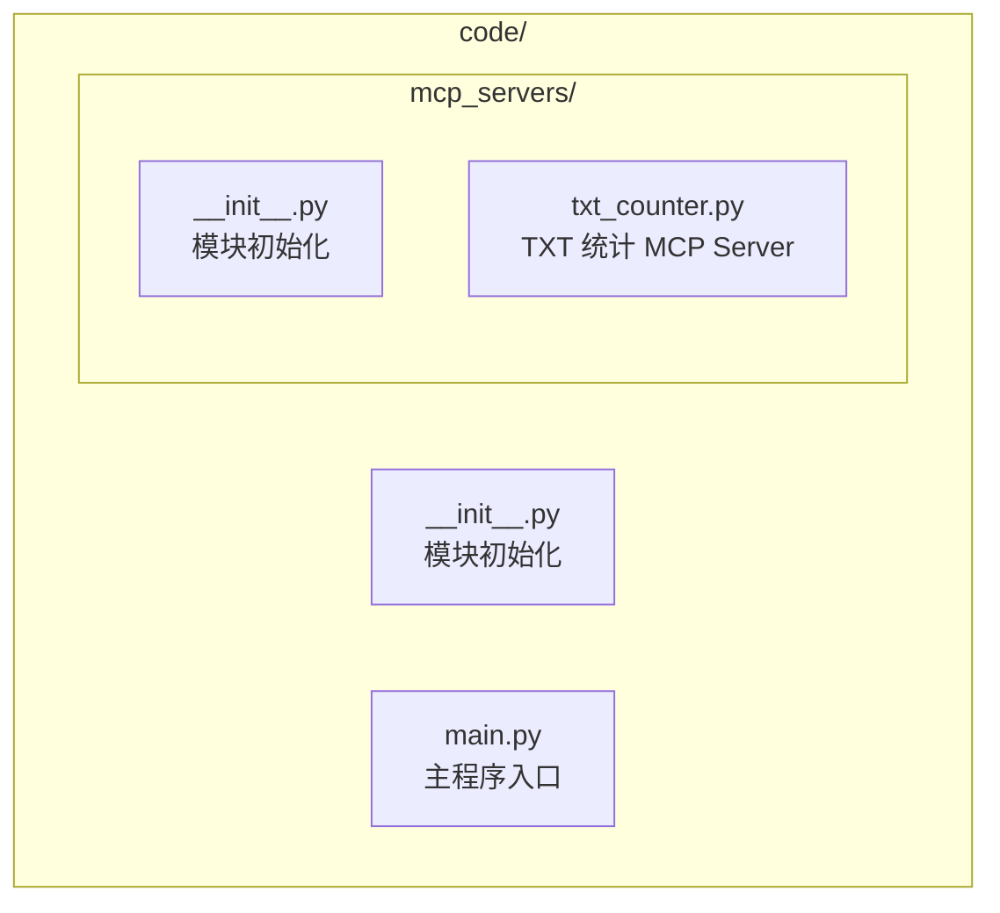
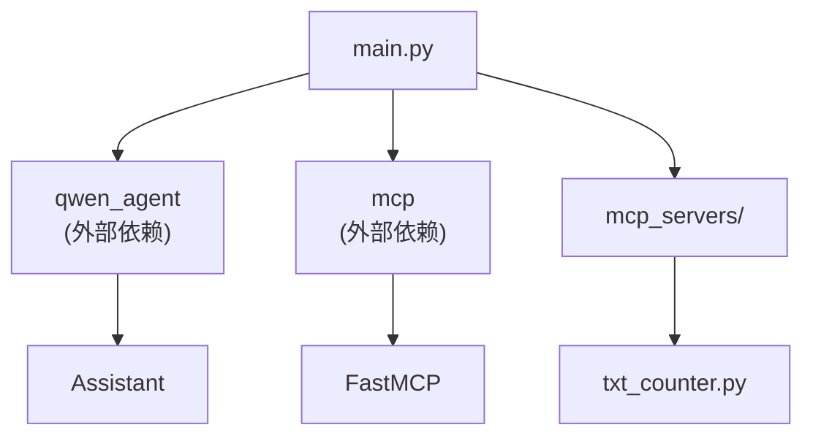

# MCP Agent 调用示例 - 代码实现详解

## 核心代码结构

### 1. 项目模块结构



### 2. 模块依赖关系



## 主程序入口 (main.py)

### 1. 导入和配置

```python
"""MCP Agent 调用示例 - 主程序

基于 Qwen-Agent 集成多个 MCP 服务，支持：
1. 自驾游规划（高德地图 MCP）
2. 网页转 Markdown（Fetch MCP）
3. 新闻检索（Bing 搜索 MCP）
4. 桌面 TXT 文件统计（自定义 MCP Server）

运行方式：
- Web GUI: python main.py
- TUI 模式: 修改 __main__ 中的调用
"""

import os
from typing import Optional
from dotenv import load_dotenv
from loguru import logger
import dashscope
from qwen_agent.agents import Assistant
from qwen_agent.gui import WebUI

# 加载环境变量
load_dotenv()

# 配置 DashScope
dashscope.api_key = os.getenv('DASHSCOPE_API_KEY', '')
dashscope.timeout = 60  # type: ignore
```

**代码说明：**
- `load_dotenv()`: 从 `.env` 文件加载环境变量
- `dashscope.api_key`: 设置通义千问 API Key
- `dashscope.timeout`: 设置 API 超时时间

### 2. 系统提示词设计

```python
# 系统提示词
SYSTEM_PROMPT = '''你是一个智能助手，集成了多个 MCP 服务，可以帮助用户完成以下任务：

## 1. 自驾游规划
- 使用高德地图服务规划自驾游路线
- 查找沿途景点、加油站、餐厅等
- 提供详细的行程建议

## 2. 网页内容获取
- 获取指定网页的内容
- 将网页内容转换为 Markdown 格式
- 提取网页中的关键信息

## 3. 新闻检索
- 搜索最新的新闻资讯
- 根据关键词检索相关新闻
- 提供新闻摘要和链接

## 4. 文件管理
- 统计桌面上的 txt 文件数量
- 列出所有 txt 文件
- 读取指定 txt 文件的内容

请根据用户的需求，选择合适的工具来完成任务。回答时请使用中文，并保持专业和友好的态度。
'''
```

**设计要点：**
- **角色定义**: 明确定义 Agent 的身份和能力
- **服务说明**: 详细描述每个 MCP 服务的功能
- **输出规范**: 规定回答的语言和风格
- **用户引导**: 帮助用户了解可以做什么

## MCP 配置管理

### 1. 配置函数实现

```python
def get_mcp_config() -> dict:
    """获取 MCP 服务配置
    
    根据环境变量配置可选启用不同的 MCP 服务：
    - AMAP_API_KEY: 高德地图 MCP（自驾游规划）
    - MODELSCOPE_API_KEY: SSE 远程服务（Fetch、Bing搜索）
    - ENABLE_SSE_MCP: 是否启用 SSE 远程服务（默认禁用）
    
    注意: SSE 远程服务目前可能存在连接问题，建议先测试本地 MCP 服务。
    
    Returns:
        dict: MCP 服务配置字典
    """
    # 获取 API Keys
    amap_api_key = os.getenv('AMAP_API_KEY', '')
    modelscope_api_key = os.getenv('MODELSCOPE_API_KEY', '')
    enable_sse_mcp = os.getenv('ENABLE_SSE_MCP', 'false').lower() == 'true'
    
    # 获取当前脚本目录（用于定位 txt_counter.py）
    current_dir = os.path.dirname(os.path.abspath(__file__))
    txt_counter_path = os.path.join(current_dir, 'mcp_servers', 'txt_counter.py')
    
    mcp_servers = {}
    
    # 高德地图 MCP（npm 包方式）- 需要 API Key
    if amap_api_key:
        mcp_servers["amap-maps"] = {
            "command": "npx",
            "args": ["-y", "@amap/amap-maps-mcp-server"],
            "env": {
                "AMAP_MAPS_API_KEY": amap_api_key
            }
        }
        logger.info("已启用高德地图 MCP 服务")
    else:
        logger.warning("未配置 AMAP_API_KEY，高德地图 MCP 服务已禁用")
    
    # SSE 远程服务（Fetch、Bing搜索）- 需要 ModelScope API Key 且显式启用
    if enable_sse_mcp and modelscope_api_key:
        # Fetch MCP（SSE 远程服务）
        mcp_servers["fetch"] = {
            "type": "sse",
            "url": f"https://mcp.api-inference.modelscope.cn/sse/{modelscope_api_key}"
        }
        # Bing 中文搜索 MCP（SSE 远程服务）
        mcp_servers["bing-cn-mcp-server"] = {
            "type": "sse",
            "url": f"https://mcp.api-inference.modelscope.cn/sse/{modelscope_api_key}"
        }
        logger.info("已启用 Fetch 和 Bing 搜索 MCP 服务")
    else:
        if not enable_sse_mcp:
            logger.info("SSE 远程服务已禁用（设置 ENABLE_SSE_MCP=true 启用）")
        else:
            logger.warning("未配置 MODELSCOPE_API_KEY，Fetch 和 Bing 搜索 MCP 服务已禁用")
    
    # 自定义 TXT 计数器 MCP（本地 Python 服务）- 始终启用
    mcp_servers["txt-counter"] = {
        "command": "python3",
        "args": [txt_counter_path]
    }
    logger.info("已启用 TXT 文件统计 MCP 服务")
    
    return {"mcpServers": mcp_servers}
```

**配置说明：**

| 配置项 | 类型 | 必需 | 说明 |
|-------|------|------|------|
| `command` | string | 是 | 启动命令（npm 包用 npx，Python 用 python3） |
| `args` | list | 是 | 命令参数 |
| `env` | dict | 否 | 环境变量 |
| `type` | string | 否 | 连接类型（默认 stdio，SSE 用 "sse"） |
| `url` | string | SSE 必需 | SSE 服务 URL |

### 2. 配置类型详解

#### npm 包方式

```python
{
    "command": "npx",
    "args": ["-y", "@amap/amap-maps-mcp-server"],
    "env": {
        "AMAP_MAPS_API_KEY": "your_key"
    }
}
```

**特点：**
- 通过 npx 运行 npm 包
- `-y` 参数自动确认安装
- 通过 `env` 传递 API Key

#### SSE 远程方式

```python
{
    "type": "sse",
    "url": "https://mcp.api-inference.modelscope.cn/sse/{api_key}"
}
```

**特点：**
- 通过 Server-Sent Events 连接
- 无需本地安装服务
- 依赖网络连接

#### 本地 Python 方式

```python
{
    "command": "python3",
    "args": ["/path/to/server.py"]
}
```

**特点：**
- 运行本地 Python 脚本
- 完全可控
- 响应速度快

## Agent 初始化

### 1. Agent 服务初始化

```python
def init_agent_service() -> Assistant:
    """初始化 Agent 服务
    
    Returns:
        Assistant: 配置好的助手实例
    """
    # LLM 配置
    llm_cfg = {
        'model': 'qwen-max',
        'timeout': 60,
        'retry_count': 3,
    }
    
    # MCP 工具配置
    tools = [get_mcp_config()]
    
    try:
        bot = Assistant(
            llm=llm_cfg,
            name='MCP 智能助手',
            description='集成高德地图/网页获取/Bing搜索/TXT文件统计的智能助手',
            system_message=SYSTEM_PROMPT,
            function_list=tools,  # type: ignore
        )
        logger.info("Agent 初始化成功")
        return bot
    except Exception as e:
        logger.error(f"Agent 初始化失败: {str(e)}")
        raise
```

**配置说明：**

| 参数 | 类型 | 说明 |
|-----|------|------|
| `llm` | dict | 大模型配置 |
| `name` | str | Agent 名称 |
| `description` | str | Agent 描述 |
| `system_message` | str | 系统提示词 |
| `function_list` | list | 工具列表（MCP 配置） |

### 2. LLM 配置详解

```python
llm_cfg = {
    'model': 'qwen-max',      # 模型选择
    'timeout': 60,             # 超时时间（秒）
    'retry_count': 3,          # 重试次数
    # 其他可选参数
    # 'temperature': 0.7,      # 温度参数
    # 'top_p': 0.9,            # Top-P 采样
    # 'max_tokens': 2000,      # 最大 token 数
}
```

**模型选择建议：**

| 模型 | 特点 | 适用场景 |
|-----|------|---------|
| `qwen-max` | 最强能力 | 复杂任务、多工具调用 |
| `qwen-plus` | 平衡性能 | 一般任务 |
| `qwen-turbo-latest` | 最快响应 | 简单任务、快速交互 |

## 消息处理

### 1. 测试模式

```python
def test(query: str = '统计一下我桌面上有多少个txt文件', file: Optional[str] = None):
    """测试模式
    
    Args:
        query: 测试查询语句
        file: 可选的输入文件路径
    """
    try:
        bot = init_agent_service()
        messages = []
        
        if not file:
            messages.append({'role': 'user', 'content': query})
        else:
            messages.append({'role': 'user', 'content': [{'text': query}, {'file': file}]})
        
        logger.info(f"处理查询: {query}")
        for response in bot.run(messages):
            print('Agent 响应:', response)
    except Exception as e:
        logger.error(f"测试失败: {str(e)}")
```

### 2. 终端交互模式

```python
def app_tui():
    """终端交互模式（TUI）
    
    提供命令行交互界面，支持连续对话。
    """
    try:
        bot = init_agent_service()
        messages = []
        
        print("=" * 60)
        print("MCP 智能助手 - 终端模式")
        print("输入 'quit' 或 'exit' 退出")
        print("=" * 60)
        
        while True:
            try:
                query = input('\n用户: ').strip()
                
                if query.lower() in ['quit', 'exit', 'q']:
                    print("再见！")
                    break
                
                if not query:
                    continue
                
                file = input('文件路径 (可选，直接回车跳过): ').strip()
                
                if not file:
                    messages.append({'role': 'user', 'content': query})
                else:
                    messages.append({'role': 'user', 'content': [{'text': query}, {'file': file}]})
                
                print("\n助手: ", end="")
                response = []
                for response in bot.run(messages):
                    if response:
                        # 提取并显示响应内容
                        for msg in response:
                            if isinstance(msg, dict) and msg.get('role') == 'assistant':
                                content = msg.get('content', '')
                                if isinstance(content, str):
                                    print(content)
                messages.extend(response)
                
            except KeyboardInterrupt:
                print("\n\n已中断，再见！")
                break
            except Exception as e:
                logger.error(f"处理请求出错: {str(e)}")
                print(f"出错: {str(e)}，请重试")
                
    except Exception as e:
        logger.error(f"启动终端模式失败: {str(e)}")
```

### 3. Web 界面模式

```python
def app_gui():
    """图形界面模式（Web GUI）
    
    提供 Web 图形界面，包含预设的查询建议。
    """
    try:
        logger.info("正在启动 Web 界面...")
        bot = init_agent_service()
        
        # 预设查询建议
        chatbot_config = {
            'prompt.suggestions': [
                '规划从北京到上海的7天自驾游',
                '获取网页 https://example.com 的内容并转为Markdown格式',
                '搜索最新的关税新闻',
                '统计桌面上的txt文件数量',
            ]
        }
        
        logger.info("Web 界面已启动")
        WebUI(bot, chatbot_config=chatbot_config).run()
        
    except Exception as e:
        logger.error(f"启动 Web 界面失败: {str(e)}")
```

## 自定义 MCP Server

### 1. FastMCP 框架介绍

FastMCP 是一个 Python MCP Server 快速开发框架，提供简洁的装饰器语法来定义 MCP 工具。

**安装：**
```bash
pip install mcp
```

### 2. TXT 统计 MCP Server 实现

```python
"""桌面 TXT 文件统计 MCP Server

基于 FastMCP 实现的本地 MCP 服务，提供以下功能：
- 统计桌面 .txt 文件数量
- 列出所有 .txt 文件
- 读取指定 .txt 文件内容
"""

import os
from pathlib import Path
from mcp.server.fastmcp import FastMCP

# 创建 MCP Server 实例
mcp = FastMCP("桌面 TXT 文件统计器")


@mcp.tool()
def count_desktop_txt_files() -> int:
    """统计桌面上 .txt 文件的数量
    
    Returns:
        int: 桌面上 .txt 文件的数量
    """
    desktop_path = Path(os.path.expanduser("~/Desktop"))
    txt_files = list(desktop_path.glob("*.txt"))
    return len(txt_files)


@mcp.tool()
def list_desktop_txt_files() -> str:
    """获取桌面上所有 .txt 文件的列表
    
    Returns:
        str: 格式化的文件列表，包含文件名和数量
    """
    desktop_path = Path(os.path.expanduser("~/Desktop"))
    txt_files = list(desktop_path.glob("*.txt"))
    
    if not txt_files:
        return "桌面上没有找到 .txt 文件。"
    
    file_list = "\n".join([f"- {file.name}" for file in txt_files])
    return f"在桌面上找到 {len(txt_files)} 个 .txt 文件：\n{file_list}"


@mcp.tool()
def read_txt_file(filename: str) -> str:
    """读取指定 txt 文件的内容
    
    Args:
        filename: txt 文件的名称（例如：test.txt）
        
    Returns:
        str: 文件内容，如果文件不存在则返回错误信息
    """
    desktop_path = Path(os.path.expanduser("~/Desktop"))
    file_path = desktop_path / filename
    
    # 检查文件是否存在
    if not file_path.exists():
        return f"错误：文件 '{filename}' 不存在于桌面上。"
    
    # 检查文件是否是 txt 文件
    if file_path.suffix.lower() != '.txt':
        return f"错误：文件 '{filename}' 不是 txt 文件。"
    
    try:
        with open(file_path, 'r', encoding='utf-8') as f:
            content = f.read()
        return f"文件 '{filename}' 的内容：\n\n{content}"
    except Exception as e:
        return f"读取文件时发生错误：{str(e)}"


if __name__ == "__main__":
    # 启动 MCP Server
    mcp.run()
```

### 3. 工具装饰器详解

```python
@mcp.tool()
def my_tool(param: str) -> str:
    """工具描述
    
    Args:
        param: 参数说明
        
    Returns:
        返回值说明
    """
    return "结果"
```

**装饰器说明：**
- `@mcp.tool()`: 将函数注册为 MCP 工具
- 函数的 docstring 会自动转换为工具描述
- 类型注解会自动生成参数 schema
- 返回值必须是字符串类型

### 4. 高级 MCP Server 示例

```python
from mcp.server.fastmcp import FastMCP
from typing import Optional, List
import json

mcp = FastMCP("高级服务")


@mcp.tool()
def search_data(
    query: str,
    filters: Optional[dict] = None,
    limit: int = 10
) -> str:
    """搜索数据
    
    Args:
        query: 搜索关键词
        filters: 过滤条件（可选）
        limit: 返回结果数量限制
        
    Returns:
        搜索结果的 JSON 字符串
    """
    # 实现搜索逻辑
    results = perform_search(query, filters, limit)
    return json.dumps(results, ensure_ascii=False, indent=2)


@mcp.tool()
def batch_process(items: List[str]) -> str:
    """批量处理
    
    Args:
        items: 要处理的项目列表
        
    Returns:
        处理结果
    """
    results = []
    for item in items:
        result = process_item(item)
        results.append(result)
    return json.dumps(results, ensure_ascii=False, indent=2)


@mcp.resource("config://settings")
def get_settings() -> str:
    """获取配置资源
    
    Returns:
        配置 JSON 字符串
    """
    settings = load_settings()
    return json.dumps(settings, ensure_ascii=False, indent=2)


if __name__ == "__main__":
    mcp.run()
```

## 错误处理机制

### 1. MCP 调用错误处理

```python
def safe_mcp_call(func: callable, *args, **kwargs) -> str:
    """
    安全的 MCP 调用包装器
    
    Args:
        func: MCP 工具函数
        *args: 位置参数
        **kwargs: 关键字参数
        
    Returns:
        工具执行结果或错误信息
    """
    try:
        return func(*args, **kwargs)
    except FileNotFoundError as e:
        logger.error(f"文件未找到: {e}")
        return f"错误：文件未找到"
    except PermissionError as e:
        logger.error(f"权限不足: {e}")
        return f"错误：权限不足"
    except Exception as e:
        logger.error(f"MCP 调用失败: {e}")
        return f"错误：{str(e)}"
```

### 2. Agent 初始化错误处理

```python
def init_agent_service() -> Assistant:
    """初始化 Agent 服务（带错误处理）"""
    try:
        # 检查 API Key
        if not os.getenv('DASHSCOPE_API_KEY'):
            raise ValueError("DASHSCOPE_API_KEY 未配置")
        
        # 初始化 Agent
        bot = Assistant(...)
        
        logger.info("Agent 初始化成功")
        return bot
        
    except ValueError as e:
        logger.error(f"配置错误: {e}")
        raise
    except ImportError as e:
        logger.error(f"依赖缺失: {e}")
        raise
    except Exception as e:
        logger.error(f"初始化失败: {e}")
        raise
```

### 3. MCP Server 错误处理

```python
@mcp.tool()
def read_file_safe(filename: str) -> str:
    """安全读取文件"""
    try:
        # 参数验证
        if not filename:
            return "错误：文件名不能为空"
        
        if '..' in filename or '/' in filename:
            return "错误：文件名包含非法字符"
        
        # 路径处理
        file_path = get_safe_path(filename)
        
        # 读取文件
        with open(file_path, 'r', encoding='utf-8') as f:
            content = f.read()
        
        return content
        
    except FileNotFoundError:
        return "错误：文件不存在"
    except PermissionError:
        return "错误：没有读取权限"
    except UnicodeDecodeError:
        return "错误：文件编码不支持"
    except Exception as e:
        logger.error(f"读取文件失败: {e}")
        return f"错误：{str(e)}"
```

## 日志配置

### 1. 基础日志配置

```python
from loguru import logger
import sys

# 配置日志
logger.remove()
logger.add(
    sys.stdout,
    level="INFO",
    format="<green>{time:YYYY-MM-DD HH:mm:ss}</green> | <level>{level: <8}</level> | <cyan>{name}</cyan>:<cyan>{function}</cyan>:<cyan>{line}</cyan> - <level>{message}</level>"
)
```

### 2. 文件日志配置

```python
# 添加文件日志
logger.add(
    "logs/app.log",
    level="DEBUG",
    format="{time:YYYY-MM-DD HH:mm:ss} | {level: <8} | {name}:{function}:{line} - {message}",
    rotation="1 day",
    retention="7 days",
    compression="zip"
)
```

---

*最后更新: 2026年2月24日*
*代码实现版本: v1.0*
*开发团队: AI系统开发组*
